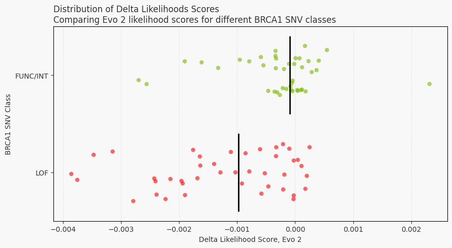

# Zero-shot prediction of BRCA1 variant effects with Evo 2
Deploy this tutorial on brev.dev: 
[](https://console.brev.dev/launchable/deploy?launchableID=env-2uGqxNLgVdl752F2qcTFwHHn4Rj)

*Note - this notebook is a reproduction of The Arc Institute’s same-titled notebook [here](https://github.com/ArcInstitute/evo2/blob/main/notebooks/brca1/brca1_zero_shot_vep.ipynb), using the BioNeMo 2 implementation of Evo2.*

Evo2 is a foundation AI model trained on 9.3 trillion DNA base pairs, predicting variant effects without prior tast-specific training. 

Without being explicitly trained on BRCA1 variants, we show Evo 2's ability to generalize across all life forms.

The human *BRCA1* gene encodes for a protein that repairs damaged DNA ([Moynahan et al., 1999](https://www.cell.com/molecular-cell/fulltext/S1097-2765%2800%2980202-6)). Certain variants of this gene have been associated with an increased risk of breast and ovarian cancers ([Miki et al., 1994](https://www.science.org/doi/10.1126/science.7545954?url_ver=Z39.88-2003&rfr_id=ori:rid:crossref.org&rfr_dat=cr_pub%20%200pubmed)). Using Evo 2, we can predict whether a particular single nucleotide variant (SNV) of the *BRCA1* gene is likely to be harmful to the protein's function, and thus potentially increase the risk of cancer for the patient with the genetic variant.


```python
%%capture
!pip install biopython openpyxl
import os


# Runs a subset of the model layers to test that the notebook runs in CI, but the output will be incorrect.
FAST_CI_MODE: bool = os.environ.get("FAST_CI_MODE", False)
```


```python
import glob
import gzip
import json
import math
import os
from pathlib import Path

import matplotlib.pyplot as plt
import pandas as pd
import seaborn as sns
import torch
from Bio import SeqIO
from sklearn.metrics import auc, roc_auc_score, roc_curve

from bionemo.core.utils.subprocess_utils import run_subprocess_safely
```

We start by loading a dataset from [Findlay et al. (2018)](https://www.nature.com/articles/s41586-018-0461-z), which contains experimentally measured function scores of 3,893 *BRCA1* SNVs. These function scores reflect the extent by which the genetic variant has disrupted the protein's function, with lower scores indicating greater disruption. In this dataset, the SNVs are classified into three categories based on their function scores: `LOF` (loss-of-function), `INT` (intermediate), and `FUNC` (functional). We start by reading in this dataset.

To keep the notebook streamlined, we've abstracted much of the preprocessing logic into accompanying scripts located in `brca1_utils`. This notebook can also be viewed [here](https://docs.nvidia.com/bionemo-framework/latest/main/examples/bionemo-evo2/zeroshot_brca1/).


```python
def download_data(data_dir="brca1", commit_hash="3819474bee6c24938016614411f1fa025e542bbe"):
    """Download required data files if they don't exist locally.

    Parameters:
    -----------
    data_dir : str
        Directory to store downloaded files
    commit_hash : str
        GitHub commit hash for data version
    """
    if not os.path.exists(data_dir):
        os.makedirs(data_dir)

    excel_path = os.path.join(data_dir, "41586_2018_461_MOESM3_ESM.xlsx")
    genome_path = os.path.join(data_dir, "GRCh37.p13_chr17.fna.gz")

    if not os.path.exists(excel_path):
        os.system(
            f"wget https://github.com/ArcInstitute/evo2/raw/{commit_hash}/notebooks/brca1/41586_2018_461_MOESM3_ESM.xlsx -O {excel_path}"
        )

    if not os.path.exists(genome_path):
        os.system(
            f"wget https://github.com/ArcInstitute/evo2/raw/{commit_hash}/notebooks/brca1/GRCh37.p13_chr17.fna.gz -O {genome_path}"
        )

    return excel_path, genome_path


def load_genome_sequence(genome_path):
    """Load genome sequence from FASTA file.

    Parameters:
    -----------
    genome_path : str
        Path to the genome FASTA file

    Returns:
    --------
    str
        Genome sequence string
    """
    with gzip.open(genome_path, "rt") as handle:
        for record in SeqIO.parse(handle, "fasta"):
            return str(record.seq)

    raise ValueError("Failed to parse genome sequence")


def load_brca1_data(excel_path):
    """Load and preprocess BRCA1 data from Excel file.

    Parameters:
    -----------
    excel_path : str
        Path to the Excel file

    Returns:
    --------
    pandas.DataFrame
        Processed BRCA1 dataframe
    """
    # Load the dataframe
    brca1_df = pd.read_excel(excel_path, header=2)

    # Select and rename columns
    brca1_df = brca1_df[
        [
            "chromosome",
            "position (hg19)",
            "reference",
            "alt",
            "function.score.mean",
            "func.class",
        ]
    ]

    brca1_df.rename(
        columns={
            "chromosome": "chrom",
            "position (hg19)": "pos",
            "reference": "ref",
            "alt": "alt",
            "function.score.mean": "score",
            "func.class": "class",
        },
        inplace=True,
    )

    # Convert to two-class system
    brca1_df["class"] = brca1_df["class"].replace(["FUNC", "INT"], "FUNC/INT")

    return brca1_df
```


```python
%%capture

# Configuration parameters
DATA_DIR = "brca1"
SAMPLE_CONFIG = {"sample_frac": 0.05, "balanced": True, "disable": False, "random_state": 42}

# 1. Download the necessary data files if not present
excel_path, genome_path = download_data(DATA_DIR)
seq_chr17 = load_genome_sequence(genome_path)

# 2. Load and preprocess BRCA1 data
brca1_df = load_brca1_data(excel_path)
```

    --2025-10-15 15:24:26--  https://github.com/ArcInstitute/evo2/raw/3819474bee6c24938016614411f1fa025e542bbe/notebooks/brca1/41586_2018_461_MOESM3_ESM.xlsx
    Resolving github.com (github.com)... 20.26.156.215
    Connecting to github.com (github.com)|20.26.156.215|:443... connected.
    HTTP request sent, awaiting response... 

    302 Found
    Location: https://raw.githubusercontent.com/ArcInstitute/evo2/3819474bee6c24938016614411f1fa025e542bbe/notebooks/brca1/41586_2018_461_MOESM3_ESM.xlsx [following]
    --2025-10-15 15:24:26--  https://raw.githubusercontent.com/ArcInstitute/evo2/3819474bee6c24938016614411f1fa025e542bbe/notebooks/brca1/41586_2018_461_MOESM3_ESM.xlsx
    Resolving raw.githubusercontent.com (raw.githubusercontent.com)... 185.199.108.133, 185.199.109.133, 185.199.111.133, ...
    Connecting to raw.githubusercontent.com (raw.githubusercontent.com)|185.199.108.133|:443... connected.
    HTTP request sent, awaiting response... 

    200 OK
    Length: 2268761 (2.2M) [application/octet-stream]
    Saving to: ‘brca1/41586_2018_461_MOESM3_ESM.xlsx’
    
         0K .......... .......... .......... .......... ..........  2% 4.30M 0s
        50K .......... .......... .......... .......... ..........  4% 6.48M 0s
       100K .......... .......... .......... .......... ..........  6% 5.67M 0s
       150K .......... .......... .......... .......... ..........  9% 9.05M 0s
       200K .......... .......... .......... .......... .......... 11% 8.86M 0s
       250K .......... .......... .......... .......... .......... 13% 11.4M 0s
       300K .......... .......... .......... .......... .......... 15% 73.7M 0s
       350K .......... .......... .......... .......... .......... 18% 12.0M 0s
       400K .......... .......... .......... .......... .......... 20% 45.6M 0s
       450K .......... .......... .......... .......... .......... 22% 10.6M 0s
       500K .......... .......... .......... .......... .......... 24%  569M 0s
       550K .......... .......... .......... .......... .......... 27% 82.4M 0s
       600K .......... .......... .......... .......... .......... 29%  110M 0s
       650K .......... .......... .......... .......... .......... 31% 18.7M 0s
       700K .......... .......... .......... .......... .......... 33%  194M 0s
       750K .......... .......... .......... .......... .......... 36% 48.5M 0s
       800K .......... .......... .......... .......... .......... 38%  112M 0s
       850K .......... .......... .......... .......... .......... 40%  117M 0s
       900K .......... .......... .......... .......... .......... 42%  234M 0s
       950K .......... .......... .......... .......... .......... 45% 11.3M 0s
      1000K .......... .......... .......... .......... .......... 47%  146M 0s
      1050K .......... .......... .......... .......... .......... 49%  201M 0s
      1100K .......... .......... .......... .......... .......... 51%  309M 0s
      1150K .......... .......... .......... .......... .......... 54%  159M 0s
      1200K .......... .......... .......... .......... .......... 56% 93.6M 0s
      1250K .......... .......... .......... .......... .......... 58%  178M 0s
      1300K .......... .......... .......... .......... .......... 60% 33.3M 0s
      1350K .......... .......... .......... .......... .......... 63%  252M 0s
      1400K .......... .......... .......... .......... .......... 65%  112M 0s
      1450K .......... .......... .......... .......... .......... 67% 51.1M 0s
      1500K .......... .......... .......... .......... .......... 69% 91.8M 0s
      1550K .......... .......... .......... .......... .......... 72%  133M 0s
      1600K .......... .......... .......... .......... .......... 74%  168M 0s
      1650K .......... .......... .......... .......... .......... 76%  383M 0s
      1700K .......... .......... .......... .......... .......... 78%  305M 0s
      1750K .......... .......... .......... .......... .......... 81%  183M 0s
      1800K .......... .......... .......... .......... .......... 83%  320M 0s
      1850K .......... .......... .......... .......... .......... 85% 16.0M 0s
      1900K .......... .......... .......... .......... .......... 88% 92.7M 0s
      1950K .......... .......... .......... .......... .......... 90%  169M 0s
      2000K .......... .......... .......... .......... .......... 92%  495M 0s
      2050K .......... .......... .......... .......... .......... 94%  161M 0s
      2100K .......... .......... .......... .......... .......... 97%  305M 0s
      2150K .......... .......... .......... .......... .......... 99%  404M 0s
      2200K .......... .....                                      100%  423M=0.07s
    
    2025-10-15 15:24:26 (28.9 MB/s) - ‘brca1/41586_2018_461_MOESM3_ESM.xlsx’ saved [2268761/2268761]
    
    --2025-10-15 15:24:27--  https://github.com/ArcInstitute/evo2/raw/3819474bee6c24938016614411f1fa025e542bbe/notebooks/brca1/GRCh37.p13_chr17.fna.gz
    Resolving github.com (github.com)... 20.26.156.215
    Connecting to github.com (github.com)|20.26.156.215|:443... connected.
    HTTP request sent, awaiting response... 

    302 Found
    Location: https://raw.githubusercontent.com/ArcInstitute/evo2/3819474bee6c24938016614411f1fa025e542bbe/notebooks/brca1/GRCh37.p13_chr17.fna.gz [following]
    --2025-10-15 15:24:27--  https://raw.githubusercontent.com/ArcInstitute/evo2/3819474bee6c24938016614411f1fa025e542bbe/notebooks/brca1/GRCh37.p13_chr17.fna.gz
    Resolving raw.githubusercontent.com (raw.githubusercontent.com)... 185.199.108.133, 185.199.111.133, 185.199.110.133, ...
    Connecting to raw.githubusercontent.com (raw.githubusercontent.com)|185.199.108.133|:443... connected.
    HTTP request sent, awaiting response... 

    200 OK
    Length: 23195609 (22M) [application/octet-stream]
    Saving to: ‘brca1/GRCh37.p13_chr17.fna.gz’
    
         0K .......... .......... .......... .......... ..........  0% 3.67M 6s
        50K .......... .......... .......... .......... ..........  0% 5.43M 5s
       100K .......... .......... .......... .......... ..........  0% 11.4M 4s
       150K .......... .......... .......... .......... ..........  0% 5.04M 4s
       200K .......... .......... .......... .......... ..........  1% 50.6M 3s
       250K .......... .......... .......... .......... ..........  1% 36.4M 3s
       300K .......... .......... .......... .......... ..........  1% 25.7M 3s
       350K .......... .......... .......... .......... ..........  1% 8.64M 3s
       400K .......... .......... .......... .......... ..........  1% 31.1M 2s
       450K .......... .......... .......... .......... ..........  2% 43.3M 2s
       500K .......... .......... .......... .......... ..........  2% 65.5M 2s
       550K .......... .......... .......... .......... ..........  2% 76.4M 2s
       600K .......... .......... .......... .......... ..........  2% 37.6M 2s
       650K .......... .......... .......... .......... ..........  3% 88.7M 2s
       700K .......... .......... .......... .......... ..........  3% 11.4M 2s
       750K .......... .......... .......... .......... ..........  3% 35.6M 2s
       800K .......... .......... .......... .......... ..........  3%  199M 1s
       850K .......... .......... .......... .......... ..........  3% 49.7M 1s
       900K .......... .......... .......... .......... ..........  4%  166M 1s
       950K .......... .......... .......... .......... ..........  4% 64.2M 1s
      1000K .......... .......... .......... .......... ..........  4%  100M 1s
      1050K .......... .......... .......... .......... ..........  4%  121M 1s
      1100K .......... .......... .......... .......... ..........  5% 70.3M 1s
      1150K .......... .......... .......... .......... ..........  5%  153M 1s
      1200K .......... .......... .......... .......... ..........  5%  142M 1s
      1250K .......... .......... .......... .......... ..........  5%  111M 1s
      1300K .......... .......... .......... .......... ..........  5% 97.8M 1s
      1350K .......... .......... .......... .......... ..........  6%  151M 1s
      1400K .......... .......... .......... .......... ..........  6%  155M 1s
      1450K .......... .......... .......... .......... ..........  6% 13.9M 1s
      1500K .......... .......... .......... .......... ..........  6% 45.6M 1s
      1550K .......... .......... .......... .......... ..........  7%  478M 1s
      1600K .......... .......... .......... .......... ..........  7% 97.4M 1s
      1650K .......... .......... .......... .......... ..........  7%  164M 1s
      1700K .......... .......... .......... .......... ..........  7%  169M 1s
      1750K .......... .......... .......... .......... ..........  7% 69.2M 1s
      1800K .......... .......... .......... .......... ..........  8% 95.2M 1s
      1850K .......... .......... .......... .......... ..........  8%  510M 1s
      1900K .......... .......... .......... .......... ..........  8% 64.9M 1s
      1950K .......... .......... .......... .......... ..........  8%  618M 1s
      2000K .......... .......... .......... .......... ..........  9%  364M 1s
      2050K .......... .......... .......... .......... ..........  9%  148M 1s
      2100K .......... .......... .......... .......... ..........  9%  471M 1s
      2150K .......... .......... .......... .......... ..........  9%  244M 1s
      2200K .......... .......... .......... .......... ..........  9% 78.7M 1s
      2250K .......... .......... .......... .......... .......... 10%  661M 1s
      2300K .......... .......... .......... .......... .......... 10%  261M 1s
      2350K .......... .......... .......... .......... .......... 10%  261M 1s
      2400K .......... .......... .......... .......... .......... 10%  235M 1s
      2450K .......... .......... .......... .......... .......... 11%  314M 1s
      2500K .......... .......... .......... .......... .......... 11%  213M 1s
      2550K .......... .......... .......... .......... .......... 11%  108M 1s
      2600K .......... .......... .......... .......... .......... 11%  363M 1s
      2650K .......... .......... .......... .......... .......... 11%  549M 1s
      2700K .......... .......... .......... .......... .......... 12%  200M 1s
      2750K .......... .......... .......... .......... .......... 12% 92.0M 1s
      2800K .......... .......... .......... .......... .......... 12%  583M 1s
      2850K .......... .......... .......... .......... .......... 12%  631M 1s
      2900K .......... .......... .......... .......... .......... 13% 17.4M 1s
      2950K .......... .......... .......... .......... .......... 13%  120M 1s
      3000K .......... .......... .......... .......... .......... 13%  605M 1s
      3050K .......... .......... .......... .......... .......... 13%  480M 0s
      3100K .......... .......... .......... .......... .......... 13% 89.8M 0s
      3150K .......... .......... .......... .......... .......... 14%  491M 0s
      3200K .......... .......... .......... .......... .......... 14% 49.0M 0s
      3250K .......... .......... .......... .......... .......... 14%  423M 0s
      3300K .......... .......... .......... .......... .......... 14%  178M 0s
      3350K .......... .......... .......... .......... .......... 15%  472M 0s
      3400K .......... .......... .......... .......... .......... 15%  434M 0s
      3450K .......... .......... .......... .......... .......... 15%  501M 0s
      3500K .......... .......... .......... .......... .......... 15%  246M 0s
      3550K .......... .......... .......... .......... .......... 15% 69.9M 0s
      3600K .......... .......... .......... .......... .......... 16%  130M 0s
      3650K .......... .......... .......... .......... .......... 16%  486M 0s
      3700K .......... .......... .......... .......... .......... 16%  283M 0s
      3750K .......... .......... .......... .......... .......... 16%  206M 0s
      3800K .......... .......... .......... .......... .......... 16%  440M 0s
      3850K .......... .......... .......... .......... .......... 17%  160M 0s
      3900K .......... .......... .......... .......... .......... 17%  515M 0s
      3950K .......... .......... .......... .......... .......... 17%  354M 0s
      4000K .......... .......... .......... .......... .......... 17%  190M 0s
      4050K .......... .......... .......... .......... .......... 18%  486M 0s
      4100K .......... .......... .......... .......... .......... 18%  151M 0s
      4150K .......... .......... .......... .......... .......... 18%  560M 0s
      4200K .......... .......... .......... .......... .......... 18%  203M 0s
      4250K .......... .......... .......... .......... .......... 18%  146M 0s
      4300K .......... .......... .......... .......... .......... 19%  565M 0s
      4350K .......... .......... .......... .......... .......... 19%  160M 0s
      4400K .......... .......... .......... .......... .......... 19%  478M 0s
      4450K .......... .......... .......... .......... .......... 19%  256M 0s
      4500K .......... .......... .......... .......... .......... 20%  199M 0s
      4550K .......... .......... .......... .......... .......... 20%  651M 0s
      4600K .......... .......... .......... .......... .......... 20%  125M 0s
      4650K .......... .......... .......... .......... .......... 20%  461M 0s
      4700K .......... .......... .......... .......... .......... 20%  203M 0s
      4750K .......... .......... .......... .......... .......... 21%  186M 0s
      4800K .......... .......... .......... .......... .......... 21%  341M 0s
      4850K .......... .......... .......... .......... .......... 21%  138M 0s
      4900K .......... .......... .......... .......... .......... 21%  517M 0s
      4950K .......... .......... .......... .......... .......... 22%  208M 0s
      5000K .......... .......... .......... .......... .......... 22%  489M 0s
      5050K .......... .......... .......... .......... .......... 22%  217M 0s
      5100K .......... .......... .......... .......... .......... 22%  166M 0s
      5150K .......... .......... .......... .......... .......... 22%  491M 0s
      5200K .......... .......... .......... .......... .......... 23%  271M 0s
      5250K .......... .......... .......... .......... .......... 23%  236M 0s
      5300K .......... .......... .......... .......... .......... 23%  489M 0s
      5350K .......... .......... .......... .......... .......... 23%  130M 0s
      5400K .......... .......... .......... .......... .......... 24%  573M 0s
      5450K .......... .......... .......... .......... .......... 24%  360M 0s
      5500K .......... .......... .......... .......... .......... 24%  144M 0s
      5550K .......... .......... .......... .......... .......... 24%  482M 0s
      5600K .......... .......... .......... .......... .......... 24%  213M 0s
      5650K .......... .......... .......... .......... .......... 25%  686M 0s
      5700K .......... .......... .......... .......... .......... 25%  132M 0s
      5750K .......... .......... .......... .......... .......... 25%  243M 0s
      5800K .......... .......... .......... .......... .......... 25%  803M 0s
      5850K .......... .......... .......... .......... .......... 26%  185M 0s
      5900K .......... .......... .......... .......... .......... 26%  570M 0s
      5950K .......... .......... .......... .......... .......... 26%  177M 0s
      6000K .......... .......... .......... .......... .......... 26%  122M 0s
      6050K .......... .......... .......... .......... .......... 26%  668M 0s
      6100K .......... .......... .......... .......... .......... 27%  246M 0s
      6150K .......... .......... .......... .......... .......... 27%  510M 0s
      6200K .......... .......... .......... .......... .......... 27%  176M 0s
      6250K .......... .......... .......... .......... .......... 27%  211M 0s
      6300K .......... .......... .......... .......... .......... 28%  499M 0s
      6350K .......... .......... .......... .......... .......... 28%  133M 0s
      6400K .......... .......... .......... .......... .......... 28%  263M 0s
      6450K .......... .......... .......... .......... .......... 28%  395M 0s
      6500K .......... .......... .......... .......... .......... 28%  170M 0s
      6550K .......... .......... .......... .......... .......... 29%  517M 0s
      6600K .......... .......... .......... .......... .......... 29%  165M 0s
      6650K .......... .......... .......... .......... .......... 29%  293M 0s
      6700K .......... .......... .......... .......... .......... 29%  463M 0s
      6750K .......... .......... .......... .......... .......... 30%  166M 0s
      6800K .......... .......... .......... .......... .......... 30%  385M 0s
      6850K .......... .......... .......... .......... .......... 30%  276M 0s
      6900K .......... .......... .......... .......... .......... 30%  536M 0s
      6950K .......... .......... .......... .......... .......... 30%  233M 0s
      7000K .......... .......... .......... .......... .......... 31%  168M 0s
      7050K .......... .......... .......... .......... .......... 31%  535M 0s
      7100K .......... .......... .......... .......... .......... 31%  273M 0s
      7150K .......... .......... .......... .......... .......... 31%  461M 0s
      7200K .......... .......... .......... .......... .......... 32%  210M 0s
      7250K .......... .......... .......... .......... .......... 32%  154M 0s
      7300K .......... .......... .......... .......... .......... 32%  584M 0s
      7350K .......... .......... .......... .......... .......... 32%  273M 0s
      7400K .......... .......... .......... .......... .......... 32%  579M 0s
      7450K .......... .......... .......... .......... .......... 33%  151M 0s
      7500K .......... .......... .......... .......... .......... 33%  285M 0s
      7550K .......... .......... .......... .......... .......... 33%  551M 0s
      7600K .......... .......... .......... .......... .......... 33%  147M 0s
      7650K .......... .......... .......... .......... .......... 33%  230M 0s
      7700K .......... .......... .......... .......... .......... 34%  530M 0s
      7750K .......... .......... .......... .......... .......... 34%  218M 0s
      7800K .......... .......... .......... .......... .......... 34%  507M 0s
      7850K .......... .......... .......... .......... .......... 34%  234M 0s
      7900K .......... .......... .......... .......... .......... 35%  156M 0s
      7950K .......... .......... .......... .......... .......... 35%  545M 0s
      8000K .......... .......... .......... .......... .......... 35%  349M 0s
      8050K .......... .......... .......... .......... .......... 35%  376M 0s
      8100K .......... .......... .......... .......... .......... 35%  158M 0s
      8150K .......... .......... .......... .......... .......... 36%  270M 0s
      8200K .......... .......... .......... .......... .......... 36%  639M 0s
      8250K .......... .......... .......... .......... .......... 36%  253M 0s
      8300K .......... .......... .......... .......... .......... 36%  437M 0s
      8350K .......... .......... .......... .......... .......... 37%  187M 0s
      8400K .......... .......... .......... .......... .......... 37%  205M 0s
      8450K .......... .......... .......... .......... .......... 37%  626M 0s
      8500K .......... .......... .......... .......... .......... 37%  174M 0s
      8550K .......... .......... .......... .......... .......... 37%  458M 0s
      8600K .......... .......... .......... .......... .......... 38%  313M 0s
      8650K .......... .......... .......... .......... .......... 38%  346M 0s
      8700K .......... .......... .......... .......... .......... 38%  234M 0s
      8750K .......... .......... .......... .......... .......... 38%  364M 0s
      8800K .......... .......... .......... .......... .......... 39%  306M 0s
      8850K .......... .......... .......... .......... .......... 39%  154M 0s
      8900K .......... .......... .......... .......... .......... 39%  476M 0s
      8950K .......... .......... .......... .......... .......... 39%  154M 0s
      9000K .......... .......... .......... .......... .......... 39%  750M 0s
      9050K .......... .......... .......... .......... .......... 40%  128M 0s
      9100K .......... .......... .......... .......... .......... 40%  397M 0s
      9150K .......... .......... .......... .......... .......... 40%  836M 0s
      9200K .......... .......... .......... .......... .......... 40%  169M 0s
      9250K .......... .......... .......... .......... .......... 41%  530M 0s
      9300K .......... .......... .......... .......... .......... 41%  307M 0s
      9350K .......... .......... .......... .......... .......... 41%  178M 0s
      9400K .......... .......... .......... .......... .......... 41%  557M 0s
      9450K .......... .......... .......... .......... .......... 41%  238M 0s
      9500K .......... .......... .......... .......... .......... 42%  263M 0s
      9550K .......... .......... .......... .......... .......... 42%  377M 0s
      9600K .......... .......... .......... .......... .......... 42%  217M 0s
      9650K .......... .......... .......... .......... .......... 42%  612M 0s
      9700K .......... .......... .......... .......... .......... 43%  187M 0s
      9750K .......... .......... .......... .......... .......... 43%  616M 0s
      9800K .......... .......... .......... .......... .......... 43%  229M 0s
      9850K .......... .......... .......... .......... .......... 43%  194M 0s
      9900K .......... .......... .......... .......... .......... 43%  587M 0s
      9950K .......... .......... .......... .......... .......... 44%  235M 0s
     10000K .......... .......... .......... .......... .......... 44%  198M 0s
     10050K .......... .......... .......... .......... .......... 44%  502M 0s
     10100K .......... .......... .......... .......... .......... 44%  162M 0s
     10150K .......... .......... .......... .......... .......... 45%  591M 0s
     10200K .......... .......... .......... .......... .......... 45%  240M 0s
     10250K .......... .......... .......... .......... .......... 45%  169M 0s
     10300K .......... .......... .......... .......... .......... 45%  449M 0s
     10350K .......... .......... .......... .......... .......... 45%  275M 0s
     10400K .......... .......... .......... .......... .......... 46%  649M 0s
     10450K .......... .......... .......... .......... .......... 46%  166M 0s
     10500K .......... .......... .......... .......... .......... 46%  278M 0s
     10550K .......... .......... .......... .......... .......... 46%  499M 0s
     10600K .......... .......... .......... .......... .......... 47%  183M 0s
     10650K .......... .......... .......... .......... .......... 47%  590M 0s
     10700K .......... .......... .......... .......... .......... 47%  241M 0s
     10750K .......... .......... .......... .......... .......... 47%  192M 0s
     10800K .......... .......... .......... .......... .......... 47%  518M 0s
     10850K .......... .......... .......... .......... .......... 48%  288M 0s
     10900K .......... .......... .......... .......... .......... 48%  531M 0s
     10950K .......... .......... .......... .......... .......... 48%  174M 0s
     11000K .......... .......... .......... .......... .......... 48%  621M 0s
     11050K .......... .......... .......... .......... .......... 49%  243M 0s
     11100K .......... .......... .......... .......... .......... 49%  182M 0s
     11150K .......... .......... .......... .......... .......... 49%  543M 0s
     11200K .......... .......... .......... .......... .......... 49%  277M 0s
     11250K .......... .......... .......... .......... .......... 49%  158M 0s
     11300K .......... .......... .......... .......... .......... 50%  832M 0s
     11350K .......... .......... .......... .......... .......... 50%  226M 0s
     11400K .......... .......... .......... .......... .......... 50%  614M 0s
     11450K .......... .......... .......... .......... .......... 50%  186M 0s
     11500K .......... .......... .......... .......... .......... 50%  218M 0s
     11550K .......... .......... .......... .......... .......... 51%  713M 0s
     11600K .......... .......... .......... .......... .......... 51%  182M 0s
     11650K .......... .......... .......... .......... .......... 51%  608M 0s
     11700K .......... .......... .......... .......... .......... 51%  233M 0s
     11750K .......... .......... .......... .......... .......... 52%  179M 0s
     11800K .......... .......... .......... .......... .......... 52%  538M 0s
     11850K .......... .......... .......... .......... .......... 52%  371M 0s
     11900K .......... .......... .......... .......... .......... 52%  493M 0s
     11950K .......... .......... .......... .......... .......... 52%  145M 0s
     12000K .......... .......... .......... .......... .......... 53%  284M 0s
     12050K .......... .......... .......... .......... .......... 53%  623M 0s
     12100K .......... .......... .......... .......... .......... 53%  184M 0s
     12150K .......... .......... .......... .......... .......... 53%  612M 0s
     12200K .......... .......... .......... .......... .......... 54%  250M 0s
     12250K .......... .......... .......... .......... .......... 54%  594M 0s
     12300K .......... .......... .......... .......... .......... 54%  168M 0s
     12350K .......... .......... .......... .......... .......... 54%  272M 0s
     12400K .......... .......... .......... .......... .......... 54%  723M 0s
     12450K .......... .......... .......... .......... .......... 55%  177M 0s
     12500K .......... .......... .......... .......... .......... 55%  596M 0s
     12550K .......... .......... .......... .......... .......... 55%  294M 0s
     12600K .......... .......... .......... .......... .......... 55%  169M 0s
     12650K .......... .......... .......... .......... .......... 56%  593M 0s
     12700K .......... .......... .......... .......... .......... 56%  247M 0s
     12750K .......... .......... .......... .......... .......... 56%  590M 0s
     12800K .......... .......... .......... .......... .......... 56%  170M 0s
     12850K .......... .......... .......... .......... .......... 56%  290M 0s
     12900K .......... .......... .......... .......... .......... 57%  773M 0s
     12950K .......... .......... .......... .......... .......... 57%  152M 0s
     13000K .......... .......... .......... .......... .......... 57%  117M 0s
     13050K .......... .......... .......... .......... .......... 57%  341M 0s
     13100K .......... .......... .......... .......... .......... 58%  465M 0s
     13150K .......... .......... .......... .......... .......... 58%  694M 0s
     13200K .......... .......... .......... .......... .......... 58%  491M 0s
     13250K .......... .......... .......... .......... .......... 58%  132M 0s
     13300K .......... .......... .......... .......... .......... 58%  668M 0s
     13350K .......... .......... .......... .......... .......... 59%  486M 0s
     13400K .......... .......... .......... .......... .......... 59%  477M 0s
     13450K .......... .......... .......... .......... .......... 59%  175M 0s
     13500K .......... .......... .......... .......... .......... 59%  169M 0s
     13550K .......... .......... .......... .......... .......... 60%  509M 0s
     13600K .......... .......... .......... .......... .......... 60%  357M 0s
     13650K .......... .......... .......... .......... .......... 60%  603M 0s
     13700K .......... .......... .......... .......... .......... 60%  174M 0s
     13750K .......... .......... .......... .......... .......... 60%  672M 0s
     13800K .......... .......... .......... .......... .......... 61%  222M 0s
     13850K .......... .......... .......... .......... .......... 61% 87.3M 0s
     13900K .......... .......... .......... .......... .......... 61%  430M 0s
     13950K .......... .......... .......... .......... .......... 61%  631M 0s
     14000K .......... .......... .......... .......... .......... 62%  651M 0s
     14050K .......... .......... .......... .......... .......... 62%  172M 0s
     14100K .......... .......... .......... .......... .......... 62%  266M 0s
     14150K .......... .......... .......... .......... .......... 62%  617M 0s
     14200K .......... .......... .......... .......... .......... 62%  126M 0s
     14250K .......... .......... .......... .......... .......... 63%  511M 0s
     14300K .......... .......... .......... .......... .......... 63%  164M 0s
     14350K .......... .......... .......... .......... .......... 63%  164M 0s
     14400K .......... .......... .......... .......... .......... 63%  410M 0s
     14450K .......... .......... .......... .......... .......... 64%  376M 0s
     14500K .......... .......... .......... .......... .......... 64%  554M 0s
     14550K .......... .......... .......... .......... .......... 64%  169M 0s
     14600K .......... .......... .......... .......... .......... 64%  251M 0s
     14650K .......... .......... .......... .......... .......... 64%  427M 0s
     14700K .......... .......... .......... .......... .......... 65%  194M 0s
     14750K .......... .......... .......... .......... .......... 65%  486M 0s
     14800K .......... .......... .......... .......... .......... 65%  363M 0s
     14850K .......... .......... .......... .......... .......... 65%  146M 0s
     14900K .......... .......... .......... .......... .......... 65%  645M 0s
     14950K .......... .......... .......... .......... .......... 66%  245M 0s
     15000K .......... .......... .......... .......... .......... 66%  522M 0s
     15050K .......... .......... .......... .......... .......... 66%  186M 0s
     15100K .......... .......... .......... .......... .......... 66%  265M 0s
     15150K .......... .......... .......... .......... .......... 67%  412M 0s
     15200K .......... .......... .......... .......... .......... 67%  177M 0s
     15250K .......... .......... .......... .......... .......... 67%  305M 0s
     15300K .......... .......... .......... .......... .......... 67%  503M 0s
     15350K .......... .......... .......... .......... .......... 67%  214M 0s
     15400K .......... .......... .......... .......... .......... 68%  551M 0s
     15450K .......... .......... .......... .......... .......... 68%  200M 0s
     15500K .......... .......... .......... .......... .......... 68%  664M 0s
     15550K .......... .......... .......... .......... .......... 68%  193M 0s
     15600K .......... .......... .......... .......... .......... 69%  169M 0s
     15650K .......... .......... .......... .......... .......... 69%  606M 0s
     15700K .......... .......... .......... .......... .......... 69%  209M 0s
     15750K .......... .......... .......... .......... .......... 69%  166M 0s
     15800K .......... .......... .......... .......... .......... 69%  542M 0s
     15850K .......... .......... .......... .......... .......... 70%  296M 0s
     15900K .......... .......... .......... .......... .......... 70%  427M 0s
     15950K .......... .......... .......... .......... .......... 70%  169M 0s
     16000K .......... .......... .......... .......... .......... 70%  238M 0s
     16050K .......... .......... .......... .......... .......... 71%  441M 0s
     16100K .......... .......... .......... .......... .......... 71%  278M 0s
     16150K .......... .......... .......... .......... .......... 71%  479M 0s
     16200K .......... .......... .......... .......... .......... 71%  188M 0s
     16250K .......... .......... .......... .......... .......... 71%  249M 0s
     16300K .......... .......... .......... .......... .......... 72%  644M 0s
     16350K .......... .......... .......... .......... .......... 72%  172M 0s
     16400K .......... .......... .......... .......... .......... 72%  543M 0s
     16450K .......... .......... .......... .......... .......... 72%  259M 0s
     16500K .......... .......... .......... .......... .......... 73%  184M 0s
     16550K .......... .......... .......... .......... .......... 73%  435M 0s
     16600K .......... .......... .......... .......... .......... 73%  292M 0s
     16650K .......... .......... .......... .......... .......... 73%  544M 0s
     16700K .......... .......... .......... .......... .......... 73%  155M 0s
     16750K .......... .......... .......... .......... .......... 74%  319M 0s
     16800K .......... .......... .......... .......... .......... 74%  549M 0s
     16850K .......... .......... .......... .......... .......... 74%  259M 0s
     16900K .......... .......... .......... .......... .......... 74%  406M 0s
     16950K .......... .......... .......... .......... .......... 75%  182M 0s
     17000K .......... .......... .......... .......... .......... 75%  218M 0s
     17050K .......... .......... .......... .......... .......... 75%  437M 0s
     17100K .......... .......... .......... .......... .......... 75%  268M 0s
     17150K .......... .......... .......... .......... .......... 75%  550M 0s
     17200K .......... .......... .......... .......... .......... 76%  168M 0s
     17250K .......... .......... .......... .......... .......... 76%  258M 0s
     17300K .......... .......... .......... .......... .......... 76%  530M 0s
     17350K .......... .......... .......... .......... .......... 76%  183M 0s
     17400K .......... .......... .......... .......... .......... 77%  235M 0s
     17450K .......... .......... .......... .......... .......... 77%  479M 0s
     17500K .......... .......... .......... .......... .......... 77%  177M 0s
     17550K .......... .......... .......... .......... .......... 77%  614M 0s
     17600K .......... .......... .......... .......... .......... 77%  370M 0s
     17650K .......... .......... .......... .......... .......... 78%  556M 0s
     17700K .......... .......... .......... .......... .......... 78%  176M 0s
     17750K .......... .......... .......... .......... .......... 78%  214M 0s
     17800K .......... .......... .......... .......... .......... 78%  595M 0s
     17850K .......... .......... .......... .......... .......... 79%  162M 0s
     17900K .......... .......... .......... .......... .......... 79%  523M 0s
     17950K .......... .......... .......... .......... .......... 79%  428M 0s
     18000K .......... .......... .......... .......... .......... 79%  158M 0s
     18050K .......... .......... .......... .......... .......... 79%  455M 0s
     18100K .......... .......... .......... .......... .......... 80%  287M 0s
     18150K .......... .......... .......... .......... .......... 80%  174M 0s
     18200K .......... .......... .......... .......... .......... 80%  469M 0s
     18250K .......... .......... .......... .......... .......... 80%  257M 0s
     18300K .......... .......... .......... .......... .......... 81%  571M 0s
     18350K .......... .......... .......... .......... .......... 81%  192M 0s
     18400K .......... .......... .......... .......... .......... 81%  545M 0s
     18450K .......... .......... .......... .......... .......... 81%  191M 0s
     18500K .......... .......... .......... .......... .......... 81%  133M 0s
     18550K .......... .......... .......... .......... .......... 82%  191M 0s
     18600K .......... .......... .......... .......... .......... 82%  486M 0s
     18650K .......... .......... .......... .......... .......... 82%  230M 0s
     18700K .......... .......... .......... .......... .......... 82%  163M 0s
     18750K .......... .......... .......... .......... .......... 82%  695M 0s
     18800K .......... .......... .......... .......... .......... 83%  165M 0s
     18850K .......... .......... .......... .......... .......... 83%  549M 0s
     18900K .......... .......... .......... .......... .......... 83%  336M 0s
     18950K .......... .......... .......... .......... .......... 83%  168M 0s
     19000K .......... .......... .......... .......... .......... 84%  527M 0s
     19050K .......... .......... .......... .......... .......... 84%  305M 0s
     19100K .......... .......... .......... .......... .......... 84%  514M 0s
     19150K .......... .......... .......... .......... .......... 84%  188M 0s
     19200K .......... .......... .......... .......... .......... 84%  272M 0s
     19250K .......... .......... .......... .......... .......... 85%  497M 0s
     19300K .......... .......... .......... .......... .......... 85%  200M 0s
     19350K .......... .......... .......... .......... .......... 85%  393M 0s
     19400K .......... .......... .......... .......... .......... 85%  278M 0s
     19450K .......... .......... .......... .......... .......... 86%  170M 0s
     19500K .......... .......... .......... .......... .......... 86%  370M 0s
     19550K .......... .......... .......... .......... .......... 86%  433M 0s
     19600K .......... .......... .......... .......... .......... 86%  494M 0s
     19650K .......... .......... .......... .......... .......... 86%  181M 0s
     19700K .......... .......... .......... .......... .......... 87%  484M 0s
     19750K .......... .......... .......... .......... .......... 87%  335M 0s
     19800K .......... .......... .......... .......... .......... 87%  173M 0s
     19850K .......... .......... .......... .......... .......... 87%  557M 0s
     19900K .......... .......... .......... .......... .......... 88%  240M 0s
     19950K .......... .......... .......... .......... .......... 88%  169M 0s
     20000K .......... .......... .......... .......... .......... 88%  471M 0s
     20050K .......... .......... .......... .......... .......... 88%  289M 0s
     20100K .......... .......... .......... .......... .......... 88%  662M 0s
     20150K .......... .......... .......... .......... .......... 89%  179M 0s
     20200K .......... .......... .......... .......... .......... 89%  249M 0s
     20250K .......... .......... .......... .......... .......... 89%  574M 0s
     20300K .......... .......... .......... .......... .......... 89%  160M 0s
     20350K .......... .......... .......... .......... .......... 90%  468M 0s
     20400K .......... .......... .......... .......... .......... 90%  465M 0s
     20450K .......... .......... .......... .......... .......... 90%  180M 0s
     20500K .......... .......... .......... .......... .......... 90%  478M 0s
     20550K .......... .......... .......... .......... .......... 90%  245M 0s
     20600K .......... .......... .......... .......... .......... 91%  550M 0s
     20650K .......... .......... .......... .......... .......... 91%  187M 0s
     20700K .......... .......... .......... .......... .......... 91%  286M 0s
     20750K .......... .......... .......... .......... .......... 91%  635M 0s
     20800K .......... .......... .......... .......... .......... 92%  174M 0s
     20850K .......... .......... .......... .......... .......... 92%  229M 0s
     20900K .......... .......... .......... .......... .......... 92%  686M 0s
     20950K .......... .......... .......... .......... .......... 92%  189M 0s
     21000K .......... .......... .......... .......... .......... 92%  590M 0s
     21050K .......... .......... .......... .......... .......... 93%  270M 0s
     21100K .......... .......... .......... .......... .......... 93%  779M 0s
     21150K .......... .......... .......... .......... .......... 93%  161M 0s
     21200K .......... .......... .......... .......... .......... 93%  291M 0s
     21250K .......... .......... .......... .......... .......... 94%  402M 0s
     21300K .......... .......... .......... .......... .......... 94%  175M 0s
     21350K .......... .......... .......... .......... .......... 94%  273M 0s
     21400K .......... .......... .......... .......... .......... 94%  548M 0s
     21450K .......... .......... .......... .......... .......... 94%  220M 0s
     21500K .......... .......... .......... .......... .......... 95%  519M 0s
     21550K .......... .......... .......... .......... .......... 95%  436M 0s
     21600K .......... .......... .......... .......... .......... 95%  647M 0s
     21650K .......... .......... .......... .......... .......... 95%  182M 0s
     21700K .......... .......... .......... .......... .......... 96%  173M 0s
     21750K .......... .......... .......... .......... .......... 96%  673M 0s
     21800K .......... .......... .......... .......... .......... 96%  258M 0s
     21850K .......... .......... .......... .......... .......... 96%  508M 0s
     21900K .......... .......... .......... .......... .......... 96%  190M 0s
     21950K .......... .......... .......... .......... .......... 97%  257M 0s
     22000K .......... .......... .......... .......... .......... 97%  699M 0s
     22050K .......... .......... .......... .......... .......... 97%  148M 0s
     22100K .......... .......... .......... .......... .......... 97%  457M 0s
     22150K .......... .......... .......... .......... .......... 98%  367M 0s
     22200K .......... .......... .......... .......... .......... 98%  181M 0s
     22250K .......... .......... .......... .......... .......... 98%  477M 0s
     22300K .......... .......... .......... .......... .......... 98%  271M 0s
     22350K .......... .......... .......... .......... .......... 98%  555M 0s
     22400K .......... .......... .......... .......... .......... 99%  322M 0s
     22450K .......... .......... .......... .......... .......... 99%  168M 0s
     22500K .......... .......... .......... .......... .......... 99%  474M 0s
     22550K .......... .......... .......... .......... .......... 99%  680M 0s
     22600K .......... .......... .......... .......... .......... 99%  277M 0s
     22650K .                                                     100% 71.5M=0.2s
    
    2025-10-15 15:24:28 (146 MB/s) - ‘brca1/GRCh37.p13_chr17.fna.gz’ saved [23195609/23195609]
    


We then group the `FUNC` and `INT` classes of SNVs together into a single category (`FUNC/INT`).


We build a function to parse the reference and variant sequences of a 8,192-bp window around the genomic position of each SNV, using the reference sequence of human chromosome 17 where *BRCA1* is located.


To make things run faster, we'll just look at a balanced sample of our data. If you want to run on the full dataset, set `disable_sample=True`


```python
def sample_data(df, sample_frac=1.0, balanced=True, disable=False, random_state=42):
    """Sample dataframe, optionally with balanced classes.

    Parameters:
    -----------
    df : pandas.DataFrame
        Input dataframe
    sample_frac : float
        Fraction of data to sample
    balanced : bool
        Whether to balance classes
    disable : bool
        Whether to disable sampling
    random_state : int
        Random seed for reproducibility

    Returns:
    --------
    pandas.DataFrame
        Sampled dataframe
    """
    if disable:
        return df

    if balanced:
        # Get the number of rows in the dataframe
        num_rows_minor_class = math.ceil(len(df[df["class"] == "LOF"]) * sample_frac)
        return (
            pd.concat(
                [
                    df[df["class"] == "LOF"].sample(n=num_rows_minor_class, random_state=random_state),
                    df[df["class"] == "FUNC/INT"].sample(n=num_rows_minor_class, random_state=random_state),
                ]
            )
            .sample(frac=1.0, random_state=random_state)
            .reset_index(drop=True)
        )
    else:
        # Calculate the number of rows to sample
        return df.sample(frac=sample_frac, random_state=random_state).reset_index(drop=True)
```


```python
OUTPUT_DIR = "brca1_fasta_files"

brca1_df = sample_data(
    brca1_df,
    sample_frac=SAMPLE_CONFIG["sample_frac"],
    balanced=SAMPLE_CONFIG["balanced"],
    disable=SAMPLE_CONFIG["disable"],
    random_state=SAMPLE_CONFIG["random_state"],
)

brca1_df.head(5)
```


<div>
<style scoped>
    .dataframe tbody tr th:only-of-type {
        vertical-align: middle;
    }

    .dataframe tbody tr th {
        vertical-align: top;
    }

    .dataframe thead th {
        text-align: right;
    }
</style>
<table border="1" class="dataframe">
  <thead>
    <tr style="text-align: right;">
      <th></th>
      <th>chrom</th>
      <th>pos</th>
      <th>ref</th>
      <th>alt</th>
      <th>score</th>
      <th>class</th>
    </tr>
  </thead>
  <tbody>
    <tr>
      <th>0</th>
      <td>17</td>
      <td>41199726</td>
      <td>T</td>
      <td>C</td>
      <td>0.159762</td>
      <td>FUNC/INT</td>
    </tr>
    <tr>
      <th>1</th>
      <td>17</td>
      <td>41209074</td>
      <td>T</td>
      <td>A</td>
      <td>-2.065569</td>
      <td>LOF</td>
    </tr>
    <tr>
      <th>2</th>
      <td>17</td>
      <td>41256913</td>
      <td>A</td>
      <td>C</td>
      <td>-0.847753</td>
      <td>FUNC/INT</td>
    </tr>
    <tr>
      <th>3</th>
      <td>17</td>
      <td>41219631</td>
      <td>T</td>
      <td>A</td>
      <td>-2.053739</td>
      <td>LOF</td>
    </tr>
    <tr>
      <th>4</th>
      <td>17</td>
      <td>41215965</td>
      <td>G</td>
      <td>A</td>
      <td>-1.671525</td>
      <td>LOF</td>
    </tr>
  </tbody>
</table>
</div>


Next, we'll write these to local `.fasta` files so we can use them for prediction below.


```python
def parse_sequences(pos, ref, alt, seq_chr17, window_size=8192):
    """Parse reference and variant sequences from the reference genome sequence.

    Parameters:
    -----------
    pos : int
        Position (1-indexed)
    ref : str
        Reference base
    alt : str
        Alternate base
    seq_chr17 : str
        Full chromosome 17 sequence
    window_size : int
        Size of the sequence window to extract

    Returns:
    --------
    tuple
        (reference_sequence, variant_sequence)
    """
    p = pos - 1  # Convert to 0-indexed position
    full_seq = seq_chr17

    ref_seq_start = max(0, p - window_size // 2)
    ref_seq_end = min(len(full_seq), p + window_size // 2)
    ref_seq = seq_chr17[ref_seq_start:ref_seq_end]
    snv_pos_in_ref = min(window_size // 2, p)
    var_seq = ref_seq[:snv_pos_in_ref] + alt + ref_seq[snv_pos_in_ref + 1 :]

    # Sanity checks
    assert len(var_seq) == len(ref_seq)
    assert ref_seq[snv_pos_in_ref] == ref
    assert var_seq[snv_pos_in_ref] == alt

    return ref_seq, var_seq


def generate_fasta_files(df, seq_chr17, output_dir="brca1_fasta_files", window_size=8192):
    """Generate FASTA files for reference and variant sequences.

    Parameters:
    -----------
    df : pandas.DataFrame
        Dataframe with variant information
    seq_chr17 : str
        Chromosome 17 sequence
    output_dir : str
        Output directory for FASTA files
    window_size : int
        Size of sequence window

    Returns:
    --------
    pandas.DataFrame
        Dataframe with added columns for FASTA names
    """
    # Create output directory
    output_dir = Path(output_dir)
    output_dir.mkdir(parents=True, exist_ok=True)

    # Paths for output files
    ref_fasta_path = output_dir / "brca1_reference_sequences.fasta"
    var_fasta_path = output_dir / "brca1_variant_sequences.fasta"

    # Track unique sequences
    ref_sequences = set()
    var_sequences = set()
    ref_seq_to_name = {}

    # Store unique sequences with metadata for writing
    ref_entries = []
    var_entries = []
    ref_names = []
    var_names = []

    # Collect unique reference and variant sequences
    for idx, row in df.iterrows():
        ref_seq, var_seq = parse_sequences(row["pos"], row["ref"], row["alt"], seq_chr17, window_size)

        # Add to sets to ensure uniqueness
        if ref_seq not in ref_sequences:
            ref_sequences.add(ref_seq)
            ref_name = f"BRCA1_ref_pos_{row['pos']}_{row['ref']}_class_{row['class']}"

            ref_entries.append(f">{ref_name}\n{ref_seq}\n")
            ref_names.append(ref_name)
            ref_seq_to_name[ref_seq] = ref_name
        else:
            ref_name = ref_seq_to_name[ref_seq]
            ref_names.append(ref_name)

        if var_seq not in var_sequences:
            var_sequences.add(var_seq)
            var_name = f"BRCA1_var_pos_{row['pos']}_{row['ref']}to{row['alt']}_class_{row['class']}"

            var_entries.append(f">{var_name}\n{var_seq}\n")
            var_names.append(var_name)
        else:
            assert False, "Duplicate variant sequence"

    # Write unique sequences to FASTA files
    with open(ref_fasta_path, "w") as f:
        f.writelines(ref_entries)

    with open(var_fasta_path, "w") as f:
        f.writelines(var_entries)

    # Add FASTA names to dataframe
    df_with_names = df.copy()
    df_with_names["ref_fasta_name"] = ref_names
    df_with_names["var_fasta_name"] = var_names

    print(f"Total unique reference sequences: {len(ref_sequences)}")
    print(f"Total unique variant sequences: {len(var_sequences)}")

    return df_with_names
```


```python
brca1_df = generate_fasta_files(brca1_df, seq_chr17, output_dir=OUTPUT_DIR)
```

    Total unique reference sequences: 79
    Total unique variant sequences: 84


### Load Evo 2 Checkpoints


Then, we load Evo 2 1B model, loading the Evo 2 weights from hugging face.

*Note - for better performance, load the 7b model by setting `MODEL_SIZE="7b"` which also works well GPUs that do not support FP8.*


```python
%%capture
MODEL_SIZE = "1b"  # also try 7b if you have a GPU with more than 32GB of memory

# Define checkpoint path
if MODEL_SIZE == "1b":
    from bionemo.core.data.load import load

    #  This line will download the checkpoint from NGC to your $HOME/.cache/bionemo directory and return the path.
    #  To do the same from the command line, use `CHECKPOINT_PATH=$(download_bionemo_data evo2/1b-8k-bf16:1.0)`
    checkpoint_path = load("evo2/1b-8k-bf16:1.0")
else:
    checkpoint_path = Path(f"nemo2_evo2_{MODEL_SIZE}_8k")

    # Check if the directory does not exist or is empty
    if not checkpoint_path.exists() or not any(checkpoint_path.iterdir()):
        !evo2_convert_to_nemo2 --model-path hf://arcinstitute/savanna_evo2_{MODEL_SIZE}_base --model-size {MODEL_SIZE} --output-dir nemo2_evo2_{MODEL_SIZE}_8k
    else:
        print("Checkpoint directory is not empty. Skipping command.")
```

### Score Sequences

Next, we score the likelihoods of the reference and variant sequences of each SNV.


```python
def check_fp8_support():
    """Check if FP8 is supported on the current GPU.

    FP8 requires compute capability 8.9+ (Ada Lovelace/Hopper architecture or newer).
    """
    if not torch.cuda.is_available():
        return False, "CUDA not available"

    device_props = torch.cuda.get_device_properties(0)
    compute_capability = f"{device_props.major}.{device_props.minor}"
    device_name = device_props.name

    # FP8 is supported on compute capability 8.9+ (Ada Lovelace/Hopper architecture)
    is_supported = (device_props.major > 8) or (device_props.major == 8 and device_props.minor >= 9)

    return is_supported, f"Device: {device_name}, Compute Capability: {compute_capability}"
```


```python
# Define output directories for prediction results
output_dir = Path("brca1_fasta_files")
output_dir.mkdir(parents=True, exist_ok=True)

# Save reference and variant sequences to FASTA
ref_fasta_path = output_dir / "brca1_reference_sequences.fasta"
var_fasta_path = output_dir / "brca1_variant_sequences.fasta"

predict_ref_dir = output_dir / "reference_predictions"
predict_var_dir = output_dir / "variant_predictions"
predict_ref_dir.mkdir(parents=True, exist_ok=True)
predict_var_dir.mkdir(parents=True, exist_ok=True)

fp8_supported, gpu_info = check_fp8_support()
print(f"FP8 Support: {fp8_supported}")
print(gpu_info)

# Note: If FP8 is not supported, you may want to disable it in the model config
# The Evo2 config has 'use_fp8_input_projections: True' by default

if FAST_CI_MODE:
    model_subset_option = "--num-layers 4 --hybrid-override-pattern SDH*"
else:
    model_subset_option = ""

fp8_option = "--fp8" if fp8_supported else ""

# Update predict commands to run on the full dataset
predict_ref_command = (
    f"predict_evo2 --fasta {ref_fasta_path} --ckpt-dir {checkpoint_path} "
    f"--output-dir {predict_ref_dir} --model-size {MODEL_SIZE} --tensor-parallel-size 1  {model_subset_option} "
    f"--pipeline-model-parallel-size 1 --context-parallel-size 1 --output-log-prob-seqs {fp8_option}"
)

predict_var_command = (
    f"predict_evo2 --fasta {var_fasta_path} --ckpt-dir {checkpoint_path} "
    f"--output-dir {predict_var_dir} --model-size {MODEL_SIZE} --tensor-parallel-size 1 {model_subset_option} "
    f"--pipeline-model-parallel-size 1 --context-parallel-size 1 --output-log-prob-seqs {fp8_option}"
)
```

    FP8 Support: True
    Device: NVIDIA H100 80GB HBM3, Compute Capability: 9.0


Score reference sequences:


```python
%%capture
print(f"Running command: {predict_ref_command}")

result = run_subprocess_safely(predict_ref_command)
```


```python
assert result["returncode"] == 0, result
```

Score variant sequences:


```python
%%capture
print(f"Running command: {predict_var_command}")

result = run_subprocess_safely(predict_var_command)
```


```python
assert result["returncode"] == 0, result
```

We calculate the change in likelihoods for each variant relative to the likelihood of their respective wild-type sequence.


First, we load the prediction files and sequence id maps:


```python
# Find and load prediction files
ref_pred_files = glob.glob(os.path.join(predict_ref_dir, "predictions__rank_*.pt"))
var_pred_files = glob.glob(os.path.join(predict_var_dir, "predictions__rank_*.pt"))

# Load sequence ID maps (maps sequence ID -> prediction index)
with open(os.path.join(predict_ref_dir, "seq_idx_map.json"), "r") as f:
    ref_seq_idx_map = json.load(f)
with open(os.path.join(predict_var_dir, "seq_idx_map.json"), "r") as f:
    var_seq_idx_map = json.load(f)

# Load predictions
ref_preds = torch.load(ref_pred_files[0])
var_preds = torch.load(var_pred_files[0])
```

Then, calculate the delta score:


```python
# next, calculate change in likelihoods
ref_log_probs = []
var_log_probs = []
for _, row in brca1_df.iterrows():
    ref_name = row["ref_fasta_name"]
    var_name = row["var_fasta_name"]
    ref_log_probs.append(ref_preds["log_probs_seqs"][ref_seq_idx_map[ref_name]].item())
    var_log_probs.append(var_preds["log_probs_seqs"][var_seq_idx_map[var_name]].item())
brca1_df["ref_log_probs"] = ref_log_probs
brca1_df["var_log_probs"] = var_log_probs
# ideally probability of a broken variant is lower than a good one. So a bad var - good ref is negative.
brca1_df["evo2_delta_score"] = brca1_df["var_log_probs"] - brca1_df["ref_log_probs"]
brca1_df.head()
```


<div>
<style scoped>
    .dataframe tbody tr th:only-of-type {
        vertical-align: middle;
    }

    .dataframe tbody tr th {
        vertical-align: top;
    }

    .dataframe thead th {
        text-align: right;
    }
</style>
<table border="1" class="dataframe">
  <thead>
    <tr style="text-align: right;">
      <th></th>
      <th>chrom</th>
      <th>pos</th>
      <th>ref</th>
      <th>alt</th>
      <th>score</th>
      <th>class</th>
      <th>ref_fasta_name</th>
      <th>var_fasta_name</th>
      <th>ref_log_probs</th>
      <th>var_log_probs</th>
      <th>evo2_delta_score</th>
    </tr>
  </thead>
  <tbody>
    <tr>
      <th>0</th>
      <td>17</td>
      <td>41199726</td>
      <td>T</td>
      <td>C</td>
      <td>0.159762</td>
      <td>FUNC/INT</td>
      <td>BRCA1_ref_pos_41199726_T_class_FUNC/INT</td>
      <td>BRCA1_var_pos_41199726_TtoC_class_FUNC/INT</td>
      <td>-0.953021</td>
      <td>-0.953359</td>
      <td>-0.000338</td>
    </tr>
    <tr>
      <th>1</th>
      <td>17</td>
      <td>41209074</td>
      <td>T</td>
      <td>A</td>
      <td>-2.065569</td>
      <td>LOF</td>
      <td>BRCA1_ref_pos_41209074_T_class_LOF</td>
      <td>BRCA1_var_pos_41209074_TtoA_class_LOF</td>
      <td>-0.750341</td>
      <td>-0.750368</td>
      <td>-0.000028</td>
    </tr>
    <tr>
      <th>2</th>
      <td>17</td>
      <td>41256913</td>
      <td>A</td>
      <td>C</td>
      <td>-0.847753</td>
      <td>FUNC/INT</td>
      <td>BRCA1_ref_pos_41256913_A_class_FUNC/INT</td>
      <td>BRCA1_var_pos_41256913_AtoC_class_FUNC/INT</td>
      <td>-0.797989</td>
      <td>-0.798942</td>
      <td>-0.000954</td>
    </tr>
    <tr>
      <th>3</th>
      <td>17</td>
      <td>41219631</td>
      <td>T</td>
      <td>A</td>
      <td>-2.053739</td>
      <td>LOF</td>
      <td>BRCA1_ref_pos_41219631_T_class_LOF</td>
      <td>BRCA1_var_pos_41219631_TtoA_class_LOF</td>
      <td>-1.033099</td>
      <td>-1.033679</td>
      <td>-0.000580</td>
    </tr>
    <tr>
      <th>4</th>
      <td>17</td>
      <td>41215965</td>
      <td>G</td>
      <td>A</td>
      <td>-1.671525</td>
      <td>LOF</td>
      <td>BRCA1_ref_pos_41215965_G_class_LOF</td>
      <td>BRCA1_var_pos_41215965_GtoA_class_LOF</td>
      <td>-0.862219</td>
      <td>-0.862549</td>
      <td>-0.000329</td>
    </tr>
  </tbody>
</table>
</div>


This delta likelihood should be predictive of how disruptive the SNV is to the protein's function: the lower the delta, the more likely that the SNV is disruptive. We can show this by comparing the distributions of delta likelihoods for the two classes of SNVs (functional/intermediate vs loss-of-function).


```python
def plot_strip_with_means(df, x_col="evo2_delta_score", class_col="class"):
    """Creates a strip plot with jittered points and median indicators for each class using Seaborn.

    Parameters:
    - df (pd.DataFrame): The input DataFrame containing data.
    - x_col (str): The column name representing the x-axis values (e.g., evo2_delta_score).
    - class_col (str): The column name representing the class labels.

    Returns:
    - matplotlib Figure: Strip plot with median indicators.
    """
    # NVIDIA theme colors
    NVIDIA_GREEN = "#76B900"
    BACKGROUND_COLOR = "#F8F8F8"
    GRID_COLOR = "#DDDDDD"
    FONT_COLOR = "#333333"

    # Determine order of classes (if not already specified)
    unique_classes = sorted(df[class_col].unique())

    # Set up the plot with NVIDIA theme
    plt.figure(figsize=(9, 5), facecolor=BACKGROUND_COLOR)
    plt.style.use("default")  # Reset to default to avoid any pre-existing style

    # Create strip plot
    p = sns.stripplot(
        data=df,
        x=x_col,
        y=class_col,
        hue=class_col,
        order=unique_classes,
        palette=[NVIDIA_GREEN, "red"],
        size=6,
        jitter=0.3,
        alpha=0.6,
    )

    # Add median indicators using boxplot
    sns.boxplot(
        showmeans=True,
        meanline=True,
        meanprops={"visible": False},
        medianprops={"color": "black", "ls": "-", "lw": 2},
        whiskerprops={"visible": False},
        zorder=10,
        x=x_col,
        y=class_col,
        data=df,
        order=unique_classes,
        showfliers=False,
        showbox=False,
        showcaps=False,
        ax=p,
    )

    # Customize plot appearance
    plt.title(
        "Distribution of Delta Likelihoods Scores\nComparing Evo 2 likelihood scores for different BRCA1 SNV classes",
        color=FONT_COLOR,
        fontsize=12,
        loc="left",
    )
    plt.xlabel("Delta Likelihood Score, Evo 2", color=FONT_COLOR)
    plt.ylabel("BRCA1 SNV Class", color=FONT_COLOR)

    # Customize grid and tick colors
    plt.grid(color=GRID_COLOR, axis="x", linestyle="--", linewidth=0.5)
    plt.tick_params(colors=FONT_COLOR)

    # Set background color
    plt.gca().set_facecolor(BACKGROUND_COLOR)
    plt.gcf().set_facecolor(BACKGROUND_COLOR)

    plt.tight_layout()

    # return plt.gcf()
```


```python
plot_strip_with_means(brca1_df, x_col="evo2_delta_score", class_col="class")
```


    

    


We can also calculate the area under the receiver operating characteristic curve (AUROC) of this zero-shot prediction method. Note that the results are nearly random unless you are on one of the following configurations:
* `--fp8` on an fp8 enabled GPU with either the 1b or 7b models. The 40b likely works as well.
* the 7b model uniquely seems to work well without `--fp8` so if you are on an older device, the 7b model should produce
  robust results. Change the `MODEL_SIZE` earlier in this tutorial and rerun for good results in that case.


```python
# Calculate AUROC of zero-shot predictions
#  class 1 is LOF which is the bad thing. That means we expect this to be more negative.
y_true = brca1_df["class"] == "LOF"
auroc = roc_auc_score(y_true, -brca1_df["evo2_delta_score"])
print(f"Zero-shot prediction AUROC: {auroc:.2}")
```

    Zero-shot prediction AUROC: 0.74


```python
def plot_roc_curve(df):
    """Plots an ROC curve using Seaborn with a light NVIDIA-themed design.

    The function assumes:
    - `class` column as the true labels (binary, 'LOF' = 1, else 0).
    - `evo2_delta_score` as the prediction score.

    Parameters:
    - df (pd.DataFrame): DataFrame containing `class` and `evo2_delta_score`.

    Returns:
    - matplotlib Figure: ROC Curve Visualization.
    """
    # NVIDIA theme colors
    NVIDIA_GREEN = "#76B900"
    BACKGROUND_COLOR = "#F8F8F8"
    GRID_COLOR = "#DDDDDD"
    FONT_COLOR = "#333333"

    # Validate required columns
    if "class" not in df.columns or "evo2_delta_score" not in df.columns:
        raise ValueError("DataFrame must contain 'class' and 'evo2_delta_score' columns.")

    # Convert 'class' to binary labels: Assume 'LOF' = 1, anything else = 0
    y_true = (df["class"] == "LOF").astype(int)

    # Compute ROC curve
    fpr, tpr, _ = roc_curve(y_true, -df["evo2_delta_score"])  # Negative to align with previous logic
    roc_auc = auc(fpr, tpr)

    # Set up the plot with NVIDIA theme
    plt.figure(figsize=(9, 5), facecolor=BACKGROUND_COLOR)
    plt.style.use("default")  # Reset to default to avoid any pre-existing style

    # Plot ROC curve
    plt.plot(fpr, tpr, color=NVIDIA_GREEN, lw=3, label=f"ROC curve (AUROC = {roc_auc:.2f})")

    # Plot diagonal reference line for random guessing
    plt.plot([0, 1], [0, 1], color="gray", lw=2, linestyle="--")

    # Customize plot appearance
    plt.xlim([0.0, 1.0])
    plt.ylim([0.0, 1.05])
    plt.xlabel("False Positive Rate", color=FONT_COLOR, fontsize=12)
    plt.ylabel("True Positive Rate", color=FONT_COLOR, fontsize=12)
    plt.title(
        "Zeroshot ROC Curve\nEvaluating the discriminative performance of Evo 2 predictions",
        color=FONT_COLOR,
        fontsize=16,
        loc="left",
    )

    # Customize grid and tick colors
    plt.grid(color=GRID_COLOR, linestyle="--", linewidth=0.5)
    plt.tick_params(colors=FONT_COLOR)

    # Set background color
    plt.gca().set_facecolor(BACKGROUND_COLOR)

    # Add legend
    plt.legend(loc="lower right", frameon=True, facecolor=BACKGROUND_COLOR, edgecolor=GRID_COLOR)
```


```python
plot_roc_curve(brca1_df)
```


    

    


```python
# Check if the AUC is a reasonable value for our CI suite when we run the full model
assert FAST_CI_MODE or auroc >= 0.73
```

### Full Sample Performance

The above analysis may have been performed on a subset of the available data.

For comparison, the table below presents the AUROC scores for different model sizes trained on the *full dataset* (100% sample fraction).

| Model Size  | Dataset Sample Fraction | AUROC |
|------------|------------------------|-------|
| Evo 2 1B   | 100%                   | 0.74  |
| Evo 2 7B   | 100%                   | 0.87  |

