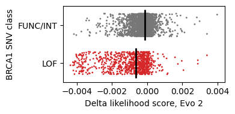

## Zero-shot prediction of *BRCA1* variant effects with Evo 2

The human *BRCA1* gene encodes for a protein that repairs damaged DNA ([Moynahan et al., 1999](https://www.cell.com/molecular-cell/fulltext/S1097-2765%2800%2980202-6)). Certain variants of this gene have been associated with an increased risk of breast and ovarian cancers ([Miki et al., 1994](https://www.science.org/doi/10.1126/science.7545954?url_ver=Z39.88-2003&rfr_id=ori:rid:crossref.org&rfr_dat=cr_pub%20%200pubmed)). Using Evo 2, we can predict whether a particular single nucleotide variant (SNV) of the *BRCA1* gene is likely to be harmful to the protein's function, and thus potentially increase the risk of cancer for the patient with the genetic variant.

We start by loading a dataset from [Findlay et al. (2018)](https://www.nature.com/articles/s41586-018-0461-z), which contains experimentally measured function scores of 3,893 *BRCA1* SNVs. These function scores reflect the extent by which the genetic variant has disrupted the protein's function, with lower scores indicating greater disruption. In this dataset, the SNVs are classified into three categories based on their function scores: `LOF` (loss-of-function), `INT` (intermediate), and `FUNC` (functional). We start by reading in this dataset.


```python
# Install dependencies
!pip install matplotlib pandas seaborn scikit-learn openpyxl

# Required imports
from Bio import SeqIO
import gzip
import matplotlib.pyplot as plt
import numpy as np
import pandas as pd
import os
import seaborn as sns
from sklearn.metrics import roc_auc_score

# Set root path
os.chdir('../..')
```

    Requirement already satisfied: matplotlib in /workspace/writeable/evo2/venv_python3.11/lib/python3.11/site-packages (3.10.6)
    Requirement already satisfied: pandas in /workspace/writeable/evo2/venv_python3.11/lib/python3.11/site-packages (2.3.3)
    Requirement already satisfied: seaborn in /workspace/writeable/evo2/venv_python3.11/lib/python3.11/site-packages (0.13.2)
    Requirement already satisfied: scikit-learn in /workspace/writeable/evo2/venv_python3.11/lib/python3.11/site-packages (1.7.2)
    Requirement already satisfied: openpyxl in /workspace/writeable/evo2/venv_python3.11/lib/python3.11/site-packages (3.1.5)
    Requirement already satisfied: contourpy>=1.0.1 in /workspace/writeable/evo2/venv_python3.11/lib/python3.11/site-packages (from matplotlib) (1.3.3)
    Requirement already satisfied: cycler>=0.10 in /workspace/writeable/evo2/venv_python3.11/lib/python3.11/site-packages (from matplotlib) (0.12.1)
    Requirement already satisfied: fonttools>=4.22.0 in /workspace/writeable/evo2/venv_python3.11/lib/python3.11/site-packages (from matplotlib) (4.60.1)
    Requirement already satisfied: kiwisolver>=1.3.1 in /workspace/writeable/evo2/venv_python3.11/lib/python3.11/site-packages (from matplotlib) (1.4.9)
    Requirement already satisfied: numpy>=1.23 in /workspace/writeable/evo2/venv_python3.11/lib/python3.11/site-packages (from matplotlib) (2.2.6)
    Requirement already satisfied: packaging>=20.0 in /workspace/writeable/evo2/venv_python3.11/lib/python3.11/site-packages (from matplotlib) (25.0)
    Requirement already satisfied: pillow>=8 in /workspace/writeable/evo2/venv_python3.11/lib/python3.11/site-packages (from matplotlib) (11.3.0)
    Requirement already satisfied: pyparsing>=2.3.1 in /workspace/writeable/evo2/venv_python3.11/lib/python3.11/site-packages (from matplotlib) (3.2.5)
    Requirement already satisfied: python-dateutil>=2.7 in /workspace/writeable/evo2/venv_python3.11/lib/python3.11/site-packages (from matplotlib) (2.9.0.post0)


    Requirement already satisfied: pytz>=2020.1 in /workspace/writeable/evo2/venv_python3.11/lib/python3.11/site-packages (from pandas) (2025.2)
    Requirement already satisfied: tzdata>=2022.7 in /workspace/writeable/evo2/venv_python3.11/lib/python3.11/site-packages (from pandas) (2025.2)
    Requirement already satisfied: scipy>=1.8.0 in /workspace/writeable/evo2/venv_python3.11/lib/python3.11/site-packages (from scikit-learn) (1.16.2)
    Requirement already satisfied: joblib>=1.2.0 in /workspace/writeable/evo2/venv_python3.11/lib/python3.11/site-packages (from scikit-learn) (1.5.2)
    Requirement already satisfied: threadpoolctl>=3.1.0 in /workspace/writeable/evo2/venv_python3.11/lib/python3.11/site-packages (from scikit-learn) (3.6.0)
    Requirement already satisfied: et-xmlfile in /workspace/writeable/evo2/venv_python3.11/lib/python3.11/site-packages (from openpyxl) (2.0.0)


    Requirement already satisfied: six>=1.5 in /workspace/writeable/evo2/venv_python3.11/lib/python3.11/site-packages (from python-dateutil>=2.7->matplotlib) (1.17.0)


    
    [notice] A new release of pip is available: 25.1.1 -> 25.2
    [notice] To update, run: pip install --upgrade pip


```python
brca1_df = pd.read_excel(
    os.path.join('notebooks', 'brca1', '41586_2018_461_MOESM3_ESM.xlsx'),
    header=2,
)
brca1_df = brca1_df[[
    'chromosome', 'position (hg19)', 'reference', 'alt', 'function.score.mean', 'func.class',
]]

brca1_df.head(10)
```


<div>
<style scoped>
    .dataframe tbody tr th:only-of-type {
        vertical-align: middle;
    }

    .dataframe tbody tr th {
        vertical-align: top;
    }

    .dataframe thead th {
        text-align: right;
    }
</style>
<table border="1" class="dataframe">
  <thead>
    <tr style="text-align: right;">
      <th></th>
      <th>chromosome</th>
      <th>position (hg19)</th>
      <th>reference</th>
      <th>alt</th>
      <th>function.score.mean</th>
      <th>func.class</th>
    </tr>
  </thead>
  <tbody>
    <tr>
      <th>0</th>
      <td>17</td>
      <td>41276135</td>
      <td>T</td>
      <td>G</td>
      <td>-0.372611</td>
      <td>FUNC</td>
    </tr>
    <tr>
      <th>1</th>
      <td>17</td>
      <td>41276135</td>
      <td>T</td>
      <td>C</td>
      <td>-0.045313</td>
      <td>FUNC</td>
    </tr>
    <tr>
      <th>2</th>
      <td>17</td>
      <td>41276135</td>
      <td>T</td>
      <td>A</td>
      <td>-0.108254</td>
      <td>FUNC</td>
    </tr>
    <tr>
      <th>3</th>
      <td>17</td>
      <td>41276134</td>
      <td>T</td>
      <td>G</td>
      <td>-0.277963</td>
      <td>FUNC</td>
    </tr>
    <tr>
      <th>4</th>
      <td>17</td>
      <td>41276134</td>
      <td>T</td>
      <td>C</td>
      <td>-0.388414</td>
      <td>FUNC</td>
    </tr>
    <tr>
      <th>5</th>
      <td>17</td>
      <td>41276134</td>
      <td>T</td>
      <td>A</td>
      <td>-0.280973</td>
      <td>FUNC</td>
    </tr>
    <tr>
      <th>6</th>
      <td>17</td>
      <td>41276133</td>
      <td>C</td>
      <td>T</td>
      <td>-0.973683</td>
      <td>INT</td>
    </tr>
    <tr>
      <th>7</th>
      <td>17</td>
      <td>41276133</td>
      <td>C</td>
      <td>G</td>
      <td>-0.373489</td>
      <td>FUNC</td>
    </tr>
    <tr>
      <th>8</th>
      <td>17</td>
      <td>41276133</td>
      <td>C</td>
      <td>A</td>
      <td>0.006314</td>
      <td>FUNC</td>
    </tr>
    <tr>
      <th>9</th>
      <td>17</td>
      <td>41276132</td>
      <td>A</td>
      <td>T</td>
      <td>-0.207552</td>
      <td>FUNC</td>
    </tr>
  </tbody>
</table>
</div>


We then group the `FUNC` and `INT` classes of SNVs together into a single category (`FUNC/INT`).


```python
# Rename columns
brca1_df.rename(columns={
    'chromosome': 'chrom',
    'position (hg19)': 'pos',
    'reference': 'ref',
    'alt': 'alt',
    'function.score.mean': 'score',
    'func.class': 'class',
}, inplace=True)

# Convert to two-class system
brca1_df['class'] = brca1_df['class'].replace(['FUNC', 'INT'], 'FUNC/INT')

brca1_df.head(10)
```


<div>
<style scoped>
    .dataframe tbody tr th:only-of-type {
        vertical-align: middle;
    }

    .dataframe tbody tr th {
        vertical-align: top;
    }

    .dataframe thead th {
        text-align: right;
    }
</style>
<table border="1" class="dataframe">
  <thead>
    <tr style="text-align: right;">
      <th></th>
      <th>chrom</th>
      <th>pos</th>
      <th>ref</th>
      <th>alt</th>
      <th>score</th>
      <th>class</th>
    </tr>
  </thead>
  <tbody>
    <tr>
      <th>0</th>
      <td>17</td>
      <td>41276135</td>
      <td>T</td>
      <td>G</td>
      <td>-0.372611</td>
      <td>FUNC/INT</td>
    </tr>
    <tr>
      <th>1</th>
      <td>17</td>
      <td>41276135</td>
      <td>T</td>
      <td>C</td>
      <td>-0.045313</td>
      <td>FUNC/INT</td>
    </tr>
    <tr>
      <th>2</th>
      <td>17</td>
      <td>41276135</td>
      <td>T</td>
      <td>A</td>
      <td>-0.108254</td>
      <td>FUNC/INT</td>
    </tr>
    <tr>
      <th>3</th>
      <td>17</td>
      <td>41276134</td>
      <td>T</td>
      <td>G</td>
      <td>-0.277963</td>
      <td>FUNC/INT</td>
    </tr>
    <tr>
      <th>4</th>
      <td>17</td>
      <td>41276134</td>
      <td>T</td>
      <td>C</td>
      <td>-0.388414</td>
      <td>FUNC/INT</td>
    </tr>
    <tr>
      <th>5</th>
      <td>17</td>
      <td>41276134</td>
      <td>T</td>
      <td>A</td>
      <td>-0.280973</td>
      <td>FUNC/INT</td>
    </tr>
    <tr>
      <th>6</th>
      <td>17</td>
      <td>41276133</td>
      <td>C</td>
      <td>T</td>
      <td>-0.973683</td>
      <td>FUNC/INT</td>
    </tr>
    <tr>
      <th>7</th>
      <td>17</td>
      <td>41276133</td>
      <td>C</td>
      <td>G</td>
      <td>-0.373489</td>
      <td>FUNC/INT</td>
    </tr>
    <tr>
      <th>8</th>
      <td>17</td>
      <td>41276133</td>
      <td>C</td>
      <td>A</td>
      <td>0.006314</td>
      <td>FUNC/INT</td>
    </tr>
    <tr>
      <th>9</th>
      <td>17</td>
      <td>41276132</td>
      <td>A</td>
      <td>T</td>
      <td>-0.207552</td>
      <td>FUNC/INT</td>
    </tr>
  </tbody>
</table>
</div>


We build a function to parse the reference and variant sequences of a 8,192-bp window around the genomic position of each SNV, using the reference sequence of human chromosome 17 where *BRCA1* is located.


```python
WINDOW_SIZE = 8192

# Read the reference genome sequence of chromosome 17
with gzip.open(os.path.join('notebooks', 'brca1', 'GRCh37.p13_chr17.fna.gz'), "rt") as handle:
    for record in SeqIO.parse(handle, "fasta"):
        seq_chr17 = str(record.seq)
        break

def parse_sequences(pos, ref, alt):
    """
    Parse reference and variant sequences from the reference genome sequence.
    """
    p = pos - 1 # Convert to 0-indexed position
    full_seq = seq_chr17

    ref_seq_start = max(0, p - WINDOW_SIZE//2)
    ref_seq_end = min(len(full_seq), p + WINDOW_SIZE//2)
    ref_seq = seq_chr17[ref_seq_start:ref_seq_end]
    snv_pos_in_ref = min(WINDOW_SIZE//2, p)
    var_seq = ref_seq[:snv_pos_in_ref] + alt + ref_seq[snv_pos_in_ref+1:]

    # Sanity checks
    assert len(var_seq) == len(ref_seq)
    assert ref_seq[snv_pos_in_ref] == ref
    assert var_seq[snv_pos_in_ref] == alt

    return ref_seq, var_seq

# Parse sequences for the first variant
row = brca1_df.iloc[0]
ref_seq, var_seq = parse_sequences(row['pos'], row['ref'], row['alt'])

print(row)
print('--')
print(f'Reference, SNV 0: ...{ref_seq[4082:4112]}...')
print(f'Variant, SNV 0:   ...{var_seq[4082:4112]}...')
```

    chrom          17
    pos      41276135
    ref             T
    alt             G
    score   -0.372611
    class    FUNC/INT
    Name: 0, dtype: object
    --
    Reference, SNV 0: ...TGTTCCAATGAACTTTAACACATTAGAAAA...
    Variant, SNV 0:   ...TGTTCCAATGAACTGTAACACATTAGAAAA...


Then, we load Evo 2 1B and score the likelihoods of the reference and variant sequences of each SNV. (Note: we use the smaller Evo 2 1B base model here as a quick demonstration, but we strongly recommend using the larger Evo 2 7B and 40B models for more accurate predictions.)


```python
from evo2.models import Evo2

# Load model
model = Evo2('evo2_1b_base')
```

    /workspace/writeable/evo2/venv_python3.11/lib/python3.11/site-packages/tqdm/auto.py:21: TqdmWarning: IProgress not found. Please update jupyter and ipywidgets. See https://ipywidgets.readthedocs.io/en/stable/user_install.html
      from .autonotebook import tqdm as notebook_tqdm


    
Fetching 4 files:   0%|                                                        | 0/4 [00:00<?, ?it/s]

    
Fetching 4 files: 100%|█████████████████████████████████████████████| 4/4 [00:00<00:00, 33026.02it/s]

    


    Found complete file in repo: evo2_1b_base.pt


    
  0%|                                                                         | 0/25 [00:00<?, ?it/s]

    
 16%|██████████▍                                                      | 4/25 [00:00<00:00, 32.94it/s]

    
100%|███████████████████████████████████████████████████████████████| 25/25 [00:00<00:00, 113.04it/s]

    


    Extra keys in state_dict: {'blocks.3.mixer.dense._extra_state', 'unembed.weight', 'blocks.24.mixer.dense._extra_state', 'blocks.10.mixer.dense._extra_state', 'blocks.17.mixer.dense._extra_state'}


    /workspace/writeable/evo2/venv_python3.11/lib/python3.11/site-packages/transformer_engine/pytorch/module/base.py:630: FutureWarning: You are using `torch.load` with `weights_only=False` (the current default value), which uses the default pickle module implicitly. It is possible to construct malicious pickle data which will execute arbitrary code during unpickling (See https://github.com/pytorch/pytorch/blob/main/SECURITY.md#untrusted-models for more details). In a future release, the default value for `weights_only` will be flipped to `True`. This limits the functions that could be executed during unpickling. Arbitrary objects will no longer be allowed to be loaded via this mode unless they are explicitly allowlisted by the user via `torch.serialization.add_safe_globals`. We recommend you start setting `weights_only=True` for any use case where you don't have full control of the loaded file. Please open an issue on GitHub for any issues related to this experimental feature.
      state = torch.load(state, map_location="cuda")


    /workspace/writeable/evo2/vortex/vortex/model/utils.py:153: FutureWarning: You are using `torch.load` with `weights_only=False` (the current default value), which uses the default pickle module implicitly. It is possible to construct malicious pickle data which will execute arbitrary code during unpickling (See https://github.com/pytorch/pytorch/blob/main/SECURITY.md#untrusted-models for more details). In a future release, the default value for `weights_only` will be flipped to `True`. This limits the functions that could be executed during unpickling. Arbitrary objects will no longer be allowed to be loaded via this mode unless they are explicitly allowlisted by the user via `torch.serialization.add_safe_globals`. We recommend you start setting `weights_only=True` for any use case where you don't have full control of the loaded file. Please open an issue on GitHub for any issues related to this experimental feature.
      return torch_load(state, map_location=device)


```python
# Build mappings of unique reference sequences
ref_seqs = []
ref_seq_to_index = {}

# Parse sequences and store indexes
ref_seq_indexes = []
var_seqs = []

for _, row in brca1_df.iterrows():
    ref_seq, var_seq = parse_sequences(row['pos'], row['ref'], row['alt'])

    # Get or create index for reference sequence
    if ref_seq not in ref_seq_to_index:
        ref_seq_to_index[ref_seq] = len(ref_seqs)
        ref_seqs.append(ref_seq)
    
    ref_seq_indexes.append(ref_seq_to_index[ref_seq])
    var_seqs.append(var_seq)

ref_seq_indexes = np.array(ref_seq_indexes)

print(f'Scoring likelihoods of {len(ref_seqs)} reference sequences with Evo 2...')
ref_scores = model.score_sequences(ref_seqs)

print(f'Scoring likelihoods of {len(var_seqs)} variant sequences with Evo 2...')
var_scores = model.score_sequences(var_seqs)
```

    Scoring likelihoods of 1326 reference sequences with Evo 2...


    
  0%|                                                                       | 0/1326 [00:00<?, ?it/s]

    
  0%|                                                               | 1/1326 [00:00<21:13,  1.04it/s]

    
  0%|▏                                                              | 3/1326 [00:01<07:04,  3.12it/s]

    
  0%|▏                                                              | 5/1326 [00:01<04:31,  4.87it/s]

    
  1%|▎                                                              | 7/1326 [00:01<03:30,  6.28it/s]

    
  1%|▍                                                              | 9/1326 [00:01<02:58,  7.37it/s]

    
  1%|▌                                                             | 11/1326 [00:01<02:40,  8.18it/s]

    
  1%|▌                                                             | 12/1326 [00:02<02:35,  8.47it/s]

    
  1%|▋                                                             | 14/1326 [00:02<02:24,  9.06it/s]

    
  1%|▋                                                             | 16/1326 [00:02<02:18,  9.45it/s]

    
  1%|▊                                                             | 18/1326 [00:02<02:14,  9.71it/s]

    
  2%|▉                                                             | 20/1326 [00:02<02:11,  9.92it/s]

    
  2%|█                                                             | 22/1326 [00:02<02:09, 10.05it/s]

    
  2%|█                                                             | 24/1326 [00:03<02:08, 10.14it/s]

    
  2%|█▏                                                            | 26/1326 [00:03<02:07, 10.22it/s]

    
  2%|█▎                                                            | 28/1326 [00:03<02:06, 10.27it/s]

    
  2%|█▍                                                            | 30/1326 [00:03<02:05, 10.29it/s]

    
  2%|█▍                                                            | 32/1326 [00:03<02:05, 10.32it/s]

    
  3%|█▌                                                            | 34/1326 [00:04<02:04, 10.34it/s]

    
  3%|█▋                                                            | 36/1326 [00:04<02:04, 10.35it/s]

    
  3%|█▊                                                            | 38/1326 [00:04<02:04, 10.36it/s]

    
  3%|█▊                                                            | 40/1326 [00:04<02:04, 10.37it/s]

    
  3%|█▉                                                            | 42/1326 [00:04<02:04, 10.32it/s]

    
  3%|██                                                            | 44/1326 [00:05<02:04, 10.29it/s]

    
  3%|██▏                                                           | 46/1326 [00:05<02:04, 10.30it/s]

    
  4%|██▏                                                           | 48/1326 [00:05<02:04, 10.30it/s]

    
  4%|██▎                                                           | 50/1326 [00:05<02:03, 10.31it/s]

    
  4%|██▍                                                           | 52/1326 [00:05<02:03, 10.35it/s]

    
  4%|██▌                                                           | 54/1326 [00:06<02:02, 10.36it/s]

    
  4%|██▌                                                           | 56/1326 [00:06<02:02, 10.37it/s]

    
  4%|██▋                                                           | 58/1326 [00:06<02:02, 10.38it/s]

    
  5%|██▊                                                           | 60/1326 [00:06<02:02, 10.37it/s]

    
  5%|██▉                                                           | 62/1326 [00:06<02:01, 10.37it/s]

    
  5%|██▉                                                           | 64/1326 [00:07<02:01, 10.37it/s]

    
  5%|███                                                           | 66/1326 [00:07<02:01, 10.38it/s]

    
  5%|███▏                                                          | 68/1326 [00:07<02:01, 10.37it/s]

    
  5%|███▎                                                          | 70/1326 [00:07<02:01, 10.37it/s]

    
  5%|███▎                                                          | 72/1326 [00:07<02:01, 10.32it/s]

    
  6%|███▍                                                          | 74/1326 [00:08<02:01, 10.27it/s]

    
  6%|███▌                                                          | 76/1326 [00:08<02:01, 10.29it/s]

    
  6%|███▋                                                          | 78/1326 [00:08<02:01, 10.29it/s]

    
  6%|███▋                                                          | 80/1326 [00:08<02:00, 10.32it/s]

    
  6%|███▊                                                          | 82/1326 [00:08<02:00, 10.35it/s]

    
  6%|███▉                                                          | 84/1326 [00:08<01:59, 10.37it/s]

    
  6%|████                                                          | 86/1326 [00:09<01:59, 10.38it/s]

    
  7%|████                                                          | 88/1326 [00:09<01:59, 10.39it/s]

    
  7%|████▏                                                         | 90/1326 [00:09<01:59, 10.38it/s]

    
  7%|████▎                                                         | 92/1326 [00:09<01:58, 10.39it/s]

    
  7%|████▍                                                         | 94/1326 [00:09<01:58, 10.40it/s]

    
  7%|████▍                                                         | 96/1326 [00:10<01:58, 10.40it/s]

    
  7%|████▌                                                         | 98/1326 [00:10<01:58, 10.40it/s]

    
  8%|████▌                                                        | 100/1326 [00:10<01:58, 10.36it/s]

    
  8%|████▋                                                        | 102/1326 [00:10<01:58, 10.31it/s]

    
  8%|████▊                                                        | 104/1326 [00:10<01:58, 10.32it/s]

    
  8%|████▉                                                        | 106/1326 [00:11<01:58, 10.29it/s]

    
  8%|████▉                                                        | 108/1326 [00:11<01:58, 10.32it/s]

    
  8%|█████                                                        | 110/1326 [00:11<01:57, 10.34it/s]

    
  8%|█████▏                                                       | 112/1326 [00:11<01:57, 10.36it/s]

    
  9%|█████▏                                                       | 114/1326 [00:11<01:56, 10.36it/s]

    
  9%|█████▎                                                       | 116/1326 [00:12<01:56, 10.38it/s]

    
  9%|█████▍                                                       | 118/1326 [00:12<01:56, 10.39it/s]

    
  9%|█████▌                                                       | 120/1326 [00:12<01:56, 10.38it/s]

    
  9%|█████▌                                                       | 122/1326 [00:12<01:56, 10.37it/s]

    
  9%|█████▋                                                       | 124/1326 [00:12<01:55, 10.38it/s]

    
 10%|█████▊                                                       | 126/1326 [00:13<01:55, 10.38it/s]

    
 10%|█████▉                                                       | 128/1326 [00:13<01:55, 10.38it/s]

    
 10%|█████▉                                                       | 130/1326 [00:13<01:55, 10.34it/s]

    
 10%|██████                                                       | 132/1326 [00:13<01:56, 10.27it/s]

    
 10%|██████▏                                                      | 134/1326 [00:13<01:55, 10.28it/s]

    
 10%|██████▎                                                      | 136/1326 [00:14<01:56, 10.26it/s]

    
 10%|██████▎                                                      | 138/1326 [00:14<01:55, 10.26it/s]

    
 11%|██████▍                                                      | 140/1326 [00:14<01:55, 10.31it/s]

    
 11%|██████▌                                                      | 142/1326 [00:14<01:54, 10.33it/s]

    
 11%|██████▌                                                      | 144/1326 [00:14<01:54, 10.35it/s]

    
 11%|██████▋                                                      | 146/1326 [00:14<01:53, 10.35it/s]

    
 11%|██████▊                                                      | 148/1326 [00:15<01:53, 10.37it/s]

    
 11%|██████▉                                                      | 150/1326 [00:15<01:53, 10.37it/s]

    
 11%|██████▉                                                      | 152/1326 [00:15<01:53, 10.38it/s]

    
 12%|███████                                                      | 154/1326 [00:15<01:52, 10.37it/s]

    
 12%|███████▏                                                     | 156/1326 [00:15<01:52, 10.37it/s]

    
 12%|███████▎                                                     | 158/1326 [00:16<01:52, 10.37it/s]

    
 12%|███████▎                                                     | 160/1326 [00:16<01:52, 10.34it/s]

    
 12%|███████▍                                                     | 162/1326 [00:16<01:53, 10.26it/s]

    
 12%|███████▌                                                     | 164/1326 [00:16<01:53, 10.25it/s]

    
 13%|███████▋                                                     | 166/1326 [00:16<01:53, 10.26it/s]

    
 13%|███████▋                                                     | 168/1326 [00:17<01:52, 10.25it/s]

    
 13%|███████▊                                                     | 170/1326 [00:17<01:52, 10.27it/s]

    
 13%|███████▉                                                     | 172/1326 [00:17<01:51, 10.31it/s]

    
 13%|████████                                                     | 174/1326 [00:17<01:51, 10.33it/s]

    
 13%|████████                                                     | 176/1326 [00:17<01:51, 10.34it/s]

    
 13%|████████▏                                                    | 178/1326 [00:18<01:50, 10.36it/s]

    
 14%|████████▎                                                    | 180/1326 [00:18<01:50, 10.36it/s]

    
 14%|████████▎                                                    | 182/1326 [00:18<01:50, 10.37it/s]

    
 14%|████████▍                                                    | 184/1326 [00:18<01:50, 10.38it/s]

    
 14%|████████▌                                                    | 186/1326 [00:18<01:49, 10.38it/s]

    
 14%|████████▋                                                    | 188/1326 [00:19<01:49, 10.38it/s]

    
 14%|████████▋                                                    | 190/1326 [00:19<01:49, 10.37it/s]

    
 14%|████████▊                                                    | 192/1326 [00:19<01:49, 10.36it/s]

    
 15%|████████▉                                                    | 194/1326 [00:19<01:49, 10.32it/s]

    
 15%|█████████                                                    | 196/1326 [00:19<01:50, 10.27it/s]

    
 15%|█████████                                                    | 198/1326 [00:20<01:49, 10.28it/s]

    
 15%|█████████▏                                                   | 200/1326 [00:20<01:49, 10.27it/s]

    
 15%|█████████▎                                                   | 202/1326 [00:20<01:49, 10.30it/s]

    
 15%|█████████▍                                                   | 204/1326 [00:20<01:48, 10.33it/s]

    
 16%|█████████▍                                                   | 206/1326 [00:20<01:48, 10.33it/s]

    
 16%|█████████▌                                                   | 208/1326 [00:20<01:48, 10.35it/s]

    
 16%|█████████▋                                                   | 210/1326 [00:21<01:47, 10.36it/s]

    
 16%|█████████▊                                                   | 212/1326 [00:21<01:47, 10.36it/s]

    
 16%|█████████▊                                                   | 214/1326 [00:21<01:47, 10.37it/s]

    
 16%|█████████▉                                                   | 216/1326 [00:21<01:47, 10.37it/s]

    
 16%|██████████                                                   | 218/1326 [00:21<01:46, 10.36it/s]

    
 17%|██████████                                                   | 220/1326 [00:22<01:46, 10.36it/s]

    
 17%|██████████▏                                                  | 222/1326 [00:22<01:46, 10.35it/s]

    
 17%|██████████▎                                                  | 224/1326 [00:22<01:46, 10.33it/s]

    
 17%|██████████▍                                                  | 226/1326 [00:22<01:46, 10.32it/s]

    
 17%|██████████▍                                                  | 228/1326 [00:22<01:46, 10.32it/s]

    
 17%|██████████▌                                                  | 230/1326 [00:23<01:46, 10.32it/s]

    
 17%|██████████▋                                                  | 232/1326 [00:23<01:45, 10.35it/s]

    
 18%|██████████▊                                                  | 234/1326 [00:23<01:45, 10.36it/s]

    
 18%|██████████▊                                                  | 236/1326 [00:23<01:45, 10.36it/s]

    
 18%|██████████▉                                                  | 238/1326 [00:23<01:45, 10.36it/s]

    
 18%|███████████                                                  | 240/1326 [00:24<01:44, 10.37it/s]

    
 18%|███████████▏                                                 | 242/1326 [00:24<01:44, 10.38it/s]

    
 18%|███████████▏                                                 | 244/1326 [00:24<01:44, 10.38it/s]

    
 19%|███████████▎                                                 | 246/1326 [00:24<01:44, 10.38it/s]

    
 19%|███████████▍                                                 | 248/1326 [00:24<01:43, 10.38it/s]

    
 19%|███████████▌                                                 | 250/1326 [00:25<01:43, 10.38it/s]

    
 19%|███████████▌                                                 | 252/1326 [00:25<01:43, 10.36it/s]

    
 19%|███████████▋                                                 | 254/1326 [00:25<01:43, 10.34it/s]

    
 19%|███████████▊                                                 | 256/1326 [00:25<01:43, 10.32it/s]

    
 19%|███████████▊                                                 | 258/1326 [00:25<01:43, 10.30it/s]

    
 20%|███████████▉                                                 | 260/1326 [00:26<01:43, 10.30it/s]

    
 20%|████████████                                                 | 262/1326 [00:26<01:43, 10.32it/s]

    
 20%|████████████▏                                                | 264/1326 [00:26<01:42, 10.34it/s]

    
 20%|████████████▏                                                | 266/1326 [00:26<01:42, 10.35it/s]

    
 20%|████████████▎                                                | 268/1326 [00:26<01:42, 10.36it/s]

    
 20%|████████████▍                                                | 270/1326 [00:26<01:41, 10.37it/s]

    
 21%|████████████▌                                                | 272/1326 [00:27<01:41, 10.37it/s]

    
 21%|████████████▌                                                | 274/1326 [00:27<01:41, 10.37it/s]

    
 21%|████████████▋                                                | 276/1326 [00:27<01:41, 10.36it/s]

    
 21%|████████████▊                                                | 278/1326 [00:27<01:41, 10.37it/s]

    
 21%|████████████▉                                                | 280/1326 [00:27<01:40, 10.37it/s]

    
 21%|████████████▉                                                | 282/1326 [00:28<01:40, 10.37it/s]

    
 21%|█████████████                                                | 284/1326 [00:28<01:40, 10.35it/s]

    
 22%|█████████████▏                                               | 286/1326 [00:28<01:40, 10.34it/s]

    
 22%|█████████████▏                                               | 288/1326 [00:28<01:40, 10.33it/s]

    
 22%|█████████████▎                                               | 290/1326 [00:28<01:40, 10.33it/s]

    
 22%|█████████████▍                                               | 292/1326 [00:29<01:39, 10.35it/s]

    
 22%|█████████████▌                                               | 294/1326 [00:29<01:39, 10.36it/s]

    
 22%|█████████████▌                                               | 296/1326 [00:29<01:39, 10.36it/s]

    
 22%|█████████████▋                                               | 298/1326 [00:29<01:39, 10.37it/s]

    
 23%|█████████████▊                                               | 300/1326 [00:29<01:38, 10.37it/s]

    
 23%|█████████████▉                                               | 302/1326 [00:30<01:38, 10.37it/s]

    
 23%|█████████████▉                                               | 304/1326 [00:30<01:38, 10.37it/s]

    
 23%|██████████████                                               | 306/1326 [00:30<01:38, 10.37it/s]

    
 23%|██████████████▏                                              | 308/1326 [00:30<01:38, 10.37it/s]

    
 23%|██████████████▎                                              | 310/1326 [00:30<01:38, 10.35it/s]

    
 24%|██████████████▎                                              | 312/1326 [00:31<01:38, 10.33it/s]

    
 24%|██████████████▍                                              | 314/1326 [00:31<01:38, 10.32it/s]

    
 24%|██████████████▌                                              | 316/1326 [00:31<01:37, 10.31it/s]

    
 24%|██████████████▋                                              | 318/1326 [00:31<01:37, 10.31it/s]

    
 24%|██████████████▋                                              | 320/1326 [00:31<01:37, 10.32it/s]

    
 24%|██████████████▊                                              | 322/1326 [00:31<01:37, 10.34it/s]

    
 24%|██████████████▉                                              | 324/1326 [00:32<01:36, 10.35it/s]

    
 25%|██████████████▉                                              | 326/1326 [00:32<01:36, 10.36it/s]

    
 25%|███████████████                                              | 328/1326 [00:32<01:36, 10.37it/s]

    
 25%|███████████████▏                                             | 330/1326 [00:32<01:35, 10.38it/s]

    
 25%|███████████████▎                                             | 332/1326 [00:32<01:35, 10.38it/s]

    
 25%|███████████████▎                                             | 334/1326 [00:33<01:35, 10.38it/s]

    
 25%|███████████████▍                                             | 336/1326 [00:33<01:35, 10.38it/s]

    
 25%|███████████████▌                                             | 338/1326 [00:33<01:35, 10.38it/s]

    
 26%|███████████████▋                                             | 340/1326 [00:33<01:35, 10.36it/s]

    
 26%|███████████████▋                                             | 342/1326 [00:33<01:35, 10.35it/s]

    
 26%|███████████████▊                                             | 344/1326 [00:34<01:35, 10.33it/s]

    
 26%|███████████████▉                                             | 346/1326 [00:34<01:34, 10.32it/s]

    
 26%|████████████████                                             | 348/1326 [00:34<01:34, 10.34it/s]

    
 26%|████████████████                                             | 350/1326 [00:34<01:34, 10.35it/s]

    
 27%|████████████████▏                                            | 352/1326 [00:34<01:34, 10.35it/s]

    
 27%|████████████████▎                                            | 354/1326 [00:35<01:33, 10.36it/s]

    
 27%|████████████████▍                                            | 356/1326 [00:35<01:33, 10.36it/s]

    
 27%|████████████████▍                                            | 358/1326 [00:35<01:33, 10.36it/s]

    
 27%|████████████████▌                                            | 360/1326 [00:35<01:33, 10.36it/s]

    
 27%|████████████████▋                                            | 362/1326 [00:35<01:33, 10.36it/s]

    
 27%|████████████████▋                                            | 364/1326 [00:36<01:32, 10.37it/s]

    
 28%|████████████████▊                                            | 366/1326 [00:36<01:32, 10.36it/s]

    
 28%|████████████████▉                                            | 368/1326 [00:36<01:32, 10.36it/s]

    
 28%|█████████████████                                            | 370/1326 [00:36<01:32, 10.37it/s]

    
 28%|█████████████████                                            | 372/1326 [00:36<01:31, 10.38it/s]

    
 28%|█████████████████▏                                           | 374/1326 [00:37<01:31, 10.38it/s]

    
 28%|█████████████████▎                                           | 376/1326 [00:37<01:31, 10.38it/s]

    
 29%|█████████████████▍                                           | 378/1326 [00:37<01:31, 10.38it/s]

    
 29%|█████████████████▍                                           | 380/1326 [00:37<01:31, 10.38it/s]

    
 29%|█████████████████▌                                           | 382/1326 [00:37<01:30, 10.39it/s]

    
 29%|█████████████████▋                                           | 384/1326 [00:37<01:30, 10.39it/s]

    
 29%|█████████████████▊                                           | 386/1326 [00:38<01:30, 10.38it/s]

    
 29%|█████████████████▊                                           | 388/1326 [00:38<01:30, 10.38it/s]

    
 29%|█████████████████▉                                           | 390/1326 [00:38<01:30, 10.38it/s]

    
 30%|██████████████████                                           | 392/1326 [00:38<01:30, 10.38it/s]

    
 30%|██████████████████▏                                          | 394/1326 [00:38<01:29, 10.38it/s]

    
 30%|██████████████████▏                                          | 396/1326 [00:39<01:29, 10.38it/s]

    
 30%|██████████████████▎                                          | 398/1326 [00:39<01:29, 10.38it/s]

    
 30%|██████████████████▍                                          | 400/1326 [00:39<01:29, 10.38it/s]

    
 30%|██████████████████▍                                          | 402/1326 [00:39<01:28, 10.38it/s]

    
 30%|██████████████████▌                                          | 404/1326 [00:39<01:28, 10.38it/s]

    
 31%|██████████████████▋                                          | 406/1326 [00:40<01:28, 10.37it/s]

    
 31%|██████████████████▊                                          | 408/1326 [00:40<01:28, 10.37it/s]

    
 31%|██████████████████▊                                          | 410/1326 [00:40<01:28, 10.38it/s]

    
 31%|██████████████████▉                                          | 412/1326 [00:40<01:28, 10.37it/s]

    
 31%|███████████████████                                          | 414/1326 [00:40<01:27, 10.37it/s]

    
 31%|███████████████████▏                                         | 416/1326 [00:41<01:27, 10.37it/s]

    
 32%|███████████████████▏                                         | 418/1326 [00:41<01:27, 10.38it/s]

    
 32%|███████████████████▎                                         | 420/1326 [00:41<01:27, 10.38it/s]

    
 32%|███████████████████▍                                         | 422/1326 [00:41<01:27, 10.38it/s]

    
 32%|███████████████████▌                                         | 424/1326 [00:41<01:26, 10.39it/s]

    
 32%|███████████████████▌                                         | 426/1326 [00:42<01:26, 10.39it/s]

    
 32%|███████████████████▋                                         | 428/1326 [00:42<01:26, 10.38it/s]

    
 32%|███████████████████▊                                         | 430/1326 [00:42<01:26, 10.38it/s]

    
 33%|███████████████████▊                                         | 432/1326 [00:42<01:26, 10.37it/s]

    
 33%|███████████████████▉                                         | 434/1326 [00:42<01:25, 10.38it/s]

    
 33%|████████████████████                                         | 436/1326 [00:42<01:25, 10.37it/s]

    
 33%|████████████████████▏                                        | 438/1326 [00:43<01:25, 10.38it/s]

    
 33%|████████████████████▏                                        | 440/1326 [00:43<01:25, 10.38it/s]

    
 33%|████████████████████▎                                        | 442/1326 [00:43<01:25, 10.38it/s]

    
 33%|████████████████████▍                                        | 444/1326 [00:43<01:25, 10.38it/s]

    
 34%|████████████████████▌                                        | 446/1326 [00:43<01:24, 10.38it/s]

    
 34%|████████████████████▌                                        | 448/1326 [00:44<01:24, 10.38it/s]

    
 34%|████████████████████▋                                        | 450/1326 [00:44<01:24, 10.38it/s]

    
 34%|████████████████████▊                                        | 452/1326 [00:44<01:24, 10.37it/s]

    
 34%|████████████████████▉                                        | 454/1326 [00:44<01:24, 10.37it/s]

    
 34%|████████████████████▉                                        | 456/1326 [00:44<01:23, 10.37it/s]

    
 35%|█████████████████████                                        | 458/1326 [00:45<01:23, 10.37it/s]

    
 35%|█████████████████████▏                                       | 460/1326 [00:45<01:23, 10.37it/s]

    
 35%|█████████████████████▎                                       | 462/1326 [00:45<01:23, 10.38it/s]

    
 35%|█████████████████████▎                                       | 464/1326 [00:45<01:23, 10.38it/s]

    
 35%|█████████████████████▍                                       | 466/1326 [00:45<01:22, 10.38it/s]

    
 35%|█████████████████████▌                                       | 468/1326 [00:46<01:22, 10.39it/s]

    
 35%|█████████████████████▌                                       | 470/1326 [00:46<01:22, 10.38it/s]

    
 36%|█████████████████████▋                                       | 472/1326 [00:46<01:22, 10.38it/s]

    
 36%|█████████████████████▊                                       | 474/1326 [00:46<01:22, 10.38it/s]

    
 36%|█████████████████████▉                                       | 476/1326 [00:46<01:21, 10.38it/s]

    
 36%|█████████████████████▉                                       | 478/1326 [00:47<01:21, 10.39it/s]

    
 36%|██████████████████████                                       | 480/1326 [00:47<01:21, 10.38it/s]

    
 36%|██████████████████████▏                                      | 482/1326 [00:47<01:21, 10.38it/s]

    
 37%|██████████████████████▎                                      | 484/1326 [00:47<01:21, 10.37it/s]

    
 37%|██████████████████████▎                                      | 486/1326 [00:47<01:20, 10.38it/s]

    
 37%|██████████████████████▍                                      | 488/1326 [00:47<01:20, 10.38it/s]

    
 37%|██████████████████████▌                                      | 490/1326 [00:48<01:20, 10.38it/s]

    
 37%|██████████████████████▋                                      | 492/1326 [00:48<01:20, 10.37it/s]

    
 37%|██████████████████████▋                                      | 494/1326 [00:48<01:20, 10.37it/s]

    
 37%|██████████████████████▊                                      | 496/1326 [00:48<01:20, 10.37it/s]

    
 38%|██████████████████████▉                                      | 498/1326 [00:48<01:19, 10.37it/s]

    
 38%|███████████████████████                                      | 500/1326 [00:49<01:19, 10.36it/s]

    
 38%|███████████████████████                                      | 502/1326 [00:49<01:19, 10.37it/s]

    
 38%|███████████████████████▏                                     | 504/1326 [00:49<01:19, 10.37it/s]

    
 38%|███████████████████████▎                                     | 506/1326 [00:49<01:19, 10.36it/s]

    
 38%|███████████████████████▎                                     | 508/1326 [00:49<01:18, 10.37it/s]

    
 38%|███████████████████████▍                                     | 510/1326 [00:50<01:18, 10.36it/s]

    
 39%|███████████████████████▌                                     | 512/1326 [00:50<01:18, 10.36it/s]

    
 39%|███████████████████████▋                                     | 514/1326 [00:50<01:18, 10.36it/s]

    
 39%|███████████████████████▋                                     | 516/1326 [00:50<01:18, 10.36it/s]

    
 39%|███████████████████████▊                                     | 518/1326 [00:50<01:17, 10.37it/s]

    
 39%|███████████████████████▉                                     | 520/1326 [00:51<01:17, 10.37it/s]

    
 39%|████████████████████████                                     | 522/1326 [00:51<01:17, 10.38it/s]

    
 40%|████████████████████████                                     | 524/1326 [00:51<01:17, 10.37it/s]

    
 40%|████████████████████████▏                                    | 526/1326 [00:51<01:17, 10.36it/s]

    
 40%|████████████████████████▎                                    | 528/1326 [00:51<01:16, 10.37it/s]

    
 40%|████████████████████████▍                                    | 530/1326 [00:52<01:16, 10.38it/s]

    
 40%|████████████████████████▍                                    | 532/1326 [00:52<01:16, 10.38it/s]

    
 40%|████████████████████████▌                                    | 534/1326 [00:52<01:16, 10.39it/s]

    
 40%|████████████████████████▋                                    | 536/1326 [00:52<01:16, 10.38it/s]

    
 41%|████████████████████████▋                                    | 538/1326 [00:52<01:15, 10.38it/s]

    
 41%|████████████████████████▊                                    | 540/1326 [00:53<01:15, 10.37it/s]

    
 41%|████████████████████████▉                                    | 542/1326 [00:53<01:15, 10.37it/s]

    
 41%|█████████████████████████                                    | 544/1326 [00:53<01:15, 10.37it/s]

    
 41%|█████████████████████████                                    | 546/1326 [00:53<01:15, 10.37it/s]

    
 41%|█████████████████████████▏                                   | 548/1326 [00:53<01:15, 10.37it/s]

    
 41%|█████████████████████████▎                                   | 550/1326 [00:53<01:14, 10.37it/s]

    
 42%|█████████████████████████▍                                   | 552/1326 [00:54<01:14, 10.37it/s]

    
 42%|█████████████████████████▍                                   | 554/1326 [00:54<01:14, 10.37it/s]

    
 42%|█████████████████████████▌                                   | 556/1326 [00:54<01:14, 10.37it/s]

    
 42%|█████████████████████████▋                                   | 558/1326 [00:54<01:14, 10.37it/s]

    
 42%|█████████████████████████▊                                   | 560/1326 [00:54<01:13, 10.38it/s]

    
 42%|█████████████████████████▊                                   | 562/1326 [00:55<01:13, 10.38it/s]

    
 43%|█████████████████████████▉                                   | 564/1326 [00:55<01:13, 10.38it/s]

    
 43%|██████████████████████████                                   | 566/1326 [00:55<01:13, 10.38it/s]

    
 43%|██████████████████████████▏                                  | 568/1326 [00:55<01:13, 10.38it/s]

    
 43%|██████████████████████████▏                                  | 570/1326 [00:55<01:12, 10.38it/s]

    
 43%|██████████████████████████▎                                  | 572/1326 [00:56<01:12, 10.37it/s]

    
 43%|██████████████████████████▍                                  | 574/1326 [00:56<01:12, 10.38it/s]

    
 43%|██████████████████████████▍                                  | 576/1326 [00:56<01:12, 10.38it/s]

    
 44%|██████████████████████████▌                                  | 578/1326 [00:56<01:12, 10.38it/s]

    
 44%|██████████████████████████▋                                  | 580/1326 [00:56<01:11, 10.38it/s]

    
 44%|██████████████████████████▊                                  | 582/1326 [00:57<01:11, 10.37it/s]

    
 44%|██████████████████████████▊                                  | 584/1326 [00:57<01:11, 10.36it/s]

    
 44%|██████████████████████████▉                                  | 586/1326 [00:57<01:11, 10.37it/s]

    
 44%|███████████████████████████                                  | 588/1326 [00:57<01:11, 10.37it/s]

    
 44%|███████████████████████████▏                                 | 590/1326 [00:57<01:11, 10.37it/s]

    
 45%|███████████████████████████▏                                 | 592/1326 [00:58<01:10, 10.37it/s]

    
 45%|███████████████████████████▎                                 | 594/1326 [00:58<01:10, 10.37it/s]

    
 45%|███████████████████████████▍                                 | 596/1326 [00:58<01:10, 10.38it/s]

    
 45%|███████████████████████████▌                                 | 598/1326 [00:58<01:10, 10.37it/s]

    
 45%|███████████████████████████▌                                 | 600/1326 [00:58<01:10, 10.37it/s]

    
 45%|███████████████████████████▋                                 | 602/1326 [00:58<01:09, 10.37it/s]

    
 46%|███████████████████████████▊                                 | 604/1326 [00:59<01:09, 10.37it/s]

    
 46%|███████████████████████████▉                                 | 606/1326 [00:59<01:09, 10.37it/s]

    
 46%|███████████████████████████▉                                 | 608/1326 [00:59<01:09, 10.38it/s]

    
 46%|████████████████████████████                                 | 610/1326 [00:59<01:09, 10.37it/s]

    
 46%|████████████████████████████▏                                | 612/1326 [00:59<01:08, 10.37it/s]

    
 46%|████████████████████████████▏                                | 614/1326 [01:00<01:08, 10.37it/s]

    
 46%|████████████████████████████▎                                | 616/1326 [01:00<01:08, 10.37it/s]

    
 47%|████████████████████████████▍                                | 618/1326 [01:00<01:08, 10.31it/s]

    
 47%|████████████████████████████▌                                | 620/1326 [01:00<01:08, 10.33it/s]

    
 47%|████████████████████████████▌                                | 622/1326 [01:00<01:08, 10.34it/s]

    
 47%|████████████████████████████▋                                | 624/1326 [01:01<01:07, 10.34it/s]

    
 47%|████████████████████████████▊                                | 626/1326 [01:01<01:07, 10.35it/s]

    
 47%|████████████████████████████▉                                | 628/1326 [01:01<01:07, 10.36it/s]

    
 48%|████████████████████████████▉                                | 630/1326 [01:01<01:07, 10.35it/s]

    
 48%|█████████████████████████████                                | 632/1326 [01:01<01:07, 10.34it/s]

    
 48%|█████████████████████████████▏                               | 634/1326 [01:02<01:06, 10.35it/s]

    
 48%|█████████████████████████████▎                               | 636/1326 [01:02<01:06, 10.36it/s]

    
 48%|█████████████████████████████▎                               | 638/1326 [01:02<01:06, 10.36it/s]

    
 48%|█████████████████████████████▍                               | 640/1326 [01:02<01:06, 10.36it/s]

    
 48%|█████████████████████████████▌                               | 642/1326 [01:02<01:05, 10.37it/s]

    
 49%|█████████████████████████████▋                               | 644/1326 [01:03<01:05, 10.37it/s]

    
 49%|█████████████████████████████▋                               | 646/1326 [01:03<01:05, 10.37it/s]

    
 49%|█████████████████████████████▊                               | 648/1326 [01:03<01:05, 10.37it/s]

    
 49%|█████████████████████████████▉                               | 650/1326 [01:03<01:05, 10.37it/s]

    
 49%|█████████████████████████████▉                               | 652/1326 [01:03<01:04, 10.37it/s]

    
 49%|██████████████████████████████                               | 654/1326 [01:04<01:04, 10.38it/s]

    
 49%|██████████████████████████████▏                              | 656/1326 [01:04<01:04, 10.38it/s]

    
 50%|██████████████████████████████▎                              | 658/1326 [01:04<01:04, 10.38it/s]

    
 50%|██████████████████████████████▎                              | 660/1326 [01:04<01:04, 10.39it/s]

    
 50%|██████████████████████████████▍                              | 662/1326 [01:04<01:03, 10.38it/s]

    
 50%|██████████████████████████████▌                              | 664/1326 [01:04<01:03, 10.37it/s]

    
 50%|██████████████████████████████▋                              | 666/1326 [01:05<01:03, 10.37it/s]

    
 50%|██████████████████████████████▋                              | 668/1326 [01:05<01:03, 10.37it/s]

    
 51%|██████████████████████████████▊                              | 670/1326 [01:05<01:03, 10.37it/s]

    
 51%|██████████████████████████████▉                              | 672/1326 [01:05<01:03, 10.37it/s]

    
 51%|███████████████████████████████                              | 674/1326 [01:05<01:02, 10.37it/s]

    
 51%|███████████████████████████████                              | 676/1326 [01:06<01:02, 10.37it/s]

    
 51%|███████████████████████████████▏                             | 678/1326 [01:06<01:02, 10.37it/s]

    
 51%|███████████████████████████████▎                             | 680/1326 [01:06<01:02, 10.36it/s]

    
 51%|███████████████████████████████▎                             | 682/1326 [01:06<01:02, 10.37it/s]

    
 52%|███████████████████████████████▍                             | 684/1326 [01:06<01:01, 10.36it/s]

    
 52%|███████████████████████████████▌                             | 686/1326 [01:07<01:01, 10.36it/s]

    
 52%|███████████████████████████████▋                             | 688/1326 [01:07<01:01, 10.37it/s]

    
 52%|███████████████████████████████▋                             | 690/1326 [01:07<01:01, 10.37it/s]

    
 52%|███████████████████████████████▊                             | 692/1326 [01:07<01:01, 10.37it/s]

    
 52%|███████████████████████████████▉                             | 694/1326 [01:07<01:00, 10.37it/s]

    
 52%|████████████████████████████████                             | 696/1326 [01:08<01:00, 10.38it/s]

    
 53%|████████████████████████████████                             | 698/1326 [01:08<01:00, 10.38it/s]

    
 53%|████████████████████████████████▏                            | 700/1326 [01:08<01:00, 10.38it/s]

    
 53%|████████████████████████████████▎                            | 702/1326 [01:08<01:00, 10.37it/s]

    
 53%|████████████████████████████████▍                            | 704/1326 [01:08<00:59, 10.37it/s]

    
 53%|████████████████████████████████▍                            | 706/1326 [01:09<00:59, 10.37it/s]

    
 53%|████████████████████████████████▌                            | 708/1326 [01:09<00:59, 10.37it/s]

    
 54%|████████████████████████████████▋                            | 710/1326 [01:09<00:59, 10.37it/s]

    
 54%|████████████████████████████████▊                            | 712/1326 [01:09<00:59, 10.38it/s]

    
 54%|████████████████████████████████▊                            | 714/1326 [01:09<00:58, 10.38it/s]

    
 54%|████████████████████████████████▉                            | 716/1326 [01:09<00:58, 10.38it/s]

    
 54%|█████████████████████████████████                            | 718/1326 [01:10<00:58, 10.37it/s]

    
 54%|█████████████████████████████████                            | 720/1326 [01:10<00:58, 10.37it/s]

    
 54%|█████████████████████████████████▏                           | 722/1326 [01:10<00:58, 10.36it/s]

    
 55%|█████████████████████████████████▎                           | 724/1326 [01:10<00:58, 10.36it/s]

    
 55%|█████████████████████████████████▍                           | 726/1326 [01:10<00:57, 10.36it/s]

    
 55%|█████████████████████████████████▍                           | 728/1326 [01:11<00:57, 10.36it/s]

    
 55%|█████████████████████████████████▌                           | 730/1326 [01:11<00:57, 10.36it/s]

    
 55%|█████████████████████████████████▋                           | 732/1326 [01:11<00:57, 10.37it/s]

    
 55%|█████████████████████████████████▊                           | 734/1326 [01:11<00:57, 10.37it/s]

    
 56%|█████████████████████████████████▊                           | 736/1326 [01:11<00:56, 10.36it/s]

    
 56%|█████████████████████████████████▉                           | 738/1326 [01:12<00:56, 10.36it/s]

    
 56%|██████████████████████████████████                           | 740/1326 [01:12<00:56, 10.36it/s]

    
 56%|██████████████████████████████████▏                          | 742/1326 [01:12<00:56, 10.36it/s]

    
 56%|██████████████████████████████████▏                          | 744/1326 [01:12<00:56, 10.36it/s]

    
 56%|██████████████████████████████████▎                          | 746/1326 [01:12<00:55, 10.37it/s]

    
 56%|██████████████████████████████████▍                          | 748/1326 [01:13<00:55, 10.37it/s]

    
 57%|██████████████████████████████████▌                          | 750/1326 [01:13<00:55, 10.37it/s]

    
 57%|██████████████████████████████████▌                          | 752/1326 [01:13<00:55, 10.37it/s]

    
 57%|██████████████████████████████████▋                          | 754/1326 [01:13<00:55, 10.37it/s]

    
 57%|██████████████████████████████████▊                          | 756/1326 [01:13<00:54, 10.37it/s]

    
 57%|██████████████████████████████████▊                          | 758/1326 [01:14<00:54, 10.37it/s]

    
 57%|██████████████████████████████████▉                          | 760/1326 [01:14<00:54, 10.38it/s]

    
 57%|███████████████████████████████████                          | 762/1326 [01:14<00:54, 10.37it/s]

    
 58%|███████████████████████████████████▏                         | 764/1326 [01:14<00:54, 10.37it/s]

    
 58%|███████████████████████████████████▏                         | 766/1326 [01:14<00:53, 10.37it/s]

    
 58%|███████████████████████████████████▎                         | 768/1326 [01:15<00:53, 10.37it/s]

    
 58%|███████████████████████████████████▍                         | 770/1326 [01:15<00:53, 10.36it/s]

    
 58%|███████████████████████████████████▌                         | 772/1326 [01:15<00:53, 10.35it/s]

    
 58%|███████████████████████████████████▌                         | 774/1326 [01:15<00:53, 10.36it/s]

    
 59%|███████████████████████████████████▋                         | 776/1326 [01:15<00:53, 10.36it/s]

    
 59%|███████████████████████████████████▊                         | 778/1326 [01:15<00:52, 10.35it/s]

    
 59%|███████████████████████████████████▉                         | 780/1326 [01:16<00:52, 10.34it/s]

    
 59%|███████████████████████████████████▉                         | 782/1326 [01:16<00:52, 10.35it/s]

    
 59%|████████████████████████████████████                         | 784/1326 [01:16<00:52, 10.34it/s]

    
 59%|████████████████████████████████████▏                        | 786/1326 [01:16<00:52, 10.35it/s]

    
 59%|████████████████████████████████████▎                        | 788/1326 [01:16<00:52, 10.34it/s]

    
 60%|████████████████████████████████████▎                        | 790/1326 [01:17<00:51, 10.35it/s]

    
 60%|████████████████████████████████████▍                        | 792/1326 [01:17<00:51, 10.36it/s]

    
 60%|████████████████████████████████████▌                        | 794/1326 [01:17<00:51, 10.35it/s]

    
 60%|████████████████████████████████████▌                        | 796/1326 [01:17<00:51, 10.36it/s]

    
 60%|████████████████████████████████████▋                        | 798/1326 [01:17<00:50, 10.36it/s]

    
 60%|████████████████████████████████████▊                        | 800/1326 [01:18<00:50, 10.36it/s]

    
 60%|████████████████████████████████████▉                        | 802/1326 [01:18<00:50, 10.36it/s]

    
 61%|████████████████████████████████████▉                        | 804/1326 [01:18<00:50, 10.36it/s]

    
 61%|█████████████████████████████████████                        | 806/1326 [01:18<00:50, 10.37it/s]

    
 61%|█████████████████████████████████████▏                       | 808/1326 [01:18<00:49, 10.37it/s]

    
 61%|█████████████████████████████████████▎                       | 810/1326 [01:19<00:49, 10.36it/s]

    
 61%|█████████████████████████████████████▎                       | 812/1326 [01:19<00:49, 10.36it/s]

    
 61%|█████████████████████████████████████▍                       | 814/1326 [01:19<00:49, 10.35it/s]

    
 62%|█████████████████████████████████████▌                       | 816/1326 [01:19<00:49, 10.35it/s]

    
 62%|█████████████████████████████████████▋                       | 818/1326 [01:19<00:49, 10.36it/s]

    
 62%|█████████████████████████████████████▋                       | 820/1326 [01:20<00:48, 10.36it/s]

    
 62%|█████████████████████████████████████▊                       | 822/1326 [01:20<00:48, 10.36it/s]

    
 62%|█████████████████████████████████████▉                       | 824/1326 [01:20<00:48, 10.36it/s]

    
 62%|█████████████████████████████████████▉                       | 826/1326 [01:20<00:48, 10.36it/s]

    
 62%|██████████████████████████████████████                       | 828/1326 [01:20<00:48, 10.35it/s]

    
 63%|██████████████████████████████████████▏                      | 830/1326 [01:20<00:47, 10.35it/s]

    
 63%|██████████████████████████████████████▎                      | 832/1326 [01:21<00:47, 10.35it/s]

    
 63%|██████████████████████████████████████▎                      | 834/1326 [01:21<00:47, 10.35it/s]

    
 63%|██████████████████████████████████████▍                      | 836/1326 [01:21<00:47, 10.36it/s]

    
 63%|██████████████████████████████████████▌                      | 838/1326 [01:21<00:47, 10.36it/s]

    
 63%|██████████████████████████████████████▋                      | 840/1326 [01:21<00:46, 10.35it/s]

    
 63%|██████████████████████████████████████▋                      | 842/1326 [01:22<00:46, 10.36it/s]

    
 64%|██████████████████████████████████████▊                      | 844/1326 [01:22<00:46, 10.36it/s]

    
 64%|██████████████████████████████████████▉                      | 846/1326 [01:22<00:46, 10.36it/s]

    
 64%|███████████████████████████████████████                      | 848/1326 [01:22<00:46, 10.36it/s]

    
 64%|███████████████████████████████████████                      | 850/1326 [01:22<00:45, 10.37it/s]

    
 64%|███████████████████████████████████████▏                     | 852/1326 [01:23<00:45, 10.37it/s]

    
 64%|███████████████████████████████████████▎                     | 854/1326 [01:23<00:45, 10.36it/s]

    
 65%|███████████████████████████████████████▍                     | 856/1326 [01:23<00:45, 10.37it/s]

    
 65%|███████████████████████████████████████▍                     | 858/1326 [01:23<00:45, 10.36it/s]

    
 65%|███████████████████████████████████████▌                     | 860/1326 [01:23<00:45, 10.35it/s]

    
 65%|███████████████████████████████████████▋                     | 862/1326 [01:24<00:44, 10.36it/s]

    
 65%|███████████████████████████████████████▋                     | 864/1326 [01:24<00:44, 10.36it/s]

    
 65%|███████████████████████████████████████▊                     | 866/1326 [01:24<00:44, 10.35it/s]

    
 65%|███████████████████████████████████████▉                     | 868/1326 [01:24<00:44, 10.35it/s]

    
 66%|████████████████████████████████████████                     | 870/1326 [01:24<00:44, 10.34it/s]

    
 66%|████████████████████████████████████████                     | 872/1326 [01:25<00:43, 10.35it/s]

    
 66%|████████████████████████████████████████▏                    | 874/1326 [01:25<00:43, 10.34it/s]

    
 66%|████████████████████████████████████████▎                    | 876/1326 [01:25<00:43, 10.35it/s]

    
 66%|████████████████████████████████████████▍                    | 878/1326 [01:25<00:43, 10.36it/s]

    
 66%|████████████████████████████████████████▍                    | 880/1326 [01:25<00:43, 10.37it/s]

    
 67%|████████████████████████████████████████▌                    | 882/1326 [01:26<00:42, 10.37it/s]

    
 67%|████████████████████████████████████████▋                    | 884/1326 [01:26<00:42, 10.37it/s]

    
 67%|████████████████████████████████████████▊                    | 886/1326 [01:26<00:42, 10.37it/s]

    
 67%|████████████████████████████████████████▊                    | 888/1326 [01:26<00:42, 10.37it/s]

    
 67%|████████████████████████████████████████▉                    | 890/1326 [01:26<00:42, 10.38it/s]

    
 67%|█████████████████████████████████████████                    | 892/1326 [01:26<00:41, 10.37it/s]

    
 67%|█████████████████████████████████████████▏                   | 894/1326 [01:27<00:41, 10.37it/s]

    
 68%|█████████████████████████████████████████▏                   | 896/1326 [01:27<00:41, 10.37it/s]

    
 68%|█████████████████████████████████████████▎                   | 898/1326 [01:27<00:41, 10.36it/s]

    
 68%|█████████████████████████████████████████▍                   | 900/1326 [01:27<00:41, 10.37it/s]

    
 68%|█████████████████████████████████████████▍                   | 902/1326 [01:27<00:40, 10.37it/s]

    
 68%|█████████████████████████████████████████▌                   | 904/1326 [01:28<00:40, 10.37it/s]

    
 68%|█████████████████████████████████████████▋                   | 906/1326 [01:28<00:40, 10.37it/s]

    
 68%|█████████████████████████████████████████▊                   | 908/1326 [01:28<00:40, 10.37it/s]

    
 69%|█████████████████████████████████████████▊                   | 910/1326 [01:28<00:40, 10.37it/s]

    
 69%|█████████████████████████████████████████▉                   | 912/1326 [01:28<00:39, 10.36it/s]

    
 69%|██████████████████████████████████████████                   | 914/1326 [01:29<00:39, 10.35it/s]

    
 69%|██████████████████████████████████████████▏                  | 916/1326 [01:29<00:39, 10.36it/s]

    
 69%|██████████████████████████████████████████▏                  | 918/1326 [01:29<00:39, 10.36it/s]

    
 69%|██████████████████████████████████████████▎                  | 920/1326 [01:29<00:39, 10.35it/s]

    
 70%|██████████████████████████████████████████▍                  | 922/1326 [01:29<00:38, 10.36it/s]

    
 70%|██████████████████████████████████████████▌                  | 924/1326 [01:30<00:38, 10.36it/s]

    
 70%|██████████████████████████████████████████▌                  | 926/1326 [01:30<00:38, 10.36it/s]

    
 70%|██████████████████████████████████████████▋                  | 928/1326 [01:30<00:38, 10.37it/s]

    
 70%|██████████████████████████████████████████▊                  | 930/1326 [01:30<00:38, 10.37it/s]

    
 70%|██████████████████████████████████████████▊                  | 932/1326 [01:30<00:37, 10.38it/s]

    
 70%|██████████████████████████████████████████▉                  | 934/1326 [01:31<00:37, 10.38it/s]

    
 71%|███████████████████████████████████████████                  | 936/1326 [01:31<00:37, 10.38it/s]

    
 71%|███████████████████████████████████████████▏                 | 938/1326 [01:31<00:37, 10.38it/s]

    
 71%|███████████████████████████████████████████▏                 | 940/1326 [01:31<00:37, 10.38it/s]

    
 71%|███████████████████████████████████████████▎                 | 942/1326 [01:31<00:36, 10.38it/s]

    
 71%|███████████████████████████████████████████▍                 | 944/1326 [01:31<00:36, 10.37it/s]

    
 71%|███████████████████████████████████████████▌                 | 946/1326 [01:32<00:36, 10.37it/s]

    
 71%|███████████████████████████████████████████▌                 | 948/1326 [01:32<00:36, 10.36it/s]

    
 72%|███████████████████████████████████████████▋                 | 950/1326 [01:32<00:36, 10.36it/s]

    
 72%|███████████████████████████████████████████▊                 | 952/1326 [01:32<00:36, 10.35it/s]

    
 72%|███████████████████████████████████████████▉                 | 954/1326 [01:32<00:35, 10.35it/s]

    
 72%|███████████████████████████████████████████▉                 | 956/1326 [01:33<00:35, 10.36it/s]

    
 72%|████████████████████████████████████████████                 | 958/1326 [01:33<00:35, 10.35it/s]

    
 72%|████████████████████████████████████████████▏                | 960/1326 [01:33<00:35, 10.35it/s]

    
 73%|████████████████████████████████████████████▎                | 962/1326 [01:33<00:35, 10.36it/s]

    
 73%|████████████████████████████████████████████▎                | 964/1326 [01:33<00:34, 10.37it/s]

    
 73%|████████████████████████████████████████████▍                | 966/1326 [01:34<00:34, 10.37it/s]

    
 73%|████████████████████████████████████████████▌                | 968/1326 [01:34<00:34, 10.38it/s]

    
 73%|████████████████████████████████████████████▌                | 970/1326 [01:34<00:34, 10.37it/s]

    
 73%|████████████████████████████████████████████▋                | 972/1326 [01:34<00:34, 10.38it/s]

    
 73%|████████████████████████████████████████████▊                | 974/1326 [01:34<00:33, 10.38it/s]

    
 74%|████████████████████████████████████████████▉                | 976/1326 [01:35<00:33, 10.39it/s]

    
 74%|████████████████████████████████████████████▉                | 978/1326 [01:35<00:33, 10.35it/s]

    
 74%|█████████████████████████████████████████████                | 980/1326 [01:35<00:33, 10.35it/s]

    
 74%|█████████████████████████████████████████████▏               | 982/1326 [01:35<00:33, 10.36it/s]

    
 74%|█████████████████████████████████████████████▎               | 984/1326 [01:35<00:33, 10.36it/s]

    
 74%|█████████████████████████████████████████████▎               | 986/1326 [01:36<00:32, 10.36it/s]

    
 75%|█████████████████████████████████████████████▍               | 988/1326 [01:36<00:32, 10.37it/s]

    
 75%|█████████████████████████████████████████████▌               | 990/1326 [01:36<00:32, 10.36it/s]

    
 75%|█████████████████████████████████████████████▋               | 992/1326 [01:36<00:32, 10.37it/s]

    
 75%|█████████████████████████████████████████████▋               | 994/1326 [01:36<00:32, 10.37it/s]

    
 75%|█████████████████████████████████████████████▊               | 996/1326 [01:37<00:31, 10.37it/s]

    
 75%|█████████████████████████████████████████████▉               | 998/1326 [01:37<00:31, 10.37it/s]

    
 75%|█████████████████████████████████████████████▏              | 1000/1326 [01:37<00:31, 10.36it/s]

    
 76%|█████████████████████████████████████████████▎              | 1002/1326 [01:37<00:31, 10.36it/s]

    
 76%|█████████████████████████████████████████████▍              | 1004/1326 [01:37<00:31, 10.36it/s]

    
 76%|█████████████████████████████████████████████▌              | 1006/1326 [01:37<00:30, 10.36it/s]

    
 76%|█████████████████████████████████████████████▌              | 1008/1326 [01:38<00:30, 10.35it/s]

    
 76%|█████████████████████████████████████████████▋              | 1010/1326 [01:38<00:30, 10.36it/s]

    
 76%|█████████████████████████████████████████████▊              | 1012/1326 [01:38<00:30, 10.36it/s]

    
 76%|█████████████████████████████████████████████▉              | 1014/1326 [01:38<00:30, 10.35it/s]

    
 77%|█████████████████████████████████████████████▉              | 1016/1326 [01:38<00:29, 10.35it/s]

    
 77%|██████████████████████████████████████████████              | 1018/1326 [01:39<00:29, 10.36it/s]

    
 77%|██████████████████████████████████████████████▏             | 1020/1326 [01:39<00:29, 10.37it/s]

    
 77%|██████████████████████████████████████████████▏             | 1022/1326 [01:39<00:29, 10.37it/s]

    
 77%|██████████████████████████████████████████████▎             | 1024/1326 [01:39<00:29, 10.37it/s]

    
 77%|██████████████████████████████████████████████▍             | 1026/1326 [01:39<00:28, 10.37it/s]

    
 78%|██████████████████████████████████████████████▌             | 1028/1326 [01:40<00:28, 10.37it/s]

    
 78%|██████████████████████████████████████████████▌             | 1030/1326 [01:40<00:28, 10.37it/s]

    
 78%|██████████████████████████████████████████████▋             | 1032/1326 [01:40<00:28, 10.38it/s]

    
 78%|██████████████████████████████████████████████▊             | 1034/1326 [01:40<00:28, 10.37it/s]

    
 78%|██████████████████████████████████████████████▉             | 1036/1326 [01:40<00:27, 10.37it/s]

    
 78%|██████████████████████████████████████████████▉             | 1038/1326 [01:41<00:27, 10.36it/s]

    
 78%|███████████████████████████████████████████████             | 1040/1326 [01:41<00:27, 10.36it/s]

    
 79%|███████████████████████████████████████████████▏            | 1042/1326 [01:41<00:27, 10.36it/s]

    
 79%|███████████████████████████████████████████████▏            | 1044/1326 [01:41<00:27, 10.36it/s]

    
 79%|███████████████████████████████████████████████▎            | 1046/1326 [01:41<00:27, 10.36it/s]

    
 79%|███████████████████████████████████████████████▍            | 1048/1326 [01:42<00:26, 10.36it/s]

    
 79%|███████████████████████████████████████████████▌            | 1050/1326 [01:42<00:26, 10.36it/s]

    
 79%|███████████████████████████████████████████████▌            | 1052/1326 [01:42<00:26, 10.36it/s]

    
 79%|███████████████████████████████████████████████▋            | 1054/1326 [01:42<00:26, 10.36it/s]

    
 80%|███████████████████████████████████████████████▊            | 1056/1326 [01:42<00:26, 10.35it/s]

    
 80%|███████████████████████████████████████████████▊            | 1058/1326 [01:42<00:25, 10.35it/s]

    
 80%|███████████████████████████████████████████████▉            | 1060/1326 [01:43<00:25, 10.35it/s]

    
 80%|████████████████████████████████████████████████            | 1062/1326 [01:43<00:25, 10.35it/s]

    
 80%|████████████████████████████████████████████████▏           | 1064/1326 [01:43<00:25, 10.35it/s]

    
 80%|████████████████████████████████████████████████▏           | 1066/1326 [01:43<00:25, 10.36it/s]

    
 81%|████████████████████████████████████████████████▎           | 1068/1326 [01:43<00:24, 10.37it/s]

    
 81%|████████████████████████████████████████████████▍           | 1070/1326 [01:44<00:24, 10.37it/s]

    
 81%|████████████████████████████████████████████████▌           | 1072/1326 [01:44<00:24, 10.37it/s]

    
 81%|████████████████████████████████████████████████▌           | 1074/1326 [01:44<00:24, 10.37it/s]

    
 81%|████████████████████████████████████████████████▋           | 1076/1326 [01:44<00:24, 10.37it/s]

    
 81%|████████████████████████████████████████████████▊           | 1078/1326 [01:44<00:23, 10.37it/s]

    
 81%|████████████████████████████████████████████████▊           | 1080/1326 [01:45<00:23, 10.37it/s]

    
 82%|████████████████████████████████████████████████▉           | 1082/1326 [01:45<00:23, 10.37it/s]

    
 82%|█████████████████████████████████████████████████           | 1084/1326 [01:45<00:23, 10.37it/s]

    
 82%|█████████████████████████████████████████████████▏          | 1086/1326 [01:45<00:23, 10.37it/s]

    
 82%|█████████████████████████████████████████████████▏          | 1088/1326 [01:45<00:22, 10.37it/s]

    
 82%|█████████████████████████████████████████████████▎          | 1090/1326 [01:46<00:22, 10.36it/s]

    
 82%|█████████████████████████████████████████████████▍          | 1092/1326 [01:46<00:22, 10.35it/s]

    
 83%|█████████████████████████████████████████████████▌          | 1094/1326 [01:46<00:22, 10.35it/s]

    
 83%|█████████████████████████████████████████████████▌          | 1096/1326 [01:46<00:22, 10.34it/s]

    
 83%|█████████████████████████████████████████████████▋          | 1098/1326 [01:46<00:22, 10.35it/s]

    
 83%|█████████████████████████████████████████████████▊          | 1100/1326 [01:47<00:21, 10.35it/s]

    
 83%|█████████████████████████████████████████████████▊          | 1102/1326 [01:47<00:21, 10.34it/s]

    
 83%|█████████████████████████████████████████████████▉          | 1104/1326 [01:47<00:21, 10.35it/s]

    
 83%|██████████████████████████████████████████████████          | 1106/1326 [01:47<00:21, 10.36it/s]

    
 84%|██████████████████████████████████████████████████▏         | 1108/1326 [01:47<00:21, 10.36it/s]

    
 84%|██████████████████████████████████████████████████▏         | 1110/1326 [01:48<00:20, 10.36it/s]

    
 84%|██████████████████████████████████████████████████▎         | 1112/1326 [01:48<00:20, 10.36it/s]

    
 84%|██████████████████████████████████████████████████▍         | 1114/1326 [01:48<00:20, 10.36it/s]

    
 84%|██████████████████████████████████████████████████▍         | 1116/1326 [01:48<00:20, 10.37it/s]

    
 84%|██████████████████████████████████████████████████▌         | 1118/1326 [01:48<00:20, 10.37it/s]

    
 84%|██████████████████████████████████████████████████▋         | 1120/1326 [01:48<00:19, 10.36it/s]

    
 85%|██████████████████████████████████████████████████▊         | 1122/1326 [01:49<00:19, 10.36it/s]

    
 85%|██████████████████████████████████████████████████▊         | 1124/1326 [01:49<00:19, 10.37it/s]

    
 85%|██████████████████████████████████████████████████▉         | 1126/1326 [01:49<00:19, 10.37it/s]

    
 85%|███████████████████████████████████████████████████         | 1128/1326 [01:49<00:19, 10.36it/s]

    
 85%|███████████████████████████████████████████████████▏        | 1130/1326 [01:49<00:18, 10.37it/s]

    
 85%|███████████████████████████████████████████████████▏        | 1132/1326 [01:50<00:18, 10.37it/s]

    
 86%|███████████████████████████████████████████████████▎        | 1134/1326 [01:50<00:18, 10.35it/s]

    
 86%|███████████████████████████████████████████████████▍        | 1136/1326 [01:50<00:18, 10.36it/s]

    
 86%|███████████████████████████████████████████████████▍        | 1138/1326 [01:50<00:18, 10.37it/s]

    
 86%|███████████████████████████████████████████████████▌        | 1140/1326 [01:50<00:17, 10.36it/s]

    
 86%|███████████████████████████████████████████████████▋        | 1142/1326 [01:51<00:17, 10.36it/s]

    
 86%|███████████████████████████████████████████████████▊        | 1144/1326 [01:51<00:17, 10.36it/s]

    
 86%|███████████████████████████████████████████████████▊        | 1146/1326 [01:51<00:17, 10.36it/s]

    
 87%|███████████████████████████████████████████████████▉        | 1148/1326 [01:51<00:17, 10.35it/s]

    
 87%|████████████████████████████████████████████████████        | 1150/1326 [01:51<00:17, 10.35it/s]

    
 87%|████████████████████████████████████████████████████▏       | 1152/1326 [01:52<00:16, 10.36it/s]

    
 87%|████████████████████████████████████████████████████▏       | 1154/1326 [01:52<00:16, 10.35it/s]

    
 87%|████████████████████████████████████████████████████▎       | 1156/1326 [01:52<00:16, 10.35it/s]

    
 87%|████████████████████████████████████████████████████▍       | 1158/1326 [01:52<00:16, 10.35it/s]

    
 87%|████████████████████████████████████████████████████▍       | 1160/1326 [01:52<00:16, 10.36it/s]

    
 88%|████████████████████████████████████████████████████▌       | 1162/1326 [01:53<00:15, 10.37it/s]

    
 88%|████████████████████████████████████████████████████▋       | 1164/1326 [01:53<00:15, 10.37it/s]

    
 88%|████████████████████████████████████████████████████▊       | 1166/1326 [01:53<00:15, 10.37it/s]

    
 88%|████████████████████████████████████████████████████▊       | 1168/1326 [01:53<00:15, 10.38it/s]

    
 88%|████████████████████████████████████████████████████▉       | 1170/1326 [01:53<00:15, 10.38it/s]

    
 88%|█████████████████████████████████████████████████████       | 1172/1326 [01:53<00:14, 10.38it/s]

    
 89%|█████████████████████████████████████████████████████       | 1174/1326 [01:54<00:14, 10.37it/s]

    
 89%|█████████████████████████████████████████████████████▏      | 1176/1326 [01:54<00:14, 10.37it/s]

    
 89%|█████████████████████████████████████████████████████▎      | 1178/1326 [01:54<00:14, 10.36it/s]

    
 89%|█████████████████████████████████████████████████████▍      | 1180/1326 [01:54<00:14, 10.36it/s]

    
 89%|█████████████████████████████████████████████████████▍      | 1182/1326 [01:54<00:13, 10.36it/s]

    
 89%|█████████████████████████████████████████████████████▌      | 1184/1326 [01:55<00:13, 10.36it/s]

    
 89%|█████████████████████████████████████████████████████▋      | 1186/1326 [01:55<00:13, 10.35it/s]

    
 90%|█████████████████████████████████████████████████████▊      | 1188/1326 [01:55<00:13, 10.35it/s]

    
 90%|█████████████████████████████████████████████████████▊      | 1190/1326 [01:55<00:13, 10.36it/s]

    
 90%|█████████████████████████████████████████████████████▉      | 1192/1326 [01:55<00:12, 10.37it/s]

    
 90%|██████████████████████████████████████████████████████      | 1194/1326 [01:56<00:12, 10.37it/s]

    
 90%|██████████████████████████████████████████████████████      | 1196/1326 [01:56<00:12, 10.37it/s]

    
 90%|██████████████████████████████████████████████████████▏     | 1198/1326 [01:56<00:12, 10.37it/s]

    
 90%|██████████████████████████████████████████████████████▎     | 1200/1326 [01:56<00:12, 10.36it/s]

    
 91%|██████████████████████████████████████████████████████▍     | 1202/1326 [01:56<00:11, 10.36it/s]

    
 91%|██████████████████████████████████████████████████████▍     | 1204/1326 [01:57<00:11, 10.36it/s]

    
 91%|██████████████████████████████████████████████████████▌     | 1206/1326 [01:57<00:11, 10.37it/s]

    
 91%|██████████████████████████████████████████████████████▋     | 1208/1326 [01:57<00:11, 10.37it/s]

    
 91%|██████████████████████████████████████████████████████▊     | 1210/1326 [01:57<00:11, 10.37it/s]

    
 91%|██████████████████████████████████████████████████████▊     | 1212/1326 [01:57<00:10, 10.38it/s]

    
 92%|██████████████████████████████████████████████████████▉     | 1214/1326 [01:58<00:10, 10.38it/s]

    
 92%|███████████████████████████████████████████████████████     | 1216/1326 [01:58<00:10, 10.38it/s]

    
 92%|███████████████████████████████████████████████████████     | 1218/1326 [01:58<00:10, 10.38it/s]

    
 92%|███████████████████████████████████████████████████████▏    | 1220/1326 [01:58<00:10, 10.38it/s]

    
 92%|███████████████████████████████████████████████████████▎    | 1222/1326 [01:58<00:10, 10.39it/s]

    
 92%|███████████████████████████████████████████████████████▍    | 1224/1326 [01:59<00:09, 10.38it/s]

    
 92%|███████████████████████████████████████████████████████▍    | 1226/1326 [01:59<00:09, 10.37it/s]

    
 93%|███████████████████████████████████████████████████████▌    | 1228/1326 [01:59<00:09, 10.37it/s]

    
 93%|███████████████████████████████████████████████████████▋    | 1230/1326 [01:59<00:09, 10.37it/s]

    
 93%|███████████████████████████████████████████████████████▋    | 1232/1326 [01:59<00:09, 10.37it/s]

    
 93%|███████████████████████████████████████████████████████▊    | 1234/1326 [01:59<00:08, 10.36it/s]

    
 93%|███████████████████████████████████████████████████████▉    | 1236/1326 [02:00<00:08, 10.36it/s]

    
 93%|████████████████████████████████████████████████████████    | 1238/1326 [02:00<00:08, 10.35it/s]

    
 94%|████████████████████████████████████████████████████████    | 1240/1326 [02:00<00:08, 10.35it/s]

    
 94%|████████████████████████████████████████████████████████▏   | 1242/1326 [02:00<00:08, 10.35it/s]

    
 94%|████████████████████████████████████████████████████████▎   | 1244/1326 [02:00<00:07, 10.35it/s]

    
 94%|████████████████████████████████████████████████████████▍   | 1246/1326 [02:01<00:07, 10.36it/s]

    
 94%|████████████████████████████████████████████████████████▍   | 1248/1326 [02:01<00:07, 10.34it/s]

    
 94%|████████████████████████████████████████████████████████▌   | 1250/1326 [02:01<00:07, 10.33it/s]

    
 94%|████████████████████████████████████████████████████████▋   | 1252/1326 [02:01<00:07, 10.32it/s]

    
 95%|████████████████████████████████████████████████████████▋   | 1254/1326 [02:01<00:06, 10.32it/s]

    
 95%|████████████████████████████████████████████████████████▊   | 1256/1326 [02:02<00:06, 10.34it/s]

    
 95%|████████████████████████████████████████████████████████▉   | 1258/1326 [02:02<00:06, 10.34it/s]

    
 95%|█████████████████████████████████████████████████████████   | 1260/1326 [02:02<00:06, 10.35it/s]

    
 95%|█████████████████████████████████████████████████████████   | 1262/1326 [02:02<00:06, 10.36it/s]

    
 95%|█████████████████████████████████████████████████████████▏  | 1264/1326 [02:02<00:05, 10.37it/s]

    
 95%|█████████████████████████████████████████████████████████▎  | 1266/1326 [02:03<00:05, 10.37it/s]

    
 96%|█████████████████████████████████████████████████████████▍  | 1268/1326 [02:03<00:05, 10.35it/s]

    
 96%|█████████████████████████████████████████████████████████▍  | 1270/1326 [02:03<00:05, 10.36it/s]

    
 96%|█████████████████████████████████████████████████████████▌  | 1272/1326 [02:03<00:05, 10.36it/s]

    
 96%|█████████████████████████████████████████████████████████▋  | 1274/1326 [02:03<00:05, 10.36it/s]

    
 96%|█████████████████████████████████████████████████████████▋  | 1276/1326 [02:04<00:04, 10.36it/s]

    
 96%|█████████████████████████████████████████████████████████▊  | 1278/1326 [02:04<00:04, 10.34it/s]

    
 97%|█████████████████████████████████████████████████████████▉  | 1280/1326 [02:04<00:04, 10.32it/s]

    
 97%|██████████████████████████████████████████████████████████  | 1282/1326 [02:04<00:04, 10.32it/s]

    
 97%|██████████████████████████████████████████████████████████  | 1284/1326 [02:04<00:04, 10.32it/s]

    
 97%|██████████████████████████████████████████████████████████▏ | 1286/1326 [02:05<00:03, 10.33it/s]

    
 97%|██████████████████████████████████████████████████████████▎ | 1288/1326 [02:05<00:03, 10.34it/s]

    
 97%|██████████████████████████████████████████████████████████▎ | 1290/1326 [02:05<00:03, 10.34it/s]

    
 97%|██████████████████████████████████████████████████████████▍ | 1292/1326 [02:05<00:03, 10.36it/s]

    
 98%|██████████████████████████████████████████████████████████▌ | 1294/1326 [02:05<00:03, 10.36it/s]

    
 98%|██████████████████████████████████████████████████████████▋ | 1296/1326 [02:05<00:02, 10.35it/s]

    
 98%|██████████████████████████████████████████████████████████▋ | 1298/1326 [02:06<00:02, 10.35it/s]

    
 98%|██████████████████████████████████████████████████████████▊ | 1300/1326 [02:06<00:02, 10.35it/s]

    
 98%|██████████████████████████████████████████████████████████▉ | 1302/1326 [02:06<00:02, 10.35it/s]

    
 98%|███████████████████████████████████████████████████████████ | 1304/1326 [02:06<00:02, 10.36it/s]

    
 98%|███████████████████████████████████████████████████████████ | 1306/1326 [02:06<00:01, 10.35it/s]

    
 99%|███████████████████████████████████████████████████████████▏| 1308/1326 [02:07<00:01, 10.34it/s]

    
 99%|███████████████████████████████████████████████████████████▎| 1310/1326 [02:07<00:01, 10.33it/s]

    
 99%|███████████████████████████████████████████████████████████▎| 1312/1326 [02:07<00:01, 10.32it/s]

    
 99%|███████████████████████████████████████████████████████████▍| 1314/1326 [02:07<00:01, 10.33it/s]

    
 99%|███████████████████████████████████████████████████████████▌| 1316/1326 [02:07<00:00, 10.34it/s]

    
 99%|███████████████████████████████████████████████████████████▋| 1318/1326 [02:08<00:00, 10.35it/s]

    
100%|███████████████████████████████████████████████████████████▋| 1320/1326 [02:08<00:00, 10.36it/s]

    
100%|███████████████████████████████████████████████████████████▊| 1322/1326 [02:08<00:00, 10.36it/s]

    
100%|███████████████████████████████████████████████████████████▉| 1324/1326 [02:08<00:00, 10.36it/s]

    
100%|████████████████████████████████████████████████████████████| 1326/1326 [02:08<00:00, 10.36it/s]

    
100%|████████████████████████████████████████████████████████████| 1326/1326 [02:08<00:00, 10.29it/s]

    


    Scoring likelihoods of 3893 variant sequences with Evo 2...


    
  0%|                                                                       | 0/3893 [00:00<?, ?it/s]

    
  0%|                                                               | 2/3893 [00:00<06:14, 10.38it/s]

    
  0%|                                                               | 4/3893 [00:00<06:15, 10.36it/s]

    
  0%|                                                               | 6/3893 [00:00<06:15, 10.35it/s]

    
  0%|▏                                                              | 8/3893 [00:00<06:15, 10.35it/s]

    
  0%|▏                                                             | 10/3893 [00:00<06:15, 10.35it/s]

    
  0%|▏                                                             | 12/3893 [00:01<06:15, 10.35it/s]

    
  0%|▏                                                             | 14/3893 [00:01<06:14, 10.35it/s]

    
  0%|▎                                                             | 16/3893 [00:01<06:14, 10.35it/s]

    
  0%|▎                                                             | 18/3893 [00:01<06:14, 10.34it/s]

    
  1%|▎                                                             | 20/3893 [00:01<06:14, 10.34it/s]

    
  1%|▎                                                             | 22/3893 [00:02<06:14, 10.35it/s]

    
  1%|▍                                                             | 24/3893 [00:02<06:13, 10.35it/s]

    
  1%|▍                                                             | 26/3893 [00:02<06:13, 10.37it/s]

    
  1%|▍                                                             | 28/3893 [00:02<06:12, 10.37it/s]

    
  1%|▍                                                             | 30/3893 [00:02<06:12, 10.36it/s]

    
  1%|▌                                                             | 32/3893 [00:03<06:12, 10.36it/s]

    
  1%|▌                                                             | 34/3893 [00:03<06:12, 10.37it/s]

    
  1%|▌                                                             | 36/3893 [00:03<06:12, 10.36it/s]

    
  1%|▌                                                             | 38/3893 [00:03<06:12, 10.35it/s]

    
  1%|▋                                                             | 40/3893 [00:03<06:12, 10.35it/s]

    
  1%|▋                                                             | 42/3893 [00:04<06:12, 10.34it/s]

    
  1%|▋                                                             | 44/3893 [00:04<06:12, 10.32it/s]

    
  1%|▋                                                             | 46/3893 [00:04<06:12, 10.32it/s]

    
  1%|▊                                                             | 48/3893 [00:04<06:12, 10.31it/s]

    
  1%|▊                                                             | 50/3893 [00:04<06:12, 10.32it/s]

    
  1%|▊                                                             | 52/3893 [00:05<06:11, 10.33it/s]

    
  1%|▊                                                             | 54/3893 [00:05<06:11, 10.33it/s]

    
  1%|▉                                                             | 56/3893 [00:05<06:10, 10.35it/s]

    
  1%|▉                                                             | 58/3893 [00:05<06:10, 10.35it/s]

    
  2%|▉                                                             | 60/3893 [00:05<06:10, 10.35it/s]

    
  2%|▉                                                             | 62/3893 [00:05<06:10, 10.34it/s]

    
  2%|█                                                             | 64/3893 [00:06<06:10, 10.34it/s]

    
  2%|█                                                             | 66/3893 [00:06<06:10, 10.34it/s]

    
  2%|█                                                             | 68/3893 [00:06<06:09, 10.34it/s]

    
  2%|█                                                             | 70/3893 [00:06<06:09, 10.34it/s]

    
  2%|█▏                                                            | 72/3893 [00:06<06:09, 10.34it/s]

    
  2%|█▏                                                            | 74/3893 [00:07<06:10, 10.32it/s]

    
  2%|█▏                                                            | 76/3893 [00:07<06:10, 10.31it/s]

    
  2%|█▏                                                            | 78/3893 [00:07<06:10, 10.29it/s]

    
  2%|█▎                                                            | 80/3893 [00:07<06:10, 10.29it/s]

    
  2%|█▎                                                            | 82/3893 [00:07<06:09, 10.31it/s]

    
  2%|█▎                                                            | 84/3893 [00:08<06:08, 10.33it/s]

    
  2%|█▎                                                            | 86/3893 [00:08<06:08, 10.34it/s]

    
  2%|█▍                                                            | 88/3893 [00:08<06:08, 10.34it/s]

    
  2%|█▍                                                            | 90/3893 [00:08<06:07, 10.35it/s]

    
  2%|█▍                                                            | 92/3893 [00:08<06:07, 10.34it/s]

    
  2%|█▍                                                            | 94/3893 [00:09<06:07, 10.35it/s]

    
  2%|█▌                                                            | 96/3893 [00:09<06:07, 10.34it/s]

    
  3%|█▌                                                            | 98/3893 [00:09<06:07, 10.34it/s]

    
  3%|█▌                                                           | 100/3893 [00:09<06:07, 10.33it/s]

    
  3%|█▌                                                           | 102/3893 [00:09<06:06, 10.34it/s]

    
  3%|█▋                                                           | 104/3893 [00:10<06:06, 10.34it/s]

    
  3%|█▋                                                           | 106/3893 [00:10<06:05, 10.36it/s]

    
  3%|█▋                                                           | 108/3893 [00:10<06:05, 10.36it/s]

    
  3%|█▋                                                           | 110/3893 [00:10<06:04, 10.36it/s]

    
  3%|█▊                                                           | 112/3893 [00:10<06:04, 10.37it/s]

    
  3%|█▊                                                           | 114/3893 [00:11<06:04, 10.37it/s]

    
  3%|█▊                                                           | 116/3893 [00:11<06:04, 10.37it/s]

    
  3%|█▊                                                           | 118/3893 [00:11<06:04, 10.37it/s]

    
  3%|█▉                                                           | 120/3893 [00:11<06:06, 10.30it/s]

    
  3%|█▉                                                           | 122/3893 [00:11<06:05, 10.32it/s]

    
  3%|█▉                                                           | 124/3893 [00:11<06:04, 10.33it/s]

    
  3%|█▉                                                           | 126/3893 [00:12<06:04, 10.34it/s]

    
  3%|██                                                           | 128/3893 [00:12<06:03, 10.35it/s]

    
  3%|██                                                           | 130/3893 [00:12<06:03, 10.36it/s]

    
  3%|██                                                           | 132/3893 [00:12<06:02, 10.37it/s]

    
  3%|██                                                           | 134/3893 [00:12<06:02, 10.36it/s]

    
  3%|██▏                                                          | 136/3893 [00:13<06:02, 10.35it/s]

    
  4%|██▏                                                          | 138/3893 [00:13<06:02, 10.35it/s]

    
  4%|██▏                                                          | 140/3893 [00:13<06:02, 10.35it/s]

    
  4%|██▏                                                          | 142/3893 [00:13<06:02, 10.35it/s]

    
  4%|██▎                                                          | 144/3893 [00:13<06:02, 10.35it/s]

    
  4%|██▎                                                          | 146/3893 [00:14<06:02, 10.35it/s]

    
  4%|██▎                                                          | 148/3893 [00:14<06:01, 10.35it/s]

    
  4%|██▎                                                          | 150/3893 [00:14<06:01, 10.35it/s]

    
  4%|██▍                                                          | 152/3893 [00:14<06:01, 10.35it/s]

    
  4%|██▍                                                          | 154/3893 [00:14<06:01, 10.35it/s]

    
  4%|██▍                                                          | 156/3893 [00:15<06:01, 10.35it/s]

    
  4%|██▍                                                          | 158/3893 [00:15<06:00, 10.36it/s]

    
  4%|██▌                                                          | 160/3893 [00:15<06:00, 10.35it/s]

    
  4%|██▌                                                          | 162/3893 [00:15<06:00, 10.35it/s]

    
  4%|██▌                                                          | 164/3893 [00:15<06:00, 10.34it/s]

    
  4%|██▌                                                          | 166/3893 [00:16<06:00, 10.34it/s]

    
  4%|██▋                                                          | 168/3893 [00:16<06:00, 10.34it/s]

    
  4%|██▋                                                          | 170/3893 [00:16<05:59, 10.35it/s]

    
  4%|██▋                                                          | 172/3893 [00:16<05:59, 10.35it/s]

    
  4%|██▋                                                          | 174/3893 [00:16<05:58, 10.36it/s]

    
  5%|██▊                                                          | 176/3893 [00:17<05:58, 10.36it/s]

    
  5%|██▊                                                          | 178/3893 [00:17<05:58, 10.37it/s]

    
  5%|██▊                                                          | 180/3893 [00:17<05:58, 10.36it/s]

    
  5%|██▊                                                          | 182/3893 [00:17<05:58, 10.36it/s]

    
  5%|██▉                                                          | 184/3893 [00:17<05:57, 10.36it/s]

    
  5%|██▉                                                          | 186/3893 [00:17<05:57, 10.36it/s]

    
  5%|██▉                                                          | 188/3893 [00:18<05:57, 10.35it/s]

    
  5%|██▉                                                          | 190/3893 [00:18<05:57, 10.35it/s]

    
  5%|███                                                          | 192/3893 [00:18<05:57, 10.35it/s]

    
  5%|███                                                          | 194/3893 [00:18<05:57, 10.35it/s]

    
  5%|███                                                          | 196/3893 [00:18<05:57, 10.34it/s]

    
  5%|███                                                          | 198/3893 [00:19<05:57, 10.34it/s]

    
  5%|███▏                                                         | 200/3893 [00:19<05:56, 10.35it/s]

    
  5%|███▏                                                         | 202/3893 [00:19<05:56, 10.34it/s]

    
  5%|███▏                                                         | 204/3893 [00:19<05:56, 10.35it/s]

    
  5%|███▏                                                         | 206/3893 [00:19<05:56, 10.35it/s]

    
  5%|███▎                                                         | 208/3893 [00:20<05:56, 10.35it/s]

    
  5%|███▎                                                         | 210/3893 [00:20<05:55, 10.35it/s]

    
  5%|███▎                                                         | 212/3893 [00:20<05:55, 10.36it/s]

    
  5%|███▎                                                         | 214/3893 [00:20<05:55, 10.36it/s]

    
  6%|███▍                                                         | 216/3893 [00:20<05:54, 10.37it/s]

    
  6%|███▍                                                         | 218/3893 [00:21<05:55, 10.35it/s]

    
  6%|███▍                                                         | 220/3893 [00:21<05:54, 10.36it/s]

    
  6%|███▍                                                         | 222/3893 [00:21<05:54, 10.36it/s]

    
  6%|███▌                                                         | 224/3893 [00:21<05:54, 10.36it/s]

    
  6%|███▌                                                         | 226/3893 [00:21<05:53, 10.36it/s]

    
  6%|███▌                                                         | 228/3893 [00:22<05:53, 10.36it/s]

    
  6%|███▌                                                         | 230/3893 [00:22<05:53, 10.37it/s]

    
  6%|███▋                                                         | 232/3893 [00:22<05:53, 10.36it/s]

    
  6%|███▋                                                         | 234/3893 [00:22<05:52, 10.37it/s]

    
  6%|███▋                                                         | 236/3893 [00:22<05:52, 10.38it/s]

    
  6%|███▋                                                         | 238/3893 [00:22<05:52, 10.36it/s]

    
  6%|███▊                                                         | 240/3893 [00:23<05:52, 10.36it/s]

    
  6%|███▊                                                         | 242/3893 [00:23<05:52, 10.36it/s]

    
  6%|███▊                                                         | 244/3893 [00:23<05:52, 10.35it/s]

    
  6%|███▊                                                         | 246/3893 [00:23<05:51, 10.36it/s]

    
  6%|███▉                                                         | 248/3893 [00:23<05:52, 10.35it/s]

    
  6%|███▉                                                         | 250/3893 [00:24<05:51, 10.36it/s]

    
  6%|███▉                                                         | 252/3893 [00:24<05:51, 10.36it/s]

    
  7%|███▉                                                         | 254/3893 [00:24<05:51, 10.35it/s]

    
  7%|████                                                         | 256/3893 [00:24<05:51, 10.35it/s]

    
  7%|████                                                         | 258/3893 [00:24<05:50, 10.36it/s]

    
  7%|████                                                         | 260/3893 [00:25<05:50, 10.36it/s]

    
  7%|████                                                         | 262/3893 [00:25<05:50, 10.37it/s]

    
  7%|████▏                                                        | 264/3893 [00:25<05:50, 10.36it/s]

    
  7%|████▏                                                        | 266/3893 [00:25<05:50, 10.36it/s]

    
  7%|████▏                                                        | 268/3893 [00:25<05:49, 10.36it/s]

    
  7%|████▏                                                        | 270/3893 [00:26<05:49, 10.36it/s]

    
  7%|████▎                                                        | 272/3893 [00:26<05:49, 10.36it/s]

    
  7%|████▎                                                        | 274/3893 [00:26<05:49, 10.36it/s]

    
  7%|████▎                                                        | 276/3893 [00:26<05:49, 10.36it/s]

    
  7%|████▎                                                        | 278/3893 [00:26<05:48, 10.37it/s]

    
  7%|████▍                                                        | 280/3893 [00:27<05:48, 10.37it/s]

    
  7%|████▍                                                        | 282/3893 [00:27<05:48, 10.37it/s]

    
  7%|████▍                                                        | 284/3893 [00:27<05:48, 10.37it/s]

    
  7%|████▍                                                        | 286/3893 [00:27<05:48, 10.36it/s]

    
  7%|████▌                                                        | 288/3893 [00:27<05:47, 10.36it/s]

    
  7%|████▌                                                        | 290/3893 [00:28<05:47, 10.37it/s]

    
  8%|████▌                                                        | 292/3893 [00:28<05:47, 10.37it/s]

    
  8%|████▌                                                        | 294/3893 [00:28<05:47, 10.36it/s]

    
  8%|████▋                                                        | 296/3893 [00:28<05:47, 10.36it/s]

    
  8%|████▋                                                        | 298/3893 [00:28<05:46, 10.36it/s]

    
  8%|████▋                                                        | 300/3893 [00:28<05:46, 10.36it/s]

    
  8%|████▋                                                        | 302/3893 [00:29<05:46, 10.36it/s]

    
  8%|████▊                                                        | 304/3893 [00:29<05:46, 10.37it/s]

    
  8%|████▊                                                        | 306/3893 [00:29<05:45, 10.37it/s]

    
  8%|████▊                                                        | 308/3893 [00:29<05:45, 10.37it/s]

    
  8%|████▊                                                        | 310/3893 [00:29<05:45, 10.37it/s]

    
  8%|████▉                                                        | 312/3893 [00:30<05:45, 10.37it/s]

    
  8%|████▉                                                        | 314/3893 [00:30<05:45, 10.37it/s]

    
  8%|████▉                                                        | 316/3893 [00:30<05:44, 10.37it/s]

    
  8%|████▉                                                        | 318/3893 [00:30<05:44, 10.37it/s]

    
  8%|█████                                                        | 320/3893 [00:30<05:44, 10.37it/s]

    
  8%|█████                                                        | 322/3893 [00:31<05:44, 10.37it/s]

    
  8%|█████                                                        | 324/3893 [00:31<05:43, 10.38it/s]

    
  8%|█████                                                        | 326/3893 [00:31<05:43, 10.37it/s]

    
  8%|█████▏                                                       | 328/3893 [00:31<05:43, 10.37it/s]

    
  8%|█████▏                                                       | 330/3893 [00:31<05:43, 10.37it/s]

    
  9%|█████▏                                                       | 332/3893 [00:32<05:43, 10.37it/s]

    
  9%|█████▏                                                       | 334/3893 [00:32<05:43, 10.37it/s]

    
  9%|█████▎                                                       | 336/3893 [00:32<05:43, 10.37it/s]

    
  9%|█████▎                                                       | 338/3893 [00:32<05:42, 10.37it/s]

    
  9%|█████▎                                                       | 340/3893 [00:32<05:42, 10.37it/s]

    
  9%|█████▎                                                       | 342/3893 [00:33<05:42, 10.37it/s]

    
  9%|█████▍                                                       | 344/3893 [00:33<05:42, 10.37it/s]

    
  9%|█████▍                                                       | 346/3893 [00:33<05:42, 10.37it/s]

    
  9%|█████▍                                                       | 348/3893 [00:33<05:41, 10.37it/s]

    
  9%|█████▍                                                       | 350/3893 [00:33<05:41, 10.37it/s]

    
  9%|█████▌                                                       | 352/3893 [00:33<05:41, 10.37it/s]

    
  9%|█████▌                                                       | 354/3893 [00:34<05:41, 10.37it/s]

    
  9%|█████▌                                                       | 356/3893 [00:34<05:40, 10.37it/s]

    
  9%|█████▌                                                       | 358/3893 [00:34<05:40, 10.37it/s]

    
  9%|█████▋                                                       | 360/3893 [00:34<05:40, 10.38it/s]

    
  9%|█████▋                                                       | 362/3893 [00:34<05:40, 10.38it/s]

    
  9%|█████▋                                                       | 364/3893 [00:35<05:40, 10.38it/s]

    
  9%|█████▋                                                       | 366/3893 [00:35<05:39, 10.38it/s]

    
  9%|█████▊                                                       | 368/3893 [00:35<05:39, 10.38it/s]

    
 10%|█████▊                                                       | 370/3893 [00:35<05:39, 10.38it/s]

    
 10%|█████▊                                                       | 372/3893 [00:35<05:39, 10.38it/s]

    
 10%|█████▊                                                       | 374/3893 [00:36<05:39, 10.38it/s]

    
 10%|█████▉                                                       | 376/3893 [00:36<05:38, 10.38it/s]

    
 10%|█████▉                                                       | 378/3893 [00:36<05:38, 10.38it/s]

    
 10%|█████▉                                                       | 380/3893 [00:36<05:38, 10.38it/s]

    
 10%|█████▉                                                       | 382/3893 [00:36<05:38, 10.37it/s]

    
 10%|██████                                                       | 384/3893 [00:37<05:38, 10.37it/s]

    
 10%|██████                                                       | 386/3893 [00:37<05:38, 10.37it/s]

    
 10%|██████                                                       | 388/3893 [00:37<05:38, 10.37it/s]

    
 10%|██████                                                       | 390/3893 [00:37<05:37, 10.37it/s]

    
 10%|██████▏                                                      | 392/3893 [00:37<05:37, 10.37it/s]

    
 10%|██████▏                                                      | 394/3893 [00:38<05:37, 10.37it/s]

    
 10%|██████▏                                                      | 396/3893 [00:38<05:37, 10.37it/s]

    
 10%|██████▏                                                      | 398/3893 [00:38<05:36, 10.37it/s]

    
 10%|██████▎                                                      | 400/3893 [00:38<05:36, 10.38it/s]

    
 10%|██████▎                                                      | 402/3893 [00:38<05:36, 10.38it/s]

    
 10%|██████▎                                                      | 404/3893 [00:39<05:36, 10.37it/s]

    
 10%|██████▎                                                      | 406/3893 [00:39<05:35, 10.38it/s]

    
 10%|██████▍                                                      | 408/3893 [00:39<05:35, 10.38it/s]

    
 11%|██████▍                                                      | 410/3893 [00:39<05:35, 10.39it/s]

    
 11%|██████▍                                                      | 412/3893 [00:39<05:35, 10.38it/s]

    
 11%|██████▍                                                      | 414/3893 [00:39<05:35, 10.38it/s]

    
 11%|██████▌                                                      | 416/3893 [00:40<05:34, 10.38it/s]

    
 11%|██████▌                                                      | 418/3893 [00:40<05:34, 10.38it/s]

    
 11%|██████▌                                                      | 420/3893 [00:40<05:34, 10.38it/s]

    
 11%|██████▌                                                      | 422/3893 [00:40<05:34, 10.38it/s]

    
 11%|██████▋                                                      | 424/3893 [00:40<05:34, 10.38it/s]

    
 11%|██████▋                                                      | 426/3893 [00:41<05:34, 10.37it/s]

    
 11%|██████▋                                                      | 428/3893 [00:41<05:34, 10.37it/s]

    
 11%|██████▋                                                      | 430/3893 [00:41<05:34, 10.37it/s]

    
 11%|██████▊                                                      | 432/3893 [00:41<05:33, 10.37it/s]

    
 11%|██████▊                                                      | 434/3893 [00:41<05:33, 10.37it/s]

    
 11%|██████▊                                                      | 436/3893 [00:42<05:33, 10.36it/s]

    
 11%|██████▊                                                      | 438/3893 [00:42<05:33, 10.37it/s]

    
 11%|██████▉                                                      | 440/3893 [00:42<05:33, 10.36it/s]

    
 11%|██████▉                                                      | 442/3893 [00:42<05:32, 10.36it/s]

    
 11%|██████▉                                                      | 444/3893 [00:42<05:32, 10.37it/s]

    
 11%|██████▉                                                      | 446/3893 [00:43<05:32, 10.38it/s]

    
 12%|███████                                                      | 448/3893 [00:43<05:31, 10.38it/s]

    
 12%|███████                                                      | 450/3893 [00:43<05:31, 10.38it/s]

    
 12%|███████                                                      | 452/3893 [00:43<05:31, 10.38it/s]

    
 12%|███████                                                      | 454/3893 [00:43<05:31, 10.38it/s]

    
 12%|███████▏                                                     | 456/3893 [00:44<05:30, 10.39it/s]

    
 12%|███████▏                                                     | 458/3893 [00:44<05:30, 10.38it/s]

    
 12%|███████▏                                                     | 460/3893 [00:44<05:30, 10.38it/s]

    
 12%|███████▏                                                     | 462/3893 [00:44<05:30, 10.38it/s]

    
 12%|███████▎                                                     | 464/3893 [00:44<05:30, 10.39it/s]

    
 12%|███████▎                                                     | 466/3893 [00:44<05:30, 10.38it/s]

    
 12%|███████▎                                                     | 468/3893 [00:45<05:29, 10.39it/s]

    
 12%|███████▎                                                     | 470/3893 [00:45<05:29, 10.39it/s]

    
 12%|███████▍                                                     | 472/3893 [00:45<05:29, 10.38it/s]

    
 12%|███████▍                                                     | 474/3893 [00:45<05:29, 10.37it/s]

    
 12%|███████▍                                                     | 476/3893 [00:45<05:29, 10.37it/s]

    
 12%|███████▍                                                     | 478/3893 [00:46<05:29, 10.37it/s]

    
 12%|███████▌                                                     | 480/3893 [00:46<05:28, 10.37it/s]

    
 12%|███████▌                                                     | 482/3893 [00:46<05:29, 10.36it/s]

    
 12%|███████▌                                                     | 484/3893 [00:46<05:28, 10.37it/s]

    
 12%|███████▌                                                     | 486/3893 [00:46<05:28, 10.37it/s]

    
 13%|███████▋                                                     | 488/3893 [00:47<05:28, 10.37it/s]

    
 13%|███████▋                                                     | 490/3893 [00:47<05:28, 10.37it/s]

    
 13%|███████▋                                                     | 492/3893 [00:47<05:28, 10.37it/s]

    
 13%|███████▋                                                     | 494/3893 [00:47<05:27, 10.38it/s]

    
 13%|███████▊                                                     | 496/3893 [00:47<05:27, 10.38it/s]

    
 13%|███████▊                                                     | 498/3893 [00:48<05:27, 10.38it/s]

    
 13%|███████▊                                                     | 500/3893 [00:48<05:27, 10.38it/s]

    
 13%|███████▊                                                     | 502/3893 [00:48<05:26, 10.38it/s]

    
 13%|███████▉                                                     | 504/3893 [00:48<05:26, 10.38it/s]

    
 13%|███████▉                                                     | 506/3893 [00:48<05:26, 10.38it/s]

    
 13%|███████▉                                                     | 508/3893 [00:49<05:26, 10.38it/s]

    
 13%|███████▉                                                     | 510/3893 [00:49<05:25, 10.38it/s]

    
 13%|████████                                                     | 512/3893 [00:49<05:25, 10.38it/s]

    
 13%|████████                                                     | 514/3893 [00:49<05:25, 10.37it/s]

    
 13%|████████                                                     | 516/3893 [00:49<05:25, 10.37it/s]

    
 13%|████████                                                     | 518/3893 [00:49<05:25, 10.36it/s]

    
 13%|████████▏                                                    | 520/3893 [00:50<05:25, 10.35it/s]

    
 13%|████████▏                                                    | 522/3893 [00:50<05:25, 10.36it/s]

    
 13%|████████▏                                                    | 524/3893 [00:50<05:25, 10.36it/s]

    
 14%|████████▏                                                    | 526/3893 [00:50<05:24, 10.37it/s]

    
 14%|████████▎                                                    | 528/3893 [00:50<05:24, 10.37it/s]

    
 14%|████████▎                                                    | 530/3893 [00:51<05:24, 10.38it/s]

    
 14%|████████▎                                                    | 532/3893 [00:51<05:23, 10.38it/s]

    
 14%|████████▎                                                    | 534/3893 [00:51<05:23, 10.38it/s]

    
 14%|████████▍                                                    | 536/3893 [00:51<05:23, 10.38it/s]

    
 14%|████████▍                                                    | 538/3893 [00:51<05:23, 10.38it/s]

    
 14%|████████▍                                                    | 540/3893 [00:52<05:22, 10.38it/s]

    
 14%|████████▍                                                    | 542/3893 [00:52<05:22, 10.38it/s]

    
 14%|████████▌                                                    | 544/3893 [00:52<05:22, 10.39it/s]

    
 14%|████████▌                                                    | 546/3893 [00:52<05:22, 10.39it/s]

    
 14%|████████▌                                                    | 548/3893 [00:52<05:21, 10.39it/s]

    
 14%|████████▌                                                    | 550/3893 [00:53<05:21, 10.39it/s]

    
 14%|████████▋                                                    | 552/3893 [00:53<05:21, 10.38it/s]

    
 14%|████████▋                                                    | 554/3893 [00:53<05:21, 10.38it/s]

    
 14%|████████▋                                                    | 556/3893 [00:53<05:21, 10.37it/s]

    
 14%|████████▋                                                    | 558/3893 [00:53<05:22, 10.34it/s]

    
 14%|████████▊                                                    | 560/3893 [00:54<05:22, 10.33it/s]

    
 14%|████████▊                                                    | 562/3893 [00:54<05:23, 10.28it/s]

    
 14%|████████▊                                                    | 564/3893 [00:54<05:23, 10.30it/s]

    
 15%|████████▊                                                    | 566/3893 [00:54<05:22, 10.32it/s]

    
 15%|████████▉                                                    | 568/3893 [00:54<05:21, 10.33it/s]

    
 15%|████████▉                                                    | 570/3893 [00:55<05:21, 10.34it/s]

    
 15%|████████▉                                                    | 572/3893 [00:55<05:21, 10.34it/s]

    
 15%|████████▉                                                    | 574/3893 [00:55<05:20, 10.35it/s]

    
 15%|█████████                                                    | 576/3893 [00:55<05:20, 10.35it/s]

    
 15%|█████████                                                    | 578/3893 [00:55<05:20, 10.36it/s]

    
 15%|█████████                                                    | 580/3893 [00:55<05:19, 10.36it/s]

    
 15%|█████████                                                    | 582/3893 [00:56<05:19, 10.35it/s]

    
 15%|█████████▏                                                   | 584/3893 [00:56<05:19, 10.35it/s]

    
 15%|█████████▏                                                   | 586/3893 [00:56<05:19, 10.35it/s]

    
 15%|█████████▏                                                   | 588/3893 [00:56<05:20, 10.31it/s]

    
 15%|█████████▏                                                   | 590/3893 [00:56<05:20, 10.29it/s]

    
 15%|█████████▎                                                   | 592/3893 [00:57<05:21, 10.28it/s]

    
 15%|█████████▎                                                   | 594/3893 [00:57<05:21, 10.27it/s]

    
 15%|█████████▎                                                   | 596/3893 [00:57<05:20, 10.29it/s]

    
 15%|█████████▎                                                   | 598/3893 [00:57<05:19, 10.32it/s]

    
 15%|█████████▍                                                   | 600/3893 [00:57<05:18, 10.34it/s]

    
 15%|█████████▍                                                   | 602/3893 [00:58<05:18, 10.35it/s]

    
 16%|█████████▍                                                   | 604/3893 [00:58<05:17, 10.36it/s]

    
 16%|█████████▍                                                   | 606/3893 [00:58<05:17, 10.36it/s]

    
 16%|█████████▌                                                   | 608/3893 [00:58<05:17, 10.36it/s]

    
 16%|█████████▌                                                   | 610/3893 [00:58<05:16, 10.37it/s]

    
 16%|█████████▌                                                   | 612/3893 [00:59<05:16, 10.36it/s]

    
 16%|█████████▌                                                   | 614/3893 [00:59<05:16, 10.35it/s]

    
 16%|█████████▋                                                   | 616/3893 [00:59<05:16, 10.36it/s]

    
 16%|█████████▋                                                   | 618/3893 [00:59<05:16, 10.33it/s]

    
 16%|█████████▋                                                   | 620/3893 [00:59<05:17, 10.32it/s]

    
 16%|█████████▋                                                   | 622/3893 [01:00<05:17, 10.29it/s]

    
 16%|█████████▊                                                   | 624/3893 [01:00<05:17, 10.28it/s]

    
 16%|█████████▊                                                   | 626/3893 [01:00<05:17, 10.28it/s]

    
 16%|█████████▊                                                   | 628/3893 [01:00<05:16, 10.31it/s]

    
 16%|█████████▊                                                   | 630/3893 [01:00<05:15, 10.33it/s]

    
 16%|█████████▉                                                   | 632/3893 [01:01<05:15, 10.34it/s]

    
 16%|█████████▉                                                   | 634/3893 [01:01<05:14, 10.36it/s]

    
 16%|█████████▉                                                   | 636/3893 [01:01<05:14, 10.37it/s]

    
 16%|█████████▉                                                   | 638/3893 [01:01<05:13, 10.37it/s]

    
 16%|██████████                                                   | 640/3893 [01:01<05:13, 10.37it/s]

    
 16%|██████████                                                   | 642/3893 [01:01<05:13, 10.36it/s]

    
 17%|██████████                                                   | 644/3893 [01:02<05:13, 10.36it/s]

    
 17%|██████████                                                   | 646/3893 [01:02<05:13, 10.36it/s]

    
 17%|██████████▏                                                  | 648/3893 [01:02<05:13, 10.35it/s]

    
 17%|██████████▏                                                  | 650/3893 [01:02<05:13, 10.33it/s]

    
 17%|██████████▏                                                  | 652/3893 [01:02<05:14, 10.31it/s]

    
 17%|██████████▏                                                  | 654/3893 [01:03<05:14, 10.28it/s]

    
 17%|██████████▎                                                  | 656/3893 [01:03<05:14, 10.28it/s]

    
 17%|██████████▎                                                  | 658/3893 [01:03<05:14, 10.30it/s]

    
 17%|██████████▎                                                  | 660/3893 [01:03<05:13, 10.32it/s]

    
 17%|██████████▎                                                  | 662/3893 [01:03<05:12, 10.33it/s]

    
 17%|██████████▍                                                  | 664/3893 [01:04<05:11, 10.35it/s]

    
 17%|██████████▍                                                  | 666/3893 [01:04<05:11, 10.36it/s]

    
 17%|██████████▍                                                  | 668/3893 [01:04<05:11, 10.36it/s]

    
 17%|██████████▍                                                  | 670/3893 [01:04<05:11, 10.36it/s]

    
 17%|██████████▌                                                  | 672/3893 [01:04<05:10, 10.37it/s]

    
 17%|██████████▌                                                  | 674/3893 [01:05<05:10, 10.37it/s]

    
 17%|██████████▌                                                  | 676/3893 [01:05<05:10, 10.36it/s]

    
 17%|██████████▌                                                  | 678/3893 [01:05<05:10, 10.35it/s]

    
 17%|██████████▋                                                  | 680/3893 [01:05<05:11, 10.33it/s]

    
 18%|██████████▋                                                  | 682/3893 [01:05<05:11, 10.31it/s]

    
 18%|██████████▋                                                  | 684/3893 [01:06<05:11, 10.30it/s]

    
 18%|██████████▋                                                  | 686/3893 [01:06<05:11, 10.28it/s]

    
 18%|██████████▊                                                  | 688/3893 [01:06<05:11, 10.29it/s]

    
 18%|██████████▊                                                  | 690/3893 [01:06<05:10, 10.32it/s]

    
 18%|██████████▊                                                  | 692/3893 [01:06<05:09, 10.34it/s]

    
 18%|██████████▊                                                  | 694/3893 [01:07<05:08, 10.36it/s]

    
 18%|██████████▉                                                  | 696/3893 [01:07<05:08, 10.37it/s]

    
 18%|██████████▉                                                  | 698/3893 [01:07<05:08, 10.37it/s]

    
 18%|██████████▉                                                  | 700/3893 [01:07<05:08, 10.37it/s]

    
 18%|██████████▉                                                  | 702/3893 [01:07<05:07, 10.37it/s]

    
 18%|███████████                                                  | 704/3893 [01:07<05:07, 10.37it/s]

    
 18%|███████████                                                  | 706/3893 [01:08<05:07, 10.37it/s]

    
 18%|███████████                                                  | 708/3893 [01:08<05:07, 10.37it/s]

    
 18%|███████████▏                                                 | 710/3893 [01:08<05:07, 10.36it/s]

    
 18%|███████████▏                                                 | 712/3893 [01:08<05:08, 10.32it/s]

    
 18%|███████████▏                                                 | 714/3893 [01:08<05:08, 10.29it/s]

    
 18%|███████████▏                                                 | 716/3893 [01:09<05:09, 10.25it/s]

    
 18%|███████████▎                                                 | 718/3893 [01:09<05:10, 10.23it/s]

    
 18%|███████████▎                                                 | 720/3893 [01:09<05:10, 10.23it/s]

    
 19%|███████████▎                                                 | 722/3893 [01:09<05:08, 10.27it/s]

    
 19%|███████████▎                                                 | 724/3893 [01:09<05:07, 10.30it/s]

    
 19%|███████████▍                                                 | 726/3893 [01:10<05:06, 10.32it/s]

    
 19%|███████████▍                                                 | 728/3893 [01:10<05:06, 10.34it/s]

    
 19%|███████████▍                                                 | 730/3893 [01:10<05:05, 10.35it/s]

    
 19%|███████████▍                                                 | 732/3893 [01:10<05:05, 10.36it/s]

    
 19%|███████████▌                                                 | 734/3893 [01:10<05:04, 10.36it/s]

    
 19%|███████████▌                                                 | 736/3893 [01:11<05:04, 10.37it/s]

    
 19%|███████████▌                                                 | 738/3893 [01:11<05:04, 10.37it/s]

    
 19%|███████████▌                                                 | 740/3893 [01:11<05:04, 10.37it/s]

    
 19%|███████████▋                                                 | 742/3893 [01:11<05:04, 10.34it/s]

    
 19%|███████████▋                                                 | 744/3893 [01:11<05:05, 10.32it/s]

    
 19%|███████████▋                                                 | 746/3893 [01:12<05:05, 10.31it/s]

    
 19%|███████████▋                                                 | 748/3893 [01:12<05:05, 10.30it/s]

    
 19%|███████████▊                                                 | 750/3893 [01:12<05:05, 10.30it/s]

    
 19%|███████████▊                                                 | 752/3893 [01:12<05:04, 10.32it/s]

    
 19%|███████████▊                                                 | 754/3893 [01:12<05:03, 10.34it/s]

    
 19%|███████████▊                                                 | 756/3893 [01:13<05:03, 10.35it/s]

    
 19%|███████████▉                                                 | 758/3893 [01:13<05:02, 10.36it/s]

    
 20%|███████████▉                                                 | 760/3893 [01:13<05:02, 10.37it/s]

    
 20%|███████████▉                                                 | 762/3893 [01:13<05:01, 10.37it/s]

    
 20%|███████████▉                                                 | 764/3893 [01:13<05:01, 10.36it/s]

    
 20%|████████████                                                 | 766/3893 [01:13<05:01, 10.37it/s]

    
 20%|████████████                                                 | 768/3893 [01:14<05:01, 10.36it/s]

    
 20%|████████████                                                 | 770/3893 [01:14<05:01, 10.36it/s]

    
 20%|████████████                                                 | 772/3893 [01:14<05:01, 10.36it/s]

    
 20%|████████████▏                                                | 774/3893 [01:14<05:01, 10.34it/s]

    
 20%|████████████▏                                                | 776/3893 [01:14<05:01, 10.32it/s]

    
 20%|████████████▏                                                | 778/3893 [01:15<05:02, 10.31it/s]

    
 20%|████████████▏                                                | 780/3893 [01:15<05:02, 10.29it/s]

    
 20%|████████████▎                                                | 782/3893 [01:15<05:01, 10.32it/s]

    
 20%|████████████▎                                                | 784/3893 [01:15<05:00, 10.34it/s]

    
 20%|████████████▎                                                | 786/3893 [01:15<04:59, 10.36it/s]

    
 20%|████████████▎                                                | 788/3893 [01:16<04:59, 10.36it/s]

    
 20%|████████████▍                                                | 790/3893 [01:16<04:59, 10.37it/s]

    
 20%|████████████▍                                                | 792/3893 [01:16<04:58, 10.38it/s]

    
 20%|████████████▍                                                | 794/3893 [01:16<04:58, 10.38it/s]

    
 20%|████████████▍                                                | 796/3893 [01:16<04:58, 10.37it/s]

    
 20%|████████████▌                                                | 798/3893 [01:17<04:58, 10.37it/s]

    
 21%|████████████▌                                                | 800/3893 [01:17<04:58, 10.36it/s]

    
 21%|████████████▌                                                | 802/3893 [01:17<04:58, 10.34it/s]

    
 21%|████████████▌                                                | 804/3893 [01:17<04:59, 10.31it/s]

    
 21%|████████████▋                                                | 806/3893 [01:17<05:00, 10.29it/s]

    
 21%|████████████▋                                                | 808/3893 [01:18<05:00, 10.27it/s]

    
 21%|████████████▋                                                | 810/3893 [01:18<05:00, 10.26it/s]

    
 21%|████████████▋                                                | 812/3893 [01:18<04:59, 10.27it/s]

    
 21%|████████████▊                                                | 814/3893 [01:18<04:59, 10.30it/s]

    
 21%|████████████▊                                                | 816/3893 [01:18<04:58, 10.32it/s]

    
 21%|████████████▊                                                | 818/3893 [01:19<04:57, 10.34it/s]

    
 21%|████████████▊                                                | 820/3893 [01:19<04:56, 10.35it/s]

    
 21%|████████████▉                                                | 822/3893 [01:19<04:56, 10.36it/s]

    
 21%|████████████▉                                                | 824/3893 [01:19<04:56, 10.36it/s]

    
 21%|████████████▉                                                | 826/3893 [01:19<04:55, 10.36it/s]

    
 21%|████████████▉                                                | 828/3893 [01:19<04:55, 10.36it/s]

    
 21%|█████████████                                                | 830/3893 [01:20<04:55, 10.36it/s]

    
 21%|█████████████                                                | 832/3893 [01:20<04:55, 10.36it/s]

    
 21%|█████████████                                                | 834/3893 [01:20<04:55, 10.35it/s]

    
 21%|█████████████                                                | 836/3893 [01:20<04:56, 10.32it/s]

    
 22%|█████████████▏                                               | 838/3893 [01:20<04:56, 10.29it/s]

    
 22%|█████████████▏                                               | 840/3893 [01:21<04:57, 10.27it/s]

    
 22%|█████████████▏                                               | 842/3893 [01:21<04:57, 10.26it/s]

    
 22%|█████████████▏                                               | 844/3893 [01:21<04:56, 10.28it/s]

    
 22%|█████████████▎                                               | 846/3893 [01:21<04:55, 10.30it/s]

    
 22%|█████████████▎                                               | 848/3893 [01:21<04:54, 10.32it/s]

    
 22%|█████████████▎                                               | 850/3893 [01:22<04:54, 10.34it/s]

    
 22%|█████████████▎                                               | 852/3893 [01:22<04:53, 10.35it/s]

    
 22%|█████████████▍                                               | 854/3893 [01:22<04:53, 10.35it/s]

    
 22%|█████████████▍                                               | 856/3893 [01:22<04:53, 10.35it/s]

    
 22%|█████████████▍                                               | 858/3893 [01:22<04:52, 10.36it/s]

    
 22%|█████████████▍                                               | 860/3893 [01:23<04:52, 10.35it/s]

    
 22%|█████████████▌                                               | 862/3893 [01:23<04:52, 10.36it/s]

    
 22%|█████████████▌                                               | 864/3893 [01:23<04:52, 10.35it/s]

    
 22%|█████████████▌                                               | 866/3893 [01:23<04:53, 10.32it/s]

    
 22%|█████████████▌                                               | 868/3893 [01:23<04:53, 10.31it/s]

    
 22%|█████████████▋                                               | 870/3893 [01:24<04:53, 10.28it/s]

    
 22%|█████████████▋                                               | 872/3893 [01:24<04:54, 10.27it/s]

    
 22%|█████████████▋                                               | 874/3893 [01:24<04:54, 10.26it/s]

    
 23%|█████████████▋                                               | 876/3893 [01:24<04:53, 10.28it/s]

    
 23%|█████████████▊                                               | 878/3893 [01:24<04:52, 10.31it/s]

    
 23%|█████████████▊                                               | 880/3893 [01:25<04:51, 10.33it/s]

    
 23%|█████████████▊                                               | 882/3893 [01:25<04:51, 10.34it/s]

    
 23%|█████████████▊                                               | 884/3893 [01:25<04:50, 10.35it/s]

    
 23%|█████████████▉                                               | 886/3893 [01:25<04:50, 10.36it/s]

    
 23%|█████████████▉                                               | 888/3893 [01:25<04:50, 10.36it/s]

    
 23%|█████████████▉                                               | 890/3893 [01:25<04:49, 10.36it/s]

    
 23%|█████████████▉                                               | 892/3893 [01:26<04:49, 10.35it/s]

    
 23%|██████████████                                               | 894/3893 [01:26<04:49, 10.35it/s]

    
 23%|██████████████                                               | 896/3893 [01:26<04:49, 10.35it/s]

    
 23%|██████████████                                               | 898/3893 [01:26<04:49, 10.33it/s]

    
 23%|██████████████                                               | 900/3893 [01:26<04:50, 10.30it/s]

    
 23%|██████████████▏                                              | 902/3893 [01:27<04:51, 10.28it/s]

    
 23%|██████████████▏                                              | 904/3893 [01:27<04:51, 10.26it/s]

    
 23%|██████████████▏                                              | 906/3893 [01:27<04:51, 10.25it/s]

    
 23%|██████████████▏                                              | 908/3893 [01:27<04:51, 10.23it/s]

    
 23%|██████████████▎                                              | 910/3893 [01:27<04:50, 10.27it/s]

    
 23%|██████████████▎                                              | 912/3893 [01:28<04:49, 10.29it/s]

    
 23%|██████████████▎                                              | 914/3893 [01:28<04:48, 10.33it/s]

    
 24%|██████████████▎                                              | 916/3893 [01:28<04:47, 10.34it/s]

    
 24%|██████████████▍                                              | 918/3893 [01:28<04:47, 10.35it/s]

    
 24%|██████████████▍                                              | 920/3893 [01:28<04:47, 10.36it/s]

    
 24%|██████████████▍                                              | 922/3893 [01:29<04:46, 10.36it/s]

    
 24%|██████████████▍                                              | 924/3893 [01:29<04:46, 10.35it/s]

    
 24%|██████████████▌                                              | 926/3893 [01:29<04:46, 10.35it/s]

    
 24%|██████████████▌                                              | 928/3893 [01:29<04:46, 10.35it/s]

    
 24%|██████████████▌                                              | 930/3893 [01:29<04:46, 10.35it/s]

    
 24%|██████████████▌                                              | 932/3893 [01:30<04:46, 10.33it/s]

    
 24%|██████████████▋                                              | 934/3893 [01:30<04:46, 10.31it/s]

    
 24%|██████████████▋                                              | 936/3893 [01:30<04:47, 10.29it/s]

    
 24%|██████████████▋                                              | 938/3893 [01:30<04:47, 10.27it/s]

    
 24%|██████████████▋                                              | 940/3893 [01:30<04:47, 10.28it/s]

    
 24%|██████████████▊                                              | 942/3893 [01:31<04:46, 10.31it/s]

    
 24%|██████████████▊                                              | 944/3893 [01:31<04:45, 10.33it/s]

    
 24%|██████████████▊                                              | 946/3893 [01:31<04:45, 10.34it/s]

    
 24%|██████████████▊                                              | 948/3893 [01:31<04:44, 10.35it/s]

    
 24%|██████████████▉                                              | 950/3893 [01:31<04:44, 10.35it/s]

    
 24%|██████████████▉                                              | 952/3893 [01:31<04:44, 10.35it/s]

    
 25%|██████████████▉                                              | 954/3893 [01:32<04:44, 10.35it/s]

    
 25%|██████████████▉                                              | 956/3893 [01:32<04:43, 10.35it/s]

    
 25%|███████████████                                              | 958/3893 [01:32<04:43, 10.36it/s]

    
 25%|███████████████                                              | 960/3893 [01:32<04:42, 10.37it/s]

    
 25%|███████████████                                              | 962/3893 [01:32<04:43, 10.35it/s]

    
 25%|███████████████                                              | 964/3893 [01:33<04:43, 10.33it/s]

    
 25%|███████████████▏                                             | 966/3893 [01:33<04:44, 10.31it/s]

    
 25%|███████████████▏                                             | 968/3893 [01:33<04:44, 10.30it/s]

    
 25%|███████████████▏                                             | 970/3893 [01:33<04:43, 10.29it/s]

    
 25%|███████████████▏                                             | 972/3893 [01:33<04:42, 10.32it/s]

    
 25%|███████████████▎                                             | 974/3893 [01:34<04:42, 10.34it/s]

    
 25%|███████████████▎                                             | 976/3893 [01:34<04:41, 10.35it/s]

    
 25%|███████████████▎                                             | 978/3893 [01:34<04:41, 10.36it/s]

    
 25%|███████████████▎                                             | 980/3893 [01:34<04:41, 10.36it/s]

    
 25%|███████████████▍                                             | 982/3893 [01:34<04:41, 10.35it/s]

    
 25%|███████████████▍                                             | 984/3893 [01:35<04:40, 10.35it/s]

    
 25%|███████████████▍                                             | 986/3893 [01:35<04:40, 10.36it/s]

    
 25%|███████████████▍                                             | 988/3893 [01:35<04:40, 10.37it/s]

    
 25%|███████████████▌                                             | 990/3893 [01:35<04:40, 10.36it/s]

    
 25%|███████████████▌                                             | 992/3893 [01:35<04:40, 10.34it/s]

    
 26%|███████████████▌                                             | 994/3893 [01:36<04:40, 10.33it/s]

    
 26%|███████████████▌                                             | 996/3893 [01:36<04:40, 10.32it/s]

    
 26%|███████████████▋                                             | 998/3893 [01:36<04:41, 10.30it/s]

    
 26%|███████████████▍                                            | 1000/3893 [01:36<04:40, 10.31it/s]

    
 26%|███████████████▍                                            | 1002/3893 [01:36<04:39, 10.33it/s]

    
 26%|███████████████▍                                            | 1004/3893 [01:37<04:39, 10.35it/s]

    
 26%|███████████████▌                                            | 1006/3893 [01:37<04:38, 10.36it/s]

    
 26%|███████████████▌                                            | 1008/3893 [01:37<04:38, 10.35it/s]

    
 26%|███████████████▌                                            | 1010/3893 [01:37<04:38, 10.36it/s]

    
 26%|███████████████▌                                            | 1012/3893 [01:37<04:37, 10.37it/s]

    
 26%|███████████████▋                                            | 1014/3893 [01:37<04:37, 10.37it/s]

    
 26%|███████████████▋                                            | 1016/3893 [01:38<04:37, 10.36it/s]

    
 26%|███████████████▋                                            | 1018/3893 [01:38<04:37, 10.37it/s]

    
 26%|███████████████▋                                            | 1020/3893 [01:38<04:37, 10.37it/s]

    
 26%|███████████████▊                                            | 1022/3893 [01:38<04:37, 10.36it/s]

    
 26%|███████████████▊                                            | 1024/3893 [01:38<04:37, 10.34it/s]

    
 26%|███████████████▊                                            | 1026/3893 [01:39<04:37, 10.33it/s]

    
 26%|███████████████▊                                            | 1028/3893 [01:39<04:37, 10.32it/s]

    
 26%|███████████████▊                                            | 1030/3893 [01:39<04:37, 10.32it/s]

    
 27%|███████████████▉                                            | 1032/3893 [01:39<04:36, 10.33it/s]

    
 27%|███████████████▉                                            | 1034/3893 [01:39<04:36, 10.35it/s]

    
 27%|███████████████▉                                            | 1036/3893 [01:40<04:35, 10.35it/s]

    
 27%|███████████████▉                                            | 1038/3893 [01:40<04:35, 10.35it/s]

    
 27%|████████████████                                            | 1040/3893 [01:40<04:35, 10.36it/s]

    
 27%|████████████████                                            | 1042/3893 [01:40<04:35, 10.36it/s]

    
 27%|████████████████                                            | 1044/3893 [01:40<04:34, 10.36it/s]

    
 27%|████████████████                                            | 1046/3893 [01:41<04:34, 10.36it/s]

    
 27%|████████████████▏                                           | 1048/3893 [01:41<04:34, 10.37it/s]

    
 27%|████████████████▏                                           | 1050/3893 [01:41<04:34, 10.37it/s]

    
 27%|████████████████▏                                           | 1052/3893 [01:41<04:34, 10.36it/s]

    
 27%|████████████████▏                                           | 1054/3893 [01:41<04:34, 10.34it/s]

    
 27%|████████████████▎                                           | 1056/3893 [01:42<04:34, 10.33it/s]

    
 27%|████████████████▎                                           | 1058/3893 [01:42<04:34, 10.32it/s]

    
 27%|████████████████▎                                           | 1060/3893 [01:42<04:34, 10.33it/s]

    
 27%|████████████████▎                                           | 1062/3893 [01:42<04:33, 10.34it/s]

    
 27%|████████████████▍                                           | 1064/3893 [01:42<04:33, 10.35it/s]

    
 27%|████████████████▍                                           | 1066/3893 [01:43<04:32, 10.36it/s]

    
 27%|████████████████▍                                           | 1068/3893 [01:43<04:32, 10.36it/s]

    
 27%|████████████████▍                                           | 1070/3893 [01:43<04:32, 10.36it/s]

    
 28%|████████████████▌                                           | 1072/3893 [01:43<04:32, 10.37it/s]

    
 28%|████████████████▌                                           | 1074/3893 [01:43<04:32, 10.36it/s]

    
 28%|████████████████▌                                           | 1076/3893 [01:43<04:32, 10.35it/s]

    
 28%|████████████████▌                                           | 1078/3893 [01:44<04:31, 10.35it/s]

    
 28%|████████████████▋                                           | 1080/3893 [01:44<04:31, 10.36it/s]

    
 28%|████████████████▋                                           | 1082/3893 [01:44<04:31, 10.34it/s]

    
 28%|████████████████▋                                           | 1084/3893 [01:44<04:32, 10.32it/s]

    
 28%|████████████████▋                                           | 1086/3893 [01:44<04:32, 10.32it/s]

    
 28%|████████████████▊                                           | 1088/3893 [01:45<04:32, 10.31it/s]

    
 28%|████████████████▊                                           | 1090/3893 [01:45<04:31, 10.31it/s]

    
 28%|████████████████▊                                           | 1092/3893 [01:45<04:31, 10.33it/s]

    
 28%|████████████████▊                                           | 1094/3893 [01:45<04:30, 10.35it/s]

    
 28%|████████████████▉                                           | 1096/3893 [01:45<04:30, 10.36it/s]

    
 28%|████████████████▉                                           | 1098/3893 [01:46<04:29, 10.37it/s]

    
 28%|████████████████▉                                           | 1100/3893 [01:46<04:29, 10.36it/s]

    
 28%|████████████████▉                                           | 1102/3893 [01:46<04:29, 10.36it/s]

    
 28%|█████████████████                                           | 1104/3893 [01:46<04:29, 10.36it/s]

    
 28%|█████████████████                                           | 1106/3893 [01:46<04:28, 10.36it/s]

    
 28%|█████████████████                                           | 1108/3893 [01:47<04:28, 10.36it/s]

    
 29%|█████████████████                                           | 1110/3893 [01:47<04:28, 10.36it/s]

    
 29%|█████████████████▏                                          | 1112/3893 [01:47<04:28, 10.36it/s]

    
 29%|█████████████████▏                                          | 1114/3893 [01:47<04:28, 10.34it/s]

    
 29%|█████████████████▏                                          | 1116/3893 [01:47<04:29, 10.32it/s]

    
 29%|█████████████████▏                                          | 1118/3893 [01:48<04:29, 10.31it/s]

    
 29%|█████████████████▎                                          | 1120/3893 [01:48<04:28, 10.32it/s]

    
 29%|█████████████████▎                                          | 1122/3893 [01:48<04:28, 10.33it/s]

    
 29%|█████████████████▎                                          | 1124/3893 [01:48<04:27, 10.34it/s]

    
 29%|█████████████████▎                                          | 1126/3893 [01:48<04:27, 10.35it/s]

    
 29%|█████████████████▍                                          | 1128/3893 [01:49<04:26, 10.36it/s]

    
 29%|█████████████████▍                                          | 1130/3893 [01:49<04:26, 10.36it/s]

    
 29%|█████████████████▍                                          | 1132/3893 [01:49<04:26, 10.35it/s]

    
 29%|█████████████████▍                                          | 1134/3893 [01:49<04:26, 10.36it/s]

    
 29%|█████████████████▌                                          | 1136/3893 [01:49<04:26, 10.36it/s]

    
 29%|█████████████████▌                                          | 1138/3893 [01:49<04:25, 10.36it/s]

    
 29%|█████████████████▌                                          | 1140/3893 [01:50<04:25, 10.35it/s]

    
 29%|█████████████████▌                                          | 1142/3893 [01:50<04:26, 10.34it/s]

    
 29%|█████████████████▋                                          | 1144/3893 [01:50<04:26, 10.33it/s]

    
 29%|█████████████████▋                                          | 1146/3893 [01:50<04:26, 10.32it/s]

    
 29%|█████████████████▋                                          | 1148/3893 [01:50<04:26, 10.32it/s]

    
 30%|█████████████████▋                                          | 1150/3893 [01:51<04:25, 10.34it/s]

    
 30%|█████████████████▊                                          | 1152/3893 [01:51<04:24, 10.35it/s]

    
 30%|█████████████████▊                                          | 1154/3893 [01:51<04:24, 10.37it/s]

    
 30%|█████████████████▊                                          | 1156/3893 [01:51<04:23, 10.37it/s]

    
 30%|█████████████████▊                                          | 1158/3893 [01:51<04:23, 10.38it/s]

    
 30%|█████████████████▉                                          | 1160/3893 [01:52<04:23, 10.38it/s]

    
 30%|█████████████████▉                                          | 1162/3893 [01:52<04:23, 10.38it/s]

    
 30%|█████████████████▉                                          | 1164/3893 [01:52<04:23, 10.37it/s]

    
 30%|█████████████████▉                                          | 1166/3893 [01:52<04:22, 10.37it/s]

    
 30%|██████████████████                                          | 1168/3893 [01:52<04:22, 10.37it/s]

    
 30%|██████████████████                                          | 1170/3893 [01:53<04:22, 10.36it/s]

    
 30%|██████████████████                                          | 1172/3893 [01:53<04:23, 10.33it/s]

    
 30%|██████████████████                                          | 1174/3893 [01:53<04:23, 10.32it/s]

    
 30%|██████████████████                                          | 1176/3893 [01:53<04:23, 10.31it/s]

    
 30%|██████████████████▏                                         | 1178/3893 [01:53<04:23, 10.31it/s]

    
 30%|██████████████████▏                                         | 1180/3893 [01:54<04:22, 10.33it/s]

    
 30%|██████████████████▏                                         | 1182/3893 [01:54<04:22, 10.35it/s]

    
 30%|██████████████████▏                                         | 1184/3893 [01:54<04:21, 10.36it/s]

    
 30%|██████████████████▎                                         | 1186/3893 [01:54<04:21, 10.35it/s]

    
 31%|██████████████████▎                                         | 1188/3893 [01:54<04:20, 10.37it/s]

    
 31%|██████████████████▎                                         | 1190/3893 [01:54<04:20, 10.37it/s]

    
 31%|██████████████████▎                                         | 1192/3893 [01:55<04:20, 10.38it/s]

    
 31%|██████████████████▍                                         | 1194/3893 [01:55<04:19, 10.39it/s]

    
 31%|██████████████████▍                                         | 1196/3893 [01:55<04:19, 10.39it/s]

    
 31%|██████████████████▍                                         | 1198/3893 [01:55<04:19, 10.39it/s]

    
 31%|██████████████████▍                                         | 1200/3893 [01:55<04:19, 10.36it/s]

    
 31%|██████████████████▌                                         | 1202/3893 [01:56<04:20, 10.34it/s]

    
 31%|██████████████████▌                                         | 1204/3893 [01:56<04:20, 10.33it/s]

    
 31%|██████████████████▌                                         | 1206/3893 [01:56<04:20, 10.32it/s]

    
 31%|██████████████████▌                                         | 1208/3893 [01:56<04:19, 10.34it/s]

    
 31%|██████████████████▋                                         | 1210/3893 [01:56<04:19, 10.35it/s]

    
 31%|██████████████████▋                                         | 1212/3893 [01:57<04:18, 10.36it/s]

    
 31%|██████████████████▋                                         | 1214/3893 [01:57<04:18, 10.36it/s]

    
 31%|██████████████████▋                                         | 1216/3893 [01:57<04:18, 10.36it/s]

    
 31%|██████████████████▊                                         | 1218/3893 [01:57<04:18, 10.37it/s]

    
 31%|██████████████████▊                                         | 1220/3893 [01:57<04:17, 10.37it/s]

    
 31%|██████████████████▊                                         | 1222/3893 [01:58<04:17, 10.37it/s]

    
 31%|██████████████████▊                                         | 1224/3893 [01:58<04:17, 10.37it/s]

    
 31%|██████████████████▉                                         | 1226/3893 [01:58<04:17, 10.37it/s]

    
 32%|██████████████████▉                                         | 1228/3893 [01:58<04:16, 10.38it/s]

    
 32%|██████████████████▉                                         | 1230/3893 [01:58<04:17, 10.34it/s]

    
 32%|██████████████████▉                                         | 1232/3893 [01:59<04:17, 10.32it/s]

    
 32%|███████████████████                                         | 1234/3893 [01:59<04:18, 10.30it/s]

    
 32%|███████████████████                                         | 1236/3893 [01:59<04:18, 10.29it/s]

    
 32%|███████████████████                                         | 1238/3893 [01:59<04:17, 10.32it/s]

    
 32%|███████████████████                                         | 1240/3893 [01:59<04:16, 10.34it/s]

    
 32%|███████████████████▏                                        | 1242/3893 [02:00<04:16, 10.35it/s]

    
 32%|███████████████████▏                                        | 1244/3893 [02:00<04:15, 10.37it/s]

    
 32%|███████████████████▏                                        | 1246/3893 [02:00<04:15, 10.37it/s]

    
 32%|███████████████████▏                                        | 1248/3893 [02:00<04:14, 10.38it/s]

    
 32%|███████████████████▎                                        | 1250/3893 [02:00<04:14, 10.37it/s]

    
 32%|███████████████████▎                                        | 1252/3893 [02:00<04:14, 10.37it/s]

    
 32%|███████████████████▎                                        | 1254/3893 [02:01<04:14, 10.37it/s]

    
 32%|███████████████████▎                                        | 1256/3893 [02:01<04:14, 10.37it/s]

    
 32%|███████████████████▍                                        | 1258/3893 [02:01<04:14, 10.37it/s]

    
 32%|███████████████████▍                                        | 1260/3893 [02:01<04:14, 10.34it/s]

    
 32%|███████████████████▍                                        | 1262/3893 [02:01<04:14, 10.32it/s]

    
 32%|███████████████████▍                                        | 1264/3893 [02:02<04:15, 10.31it/s]

    
 33%|███████████████████▌                                        | 1266/3893 [02:02<04:14, 10.32it/s]

    
 33%|███████████████████▌                                        | 1268/3893 [02:02<04:14, 10.33it/s]

    
 33%|███████████████████▌                                        | 1270/3893 [02:02<04:13, 10.35it/s]

    
 33%|███████████████████▌                                        | 1272/3893 [02:02<04:13, 10.35it/s]

    
 33%|███████████████████▋                                        | 1274/3893 [02:03<04:13, 10.35it/s]

    
 33%|███████████████████▋                                        | 1276/3893 [02:03<04:12, 10.36it/s]

    
 33%|███████████████████▋                                        | 1278/3893 [02:03<04:12, 10.35it/s]

    
 33%|███████████████████▋                                        | 1280/3893 [02:03<04:12, 10.36it/s]

    
 33%|███████████████████▊                                        | 1282/3893 [02:03<04:12, 10.36it/s]

    
 33%|███████████████████▊                                        | 1284/3893 [02:04<04:11, 10.36it/s]

    
 33%|███████████████████▊                                        | 1286/3893 [02:04<04:11, 10.37it/s]

    
 33%|███████████████████▊                                        | 1288/3893 [02:04<04:11, 10.36it/s]

    
 33%|███████████████████▉                                        | 1290/3893 [02:04<04:11, 10.34it/s]

    
 33%|███████████████████▉                                        | 1292/3893 [02:04<04:11, 10.33it/s]

    
 33%|███████████████████▉                                        | 1294/3893 [02:05<04:12, 10.30it/s]

    
 33%|███████████████████▉                                        | 1296/3893 [02:05<04:11, 10.31it/s]

    
 33%|████████████████████                                        | 1298/3893 [02:05<04:11, 10.33it/s]

    
 33%|████████████████████                                        | 1300/3893 [02:05<04:10, 10.35it/s]

    
 33%|████████████████████                                        | 1302/3893 [02:05<04:10, 10.36it/s]

    
 33%|████████████████████                                        | 1304/3893 [02:06<04:09, 10.37it/s]

    
 34%|████████████████████▏                                       | 1306/3893 [02:06<04:09, 10.37it/s]

    
 34%|████████████████████▏                                       | 1308/3893 [02:06<04:09, 10.37it/s]

    
 34%|████████████████████▏                                       | 1310/3893 [02:06<04:09, 10.36it/s]

    
 34%|████████████████████▏                                       | 1312/3893 [02:06<04:09, 10.36it/s]

    
 34%|████████████████████▎                                       | 1314/3893 [02:06<04:08, 10.36it/s]

    
 34%|████████████████████▎                                       | 1316/3893 [02:07<04:08, 10.36it/s]

    
 34%|████████████████████▎                                       | 1318/3893 [02:07<04:08, 10.36it/s]

    
 34%|████████████████████▎                                       | 1320/3893 [02:07<04:08, 10.34it/s]

    
 34%|████████████████████▍                                       | 1322/3893 [02:07<04:08, 10.33it/s]

    
 34%|████████████████████▍                                       | 1324/3893 [02:07<04:08, 10.32it/s]

    
 34%|████████████████████▍                                       | 1326/3893 [02:08<04:08, 10.33it/s]

    
 34%|████████████████████▍                                       | 1328/3893 [02:08<04:07, 10.35it/s]

    
 34%|████████████████████▍                                       | 1330/3893 [02:08<04:07, 10.36it/s]

    
 34%|████████████████████▌                                       | 1332/3893 [02:08<04:07, 10.36it/s]

    
 34%|████████████████████▌                                       | 1334/3893 [02:08<04:06, 10.38it/s]

    
 34%|████████████████████▌                                       | 1336/3893 [02:09<04:06, 10.38it/s]

    
 34%|████████████████████▌                                       | 1338/3893 [02:09<04:06, 10.38it/s]

    
 34%|████████████████████▋                                       | 1340/3893 [02:09<04:06, 10.38it/s]

    
 34%|████████████████████▋                                       | 1342/3893 [02:09<04:05, 10.38it/s]

    
 35%|████████████████████▋                                       | 1344/3893 [02:09<04:05, 10.38it/s]

    
 35%|████████████████████▋                                       | 1346/3893 [02:10<04:05, 10.37it/s]

    
 35%|████████████████████▊                                       | 1348/3893 [02:10<04:06, 10.34it/s]

    
 35%|████████████████████▊                                       | 1350/3893 [02:10<04:06, 10.33it/s]

    
 35%|████████████████████▊                                       | 1352/3893 [02:10<04:06, 10.31it/s]

    
 35%|████████████████████▊                                       | 1354/3893 [02:10<04:06, 10.31it/s]

    
 35%|████████████████████▉                                       | 1356/3893 [02:11<04:05, 10.32it/s]

    
 35%|████████████████████▉                                       | 1358/3893 [02:11<04:05, 10.34it/s]

    
 35%|████████████████████▉                                       | 1360/3893 [02:11<04:04, 10.35it/s]

    
 35%|████████████████████▉                                       | 1362/3893 [02:11<04:04, 10.36it/s]

    
 35%|█████████████████████                                       | 1364/3893 [02:11<04:04, 10.36it/s]

    
 35%|█████████████████████                                       | 1366/3893 [02:11<04:03, 10.36it/s]

    
 35%|█████████████████████                                       | 1368/3893 [02:12<04:03, 10.35it/s]

    
 35%|█████████████████████                                       | 1370/3893 [02:12<04:03, 10.36it/s]

    
 35%|█████████████████████▏                                      | 1372/3893 [02:12<04:03, 10.36it/s]

    
 35%|█████████████████████▏                                      | 1374/3893 [02:12<04:03, 10.36it/s]

    
 35%|█████████████████████▏                                      | 1376/3893 [02:12<04:02, 10.37it/s]

    
 35%|█████████████████████▏                                      | 1378/3893 [02:13<04:03, 10.34it/s]

    
 35%|█████████████████████▎                                      | 1380/3893 [02:13<04:03, 10.33it/s]

    
 35%|█████████████████████▎                                      | 1382/3893 [02:13<04:03, 10.31it/s]

    
 36%|█████████████████████▎                                      | 1384/3893 [02:13<04:03, 10.31it/s]

    
 36%|█████████████████████▎                                      | 1386/3893 [02:13<04:02, 10.34it/s]

    
 36%|█████████████████████▍                                      | 1388/3893 [02:14<04:01, 10.35it/s]

    
 36%|█████████████████████▍                                      | 1390/3893 [02:14<04:01, 10.36it/s]

    
 36%|█████████████████████▍                                      | 1392/3893 [02:14<04:01, 10.37it/s]

    
 36%|█████████████████████▍                                      | 1394/3893 [02:14<04:00, 10.37it/s]

    
 36%|█████████████████████▌                                      | 1396/3893 [02:14<04:00, 10.37it/s]

    
 36%|█████████████████████▌                                      | 1398/3893 [02:15<04:00, 10.37it/s]

    
 36%|█████████████████████▌                                      | 1400/3893 [02:15<04:00, 10.36it/s]

    
 36%|█████████████████████▌                                      | 1402/3893 [02:15<04:00, 10.36it/s]

    
 36%|█████████████████████▋                                      | 1404/3893 [02:15<04:00, 10.35it/s]

    
 36%|█████████████████████▋                                      | 1406/3893 [02:15<04:00, 10.34it/s]

    
 36%|█████████████████████▋                                      | 1408/3893 [02:16<04:00, 10.32it/s]

    
 36%|█████████████████████▋                                      | 1410/3893 [02:16<04:01, 10.30it/s]

    
 36%|█████████████████████▊                                      | 1412/3893 [02:16<04:01, 10.27it/s]

    
 36%|█████████████████████▊                                      | 1414/3893 [02:16<04:01, 10.26it/s]

    
 36%|█████████████████████▊                                      | 1416/3893 [02:16<04:00, 10.28it/s]

    
 36%|█████████████████████▊                                      | 1418/3893 [02:17<03:59, 10.31it/s]

    
 36%|█████████████████████▉                                      | 1420/3893 [02:17<03:59, 10.33it/s]

    
 37%|█████████████████████▉                                      | 1422/3893 [02:17<03:58, 10.35it/s]

    
 37%|█████████████████████▉                                      | 1424/3893 [02:17<03:58, 10.36it/s]

    
 37%|█████████████████████▉                                      | 1426/3893 [02:17<03:58, 10.36it/s]

    
 37%|██████████████████████                                      | 1428/3893 [02:17<03:57, 10.37it/s]

    
 37%|██████████████████████                                      | 1430/3893 [02:18<03:57, 10.36it/s]

    
 37%|██████████████████████                                      | 1432/3893 [02:18<03:57, 10.37it/s]

    
 37%|██████████████████████                                      | 1434/3893 [02:18<03:57, 10.37it/s]

    
 37%|██████████████████████▏                                     | 1436/3893 [02:18<03:57, 10.36it/s]

    
 37%|██████████████████████▏                                     | 1438/3893 [02:18<03:57, 10.34it/s]

    
 37%|██████████████████████▏                                     | 1440/3893 [02:19<03:57, 10.31it/s]

    
 37%|██████████████████████▏                                     | 1442/3893 [02:19<03:57, 10.31it/s]

    
 37%|██████████████████████▎                                     | 1444/3893 [02:19<03:58, 10.29it/s]

    
 37%|██████████████████████▎                                     | 1446/3893 [02:19<03:57, 10.30it/s]

    
 37%|██████████████████████▎                                     | 1448/3893 [02:19<03:56, 10.32it/s]

    
 37%|██████████████████████▎                                     | 1450/3893 [02:20<03:56, 10.33it/s]

    
 37%|██████████████████████▍                                     | 1452/3893 [02:20<03:56, 10.34it/s]

    
 37%|██████████████████████▍                                     | 1454/3893 [02:20<03:55, 10.35it/s]

    
 37%|██████████████████████▍                                     | 1456/3893 [02:20<03:55, 10.36it/s]

    
 37%|██████████████████████▍                                     | 1458/3893 [02:20<03:54, 10.37it/s]

    
 38%|██████████████████████▌                                     | 1460/3893 [02:21<03:54, 10.36it/s]

    
 38%|██████████████████████▌                                     | 1462/3893 [02:21<03:54, 10.36it/s]

    
 38%|██████████████████████▌                                     | 1464/3893 [02:21<03:54, 10.36it/s]

    
 38%|██████████████████████▌                                     | 1466/3893 [02:21<03:54, 10.36it/s]

    
 38%|██████████████████████▋                                     | 1468/3893 [02:21<03:54, 10.35it/s]

    
 38%|██████████████████████▋                                     | 1470/3893 [02:22<03:54, 10.33it/s]

    
 38%|██████████████████████▋                                     | 1472/3893 [02:22<03:54, 10.32it/s]

    
 38%|██████████████████████▋                                     | 1474/3893 [02:22<03:54, 10.31it/s]

    
 38%|██████████████████████▋                                     | 1476/3893 [02:22<03:54, 10.31it/s]

    
 38%|██████████████████████▊                                     | 1478/3893 [02:22<03:53, 10.33it/s]

    
 38%|██████████████████████▊                                     | 1480/3893 [02:23<03:53, 10.35it/s]

    
 38%|██████████████████████▊                                     | 1482/3893 [02:23<03:52, 10.36it/s]

    
 38%|██████████████████████▊                                     | 1484/3893 [02:23<03:52, 10.36it/s]

    
 38%|██████████████████████▉                                     | 1486/3893 [02:23<03:52, 10.36it/s]

    
 38%|██████████████████████▉                                     | 1488/3893 [02:23<03:52, 10.36it/s]

    
 38%|██████████████████████▉                                     | 1490/3893 [02:23<03:51, 10.37it/s]

    
 38%|██████████████████████▉                                     | 1492/3893 [02:24<03:51, 10.36it/s]

    
 38%|███████████████████████                                     | 1494/3893 [02:24<03:51, 10.36it/s]

    
 38%|███████████████████████                                     | 1496/3893 [02:24<03:51, 10.37it/s]

    
 38%|███████████████████████                                     | 1498/3893 [02:24<03:51, 10.35it/s]

    
 39%|███████████████████████                                     | 1500/3893 [02:24<03:51, 10.33it/s]

    
 39%|███████████████████████▏                                    | 1502/3893 [02:25<03:51, 10.32it/s]

    
 39%|███████████████████████▏                                    | 1504/3893 [02:25<03:51, 10.31it/s]

    
 39%|███████████████████████▏                                    | 1506/3893 [02:25<03:51, 10.31it/s]

    
 39%|███████████████████████▏                                    | 1508/3893 [02:25<03:51, 10.32it/s]

    
 39%|███████████████████████▎                                    | 1510/3893 [02:25<03:50, 10.33it/s]

    
 39%|███████████████████████▎                                    | 1512/3893 [02:26<03:49, 10.35it/s]

    
 39%|███████████████████████▎                                    | 1514/3893 [02:26<03:49, 10.36it/s]

    
 39%|███████████████████████▎                                    | 1516/3893 [02:26<03:49, 10.36it/s]

    
 39%|███████████████████████▍                                    | 1518/3893 [02:26<03:49, 10.36it/s]

    
 39%|███████████████████████▍                                    | 1520/3893 [02:26<03:49, 10.36it/s]

    
 39%|███████████████████████▍                                    | 1522/3893 [02:27<03:48, 10.36it/s]

    
 39%|███████████████████████▍                                    | 1524/3893 [02:27<03:48, 10.36it/s]

    
 39%|███████████████████████▌                                    | 1526/3893 [02:27<03:48, 10.35it/s]

    
 39%|███████████████████████▌                                    | 1528/3893 [02:27<03:48, 10.36it/s]

    
 39%|███████████████████████▌                                    | 1530/3893 [02:27<03:48, 10.33it/s]

    
 39%|███████████████████████▌                                    | 1532/3893 [02:28<03:48, 10.32it/s]

    
 39%|███████████████████████▋                                    | 1534/3893 [02:28<03:48, 10.32it/s]

    
 39%|███████████████████████▋                                    | 1536/3893 [02:28<03:48, 10.32it/s]

    
 40%|███████████████████████▋                                    | 1538/3893 [02:28<03:47, 10.34it/s]

    
 40%|███████████████████████▋                                    | 1540/3893 [02:28<03:47, 10.35it/s]

    
 40%|███████████████████████▊                                    | 1542/3893 [02:29<03:47, 10.35it/s]

    
 40%|███████████████████████▊                                    | 1544/3893 [02:29<03:46, 10.36it/s]

    
 40%|███████████████████████▊                                    | 1546/3893 [02:29<03:46, 10.36it/s]

    
 40%|███████████████████████▊                                    | 1548/3893 [02:29<03:46, 10.35it/s]

    
 40%|███████████████████████▉                                    | 1550/3893 [02:29<03:46, 10.35it/s]

    
 40%|███████████████████████▉                                    | 1552/3893 [02:29<03:46, 10.34it/s]

    
 40%|███████████████████████▉                                    | 1554/3893 [02:30<03:45, 10.35it/s]

    
 40%|███████████████████████▉                                    | 1556/3893 [02:30<03:45, 10.35it/s]

    
 40%|████████████████████████                                    | 1558/3893 [02:30<03:45, 10.34it/s]

    
 40%|████████████████████████                                    | 1560/3893 [02:30<03:46, 10.32it/s]

    
 40%|████████████████████████                                    | 1562/3893 [02:30<03:46, 10.30it/s]

    
 40%|████████████████████████                                    | 1564/3893 [02:31<03:46, 10.29it/s]

    
 40%|████████████████████████▏                                   | 1566/3893 [02:31<03:46, 10.28it/s]

    
 40%|████████████████████████▏                                   | 1568/3893 [02:31<03:45, 10.30it/s]

    
 40%|████████████████████████▏                                   | 1570/3893 [02:31<03:44, 10.33it/s]

    
 40%|████████████████████████▏                                   | 1572/3893 [02:31<03:44, 10.34it/s]

    
 40%|████████████████████████▎                                   | 1574/3893 [02:32<03:43, 10.36it/s]

    
 40%|████████████████████████▎                                   | 1576/3893 [02:32<03:43, 10.37it/s]

    
 41%|████████████████████████▎                                   | 1578/3893 [02:32<03:43, 10.37it/s]

    
 41%|████████████████████████▎                                   | 1580/3893 [02:32<03:43, 10.37it/s]

    
 41%|████████████████████████▍                                   | 1582/3893 [02:32<03:42, 10.36it/s]

    
 41%|████████████████████████▍                                   | 1584/3893 [02:33<03:42, 10.37it/s]

    
 41%|████████████████████████▍                                   | 1586/3893 [02:33<03:42, 10.36it/s]

    
 41%|████████████████████████▍                                   | 1588/3893 [02:33<03:42, 10.35it/s]

    
 41%|████████████████████████▌                                   | 1590/3893 [02:33<03:43, 10.31it/s]

    
 41%|████████████████████████▌                                   | 1592/3893 [02:33<03:43, 10.29it/s]

    
 41%|████████████████████████▌                                   | 1594/3893 [02:34<03:43, 10.27it/s]

    
 41%|████████████████████████▌                                   | 1596/3893 [02:34<03:43, 10.28it/s]

    
 41%|████████████████████████▋                                   | 1598/3893 [02:34<03:43, 10.29it/s]

    
 41%|████████████████████████▋                                   | 1600/3893 [02:34<03:42, 10.32it/s]

    
 41%|████████████████████████▋                                   | 1602/3893 [02:34<03:41, 10.33it/s]

    
 41%|████████████████████████▋                                   | 1604/3893 [02:35<03:41, 10.34it/s]

    
 41%|████████████████████████▊                                   | 1606/3893 [02:35<03:40, 10.35it/s]

    
 41%|████████████████████████▊                                   | 1608/3893 [02:35<03:40, 10.36it/s]

    
 41%|████████████████████████▊                                   | 1610/3893 [02:35<03:40, 10.36it/s]

    
 41%|████████████████████████▊                                   | 1612/3893 [02:35<03:40, 10.36it/s]

    
 41%|████████████████████████▉                                   | 1614/3893 [02:35<03:39, 10.36it/s]

    
 42%|████████████████████████▉                                   | 1616/3893 [02:36<03:39, 10.37it/s]

    
 42%|████████████████████████▉                                   | 1618/3893 [02:36<03:39, 10.37it/s]

    
 42%|████████████████████████▉                                   | 1620/3893 [02:36<03:39, 10.37it/s]

    
 42%|████████████████████████▉                                   | 1622/3893 [02:36<03:39, 10.34it/s]

    
 42%|█████████████████████████                                   | 1624/3893 [02:36<03:39, 10.32it/s]

    
 42%|█████████████████████████                                   | 1626/3893 [02:37<03:39, 10.31it/s]

    
 42%|█████████████████████████                                   | 1628/3893 [02:37<03:39, 10.31it/s]

    
 42%|█████████████████████████                                   | 1630/3893 [02:37<03:39, 10.33it/s]

    
 42%|█████████████████████████▏                                  | 1632/3893 [02:37<03:38, 10.35it/s]

    
 42%|█████████████████████████▏                                  | 1634/3893 [02:37<03:38, 10.35it/s]

    
 42%|█████████████████████████▏                                  | 1636/3893 [02:38<03:37, 10.37it/s]

    
 42%|█████████████████████████▏                                  | 1638/3893 [02:38<03:37, 10.37it/s]

    
 42%|█████████████████████████▎                                  | 1640/3893 [02:38<03:37, 10.36it/s]

    
 42%|█████████████████████████▎                                  | 1642/3893 [02:38<03:37, 10.36it/s]

    
 42%|█████████████████████████▎                                  | 1644/3893 [02:38<03:37, 10.36it/s]

    
 42%|█████████████████████████▎                                  | 1646/3893 [02:39<03:37, 10.35it/s]

    
 42%|█████████████████████████▍                                  | 1648/3893 [02:39<03:36, 10.36it/s]

    
 42%|█████████████████████████▍                                  | 1650/3893 [02:39<03:36, 10.36it/s]

    
 42%|█████████████████████████▍                                  | 1652/3893 [02:39<03:36, 10.34it/s]

    
 42%|█████████████████████████▍                                  | 1654/3893 [02:39<03:36, 10.33it/s]

    
 43%|█████████████████████████▌                                  | 1656/3893 [02:40<03:36, 10.32it/s]

    
 43%|█████████████████████████▌                                  | 1658/3893 [02:40<03:36, 10.33it/s]

    
 43%|█████████████████████████▌                                  | 1660/3893 [02:40<03:35, 10.35it/s]

    
 43%|█████████████████████████▌                                  | 1662/3893 [02:40<03:35, 10.35it/s]

    
 43%|█████████████████████████▋                                  | 1664/3893 [02:40<03:34, 10.37it/s]

    
 43%|█████████████████████████▋                                  | 1666/3893 [02:41<03:34, 10.37it/s]

    
 43%|█████████████████████████▋                                  | 1668/3893 [02:41<03:34, 10.38it/s]

    
 43%|█████████████████████████▋                                  | 1670/3893 [02:41<03:34, 10.37it/s]

    
 43%|█████████████████████████▊                                  | 1672/3893 [02:41<03:34, 10.38it/s]

    
 43%|█████████████████████████▊                                  | 1674/3893 [02:41<03:34, 10.37it/s]

    
 43%|█████████████████████████▊                                  | 1676/3893 [02:41<03:33, 10.37it/s]

    
 43%|█████████████████████████▊                                  | 1678/3893 [02:42<03:33, 10.37it/s]

    
 43%|█████████████████████████▉                                  | 1680/3893 [02:42<03:34, 10.33it/s]

    
 43%|█████████████████████████▉                                  | 1682/3893 [02:42<03:34, 10.32it/s]

    
 43%|█████████████████████████▉                                  | 1684/3893 [02:42<03:34, 10.30it/s]

    
 43%|█████████████████████████▉                                  | 1686/3893 [02:42<03:34, 10.30it/s]

    
 43%|██████████████████████████                                  | 1688/3893 [02:43<03:33, 10.31it/s]

    
 43%|██████████████████████████                                  | 1690/3893 [02:43<03:33, 10.32it/s]

    
 43%|██████████████████████████                                  | 1692/3893 [02:43<03:33, 10.33it/s]

    
 44%|██████████████████████████                                  | 1694/3893 [02:43<03:32, 10.35it/s]

    
 44%|██████████████████████████▏                                 | 1696/3893 [02:43<03:32, 10.35it/s]

    
 44%|██████████████████████████▏                                 | 1698/3893 [02:44<03:32, 10.35it/s]

    
 44%|██████████████████████████▏                                 | 1700/3893 [02:44<03:31, 10.36it/s]

    
 44%|██████████████████████████▏                                 | 1702/3893 [02:44<03:31, 10.36it/s]

    
 44%|██████████████████████████▎                                 | 1704/3893 [02:44<03:31, 10.36it/s]

    
 44%|██████████████████████████▎                                 | 1706/3893 [02:44<03:31, 10.36it/s]

    
 44%|██████████████████████████▎                                 | 1708/3893 [02:45<03:30, 10.36it/s]

    
 44%|██████████████████████████▎                                 | 1710/3893 [02:45<03:30, 10.36it/s]

    
 44%|██████████████████████████▍                                 | 1712/3893 [02:45<03:30, 10.34it/s]

    
 44%|██████████████████████████▍                                 | 1714/3893 [02:45<03:30, 10.33it/s]

    
 44%|██████████████████████████▍                                 | 1716/3893 [02:45<03:30, 10.32it/s]

    
 44%|██████████████████████████▍                                 | 1718/3893 [02:46<03:30, 10.33it/s]

    
 44%|██████████████████████████▌                                 | 1720/3893 [02:46<03:29, 10.36it/s]

    
 44%|██████████████████████████▌                                 | 1722/3893 [02:46<03:29, 10.36it/s]

    
 44%|██████████████████████████▌                                 | 1724/3893 [02:46<03:29, 10.37it/s]

    
 44%|██████████████████████████▌                                 | 1726/3893 [02:46<03:28, 10.37it/s]

    
 44%|██████████████████████████▋                                 | 1728/3893 [02:46<03:28, 10.36it/s]

    
 44%|██████████████████████████▋                                 | 1730/3893 [02:47<03:28, 10.37it/s]

    
 44%|██████████████████████████▋                                 | 1732/3893 [02:47<03:28, 10.36it/s]

    
 45%|██████████████████████████▋                                 | 1734/3893 [02:47<03:28, 10.35it/s]

    
 45%|██████████████████████████▊                                 | 1736/3893 [02:47<03:28, 10.35it/s]

    
 45%|██████████████████████████▊                                 | 1738/3893 [02:47<03:28, 10.36it/s]

    
 45%|██████████████████████████▊                                 | 1740/3893 [02:48<03:28, 10.35it/s]

    
 45%|██████████████████████████▊                                 | 1742/3893 [02:48<03:28, 10.33it/s]

    
 45%|██████████████████████████▉                                 | 1744/3893 [02:48<03:28, 10.33it/s]

    
 45%|██████████████████████████▉                                 | 1746/3893 [02:48<03:27, 10.32it/s]

    
 45%|██████████████████████████▉                                 | 1748/3893 [02:48<03:27, 10.33it/s]

    
 45%|██████████████████████████▉                                 | 1750/3893 [02:49<03:27, 10.35it/s]

    
 45%|███████████████████████████                                 | 1752/3893 [02:49<03:26, 10.35it/s]

    
 45%|███████████████████████████                                 | 1754/3893 [02:49<03:26, 10.36it/s]

    
 45%|███████████████████████████                                 | 1756/3893 [02:49<03:26, 10.37it/s]

    
 45%|███████████████████████████                                 | 1758/3893 [02:49<03:25, 10.37it/s]

    
 45%|███████████████████████████▏                                | 1760/3893 [02:50<03:25, 10.36it/s]

    
 45%|███████████████████████████▏                                | 1762/3893 [02:50<03:25, 10.37it/s]

    
 45%|███████████████████████████▏                                | 1764/3893 [02:50<03:25, 10.37it/s]

    
 45%|███████████████████████████▏                                | 1766/3893 [02:50<03:25, 10.37it/s]

    
 45%|███████████████████████████▏                                | 1768/3893 [02:50<03:25, 10.37it/s]

    
 45%|███████████████████████████▎                                | 1770/3893 [02:51<03:25, 10.34it/s]

    
 46%|███████████████████████████▎                                | 1772/3893 [02:51<03:25, 10.33it/s]

    
 46%|███████████████████████████▎                                | 1774/3893 [02:51<03:25, 10.31it/s]

    
 46%|███████████████████████████▎                                | 1776/3893 [02:51<03:25, 10.30it/s]

    
 46%|███████████████████████████▍                                | 1778/3893 [02:51<03:26, 10.27it/s]

    
 46%|███████████████████████████▍                                | 1780/3893 [02:52<03:25, 10.29it/s]

    
 46%|███████████████████████████▍                                | 1782/3893 [02:52<03:24, 10.31it/s]

    
 46%|███████████████████████████▍                                | 1784/3893 [02:52<03:24, 10.33it/s]

    
 46%|███████████████████████████▌                                | 1786/3893 [02:52<03:23, 10.34it/s]

    
 46%|███████████████████████████▌                                | 1788/3893 [02:52<03:23, 10.34it/s]

    
 46%|███████████████████████████▌                                | 1790/3893 [02:52<03:23, 10.34it/s]

    
 46%|███████████████████████████▌                                | 1792/3893 [02:53<03:23, 10.35it/s]

    
 46%|███████████████████████████▋                                | 1794/3893 [02:53<03:22, 10.34it/s]

    
 46%|███████████████████████████▋                                | 1796/3893 [02:53<03:22, 10.35it/s]

    
 46%|███████████████████████████▋                                | 1798/3893 [02:53<03:22, 10.35it/s]

    
 46%|███████████████████████████▋                                | 1800/3893 [02:53<03:22, 10.34it/s]

    
 46%|███████████████████████████▊                                | 1802/3893 [02:54<03:22, 10.33it/s]

    
 46%|███████████████████████████▊                                | 1804/3893 [02:54<03:22, 10.32it/s]

    
 46%|███████████████████████████▊                                | 1806/3893 [02:54<03:22, 10.32it/s]

    
 46%|███████████████████████████▊                                | 1808/3893 [02:54<03:21, 10.33it/s]

    
 46%|███████████████████████████▉                                | 1810/3893 [02:54<03:21, 10.34it/s]

    
 47%|███████████████████████████▉                                | 1812/3893 [02:55<03:20, 10.35it/s]

    
 47%|███████████████████████████▉                                | 1814/3893 [02:55<03:20, 10.36it/s]

    
 47%|███████████████████████████▉                                | 1816/3893 [02:55<03:20, 10.37it/s]

    
 47%|████████████████████████████                                | 1818/3893 [02:55<03:20, 10.37it/s]

    
 47%|████████████████████████████                                | 1820/3893 [02:55<03:20, 10.36it/s]

    
 47%|████████████████████████████                                | 1822/3893 [02:56<03:19, 10.37it/s]

    
 47%|████████████████████████████                                | 1824/3893 [02:56<03:19, 10.36it/s]

    
 47%|████████████████████████████▏                               | 1826/3893 [02:56<03:19, 10.36it/s]

    
 47%|████████████████████████████▏                               | 1828/3893 [02:56<03:19, 10.35it/s]

    
 47%|████████████████████████████▏                               | 1830/3893 [02:56<03:19, 10.35it/s]

    
 47%|████████████████████████████▏                               | 1832/3893 [02:57<03:19, 10.34it/s]

    
 47%|████████████████████████████▎                               | 1834/3893 [02:57<03:19, 10.33it/s]

    
 47%|████████████████████████████▎                               | 1836/3893 [02:57<03:19, 10.33it/s]

    
 47%|████████████████████████████▎                               | 1838/3893 [02:57<03:18, 10.34it/s]

    
 47%|████████████████████████████▎                               | 1840/3893 [02:57<03:18, 10.35it/s]

    
 47%|████████████████████████████▍                               | 1842/3893 [02:58<03:17, 10.36it/s]

    
 47%|████████████████████████████▍                               | 1844/3893 [02:58<03:17, 10.36it/s]

    
 47%|████████████████████████████▍                               | 1846/3893 [02:58<03:17, 10.36it/s]

    
 47%|████████████████████████████▍                               | 1848/3893 [02:58<03:17, 10.37it/s]

    
 48%|████████████████████████████▌                               | 1850/3893 [02:58<03:17, 10.37it/s]

    
 48%|████████████████████████████▌                               | 1852/3893 [02:58<03:16, 10.37it/s]

    
 48%|████████████████████████████▌                               | 1854/3893 [02:59<03:16, 10.37it/s]

    
 48%|████████████████████████████▌                               | 1856/3893 [02:59<03:16, 10.37it/s]

    
 48%|████████████████████████████▋                               | 1858/3893 [02:59<03:16, 10.38it/s]

    
 48%|████████████████████████████▋                               | 1860/3893 [02:59<03:16, 10.35it/s]

    
 48%|████████████████████████████▋                               | 1862/3893 [02:59<03:16, 10.34it/s]

    
 48%|████████████████████████████▋                               | 1864/3893 [03:00<03:16, 10.32it/s]

    
 48%|████████████████████████████▊                               | 1866/3893 [03:00<03:16, 10.32it/s]

    
 48%|████████████████████████████▊                               | 1868/3893 [03:00<03:15, 10.34it/s]

    
 48%|████████████████████████████▊                               | 1870/3893 [03:00<03:15, 10.34it/s]

    
 48%|████████████████████████████▊                               | 1872/3893 [03:00<03:15, 10.35it/s]

    
 48%|████████████████████████████▉                               | 1874/3893 [03:01<03:15, 10.35it/s]

    
 48%|████████████████████████████▉                               | 1876/3893 [03:01<03:14, 10.36it/s]

    
 48%|████████████████████████████▉                               | 1878/3893 [03:01<03:14, 10.37it/s]

    
 48%|████████████████████████████▉                               | 1880/3893 [03:01<03:14, 10.36it/s]

    
 48%|█████████████████████████████                               | 1882/3893 [03:01<03:14, 10.36it/s]

    
 48%|█████████████████████████████                               | 1884/3893 [03:02<03:13, 10.37it/s]

    
 48%|█████████████████████████████                               | 1886/3893 [03:02<03:13, 10.36it/s]

    
 48%|█████████████████████████████                               | 1888/3893 [03:02<03:13, 10.36it/s]

    
 49%|█████████████████████████████▏                              | 1890/3893 [03:02<03:13, 10.34it/s]

    
 49%|█████████████████████████████▏                              | 1892/3893 [03:02<03:13, 10.32it/s]

    
 49%|█████████████████████████████▏                              | 1894/3893 [03:03<03:13, 10.32it/s]

    
 49%|█████████████████████████████▏                              | 1896/3893 [03:03<03:13, 10.32it/s]

    
 49%|█████████████████████████████▎                              | 1898/3893 [03:03<03:12, 10.34it/s]

    
 49%|█████████████████████████████▎                              | 1900/3893 [03:03<03:12, 10.36it/s]

    
 49%|█████████████████████████████▎                              | 1902/3893 [03:03<03:11, 10.37it/s]

    
 49%|█████████████████████████████▎                              | 1904/3893 [03:04<03:11, 10.37it/s]

    
 49%|█████████████████████████████▍                              | 1906/3893 [03:04<03:11, 10.37it/s]

    
 49%|█████████████████████████████▍                              | 1908/3893 [03:04<03:11, 10.37it/s]

    
 49%|█████████████████████████████▍                              | 1910/3893 [03:04<03:11, 10.37it/s]

    
 49%|█████████████████████████████▍                              | 1912/3893 [03:04<03:11, 10.36it/s]

    
 49%|█████████████████████████████▍                              | 1914/3893 [03:04<03:10, 10.36it/s]

    
 49%|█████████████████████████████▌                              | 1916/3893 [03:05<03:10, 10.35it/s]

    
 49%|█████████████████████████████▌                              | 1918/3893 [03:05<03:10, 10.36it/s]

    
 49%|█████████████████████████████▌                              | 1920/3893 [03:05<03:10, 10.35it/s]

    
 49%|█████████████████████████████▌                              | 1922/3893 [03:05<03:10, 10.33it/s]

    
 49%|█████████████████████████████▋                              | 1924/3893 [03:05<03:10, 10.33it/s]

    
 49%|█████████████████████████████▋                              | 1926/3893 [03:06<03:10, 10.33it/s]

    
 50%|█████████████████████████████▋                              | 1928/3893 [03:06<03:10, 10.33it/s]

    
 50%|█████████████████████████████▋                              | 1930/3893 [03:06<03:09, 10.35it/s]

    
 50%|█████████████████████████████▊                              | 1932/3893 [03:06<03:09, 10.35it/s]

    
 50%|█████████████████████████████▊                              | 1934/3893 [03:06<03:09, 10.36it/s]

    
 50%|█████████████████████████████▊                              | 1936/3893 [03:07<03:08, 10.36it/s]

    
 50%|█████████████████████████████▊                              | 1938/3893 [03:07<03:08, 10.37it/s]

    
 50%|█████████████████████████████▉                              | 1940/3893 [03:07<03:08, 10.37it/s]

    
 50%|█████████████████████████████▉                              | 1942/3893 [03:07<03:08, 10.37it/s]

    
 50%|█████████████████████████████▉                              | 1944/3893 [03:07<03:08, 10.36it/s]

    
 50%|█████████████████████████████▉                              | 1946/3893 [03:08<03:07, 10.37it/s]

    
 50%|██████████████████████████████                              | 1948/3893 [03:08<03:07, 10.37it/s]

    
 50%|██████████████████████████████                              | 1950/3893 [03:08<03:07, 10.37it/s]

    
 50%|██████████████████████████████                              | 1952/3893 [03:08<03:07, 10.37it/s]

    
 50%|██████████████████████████████                              | 1954/3893 [03:08<03:06, 10.37it/s]

    
 50%|██████████████████████████████▏                             | 1956/3893 [03:09<03:06, 10.38it/s]

    
 50%|██████████████████████████████▏                             | 1958/3893 [03:09<03:06, 10.38it/s]

    
 50%|██████████████████████████████▏                             | 1960/3893 [03:09<03:06, 10.38it/s]

    
 50%|██████████████████████████████▏                             | 1962/3893 [03:09<03:06, 10.36it/s]

    
 50%|██████████████████████████████▎                             | 1964/3893 [03:09<03:06, 10.35it/s]

    
 51%|██████████████████████████████▎                             | 1966/3893 [03:09<03:06, 10.36it/s]

    
 51%|██████████████████████████████▎                             | 1968/3893 [03:10<03:05, 10.35it/s]

    
 51%|██████████████████████████████▎                             | 1970/3893 [03:10<03:05, 10.36it/s]

    
 51%|██████████████████████████████▍                             | 1972/3893 [03:10<03:05, 10.35it/s]

    
 51%|██████████████████████████████▍                             | 1974/3893 [03:10<03:05, 10.36it/s]

    
 51%|██████████████████████████████▍                             | 1976/3893 [03:10<03:04, 10.37it/s]

    
 51%|██████████████████████████████▍                             | 1978/3893 [03:11<03:04, 10.37it/s]

    
 51%|██████████████████████████████▌                             | 1980/3893 [03:11<03:04, 10.37it/s]

    
 51%|██████████████████████████████▌                             | 1982/3893 [03:11<03:04, 10.37it/s]

    
 51%|██████████████████████████████▌                             | 1984/3893 [03:11<03:04, 10.37it/s]

    
 51%|██████████████████████████████▌                             | 1986/3893 [03:11<03:03, 10.37it/s]

    
 51%|██████████████████████████████▋                             | 1988/3893 [03:12<03:03, 10.37it/s]

    
 51%|██████████████████████████████▋                             | 1990/3893 [03:12<03:03, 10.37it/s]

    
 51%|██████████████████████████████▋                             | 1992/3893 [03:12<03:03, 10.37it/s]

    
 51%|██████████████████████████████▋                             | 1994/3893 [03:12<03:03, 10.37it/s]

    
 51%|██████████████████████████████▊                             | 1996/3893 [03:12<03:02, 10.37it/s]

    
 51%|██████████████████████████████▊                             | 1998/3893 [03:13<03:02, 10.37it/s]

    
 51%|██████████████████████████████▊                             | 2000/3893 [03:13<03:02, 10.37it/s]

    
 51%|██████████████████████████████▊                             | 2002/3893 [03:13<03:02, 10.37it/s]

    
 51%|██████████████████████████████▉                             | 2004/3893 [03:13<03:02, 10.37it/s]

    
 52%|██████████████████████████████▉                             | 2006/3893 [03:13<03:02, 10.37it/s]

    
 52%|██████████████████████████████▉                             | 2008/3893 [03:14<03:01, 10.36it/s]

    
 52%|██████████████████████████████▉                             | 2010/3893 [03:14<03:01, 10.37it/s]

    
 52%|███████████████████████████████                             | 2012/3893 [03:14<03:01, 10.36it/s]

    
 52%|███████████████████████████████                             | 2014/3893 [03:14<03:01, 10.36it/s]

    
 52%|███████████████████████████████                             | 2016/3893 [03:14<03:01, 10.36it/s]

    
 52%|███████████████████████████████                             | 2018/3893 [03:15<03:01, 10.36it/s]

    
 52%|███████████████████████████████▏                            | 2020/3893 [03:15<03:00, 10.35it/s]

    
 52%|███████████████████████████████▏                            | 2022/3893 [03:15<03:00, 10.36it/s]

    
 52%|███████████████████████████████▏                            | 2024/3893 [03:15<03:00, 10.36it/s]

    
 52%|███████████████████████████████▏                            | 2026/3893 [03:15<03:00, 10.36it/s]

    
 52%|███████████████████████████████▎                            | 2028/3893 [03:15<03:00, 10.36it/s]

    
 52%|███████████████████████████████▎                            | 2030/3893 [03:16<02:59, 10.36it/s]

    
 52%|███████████████████████████████▎                            | 2032/3893 [03:16<02:59, 10.37it/s]

    
 52%|███████████████████████████████▎                            | 2034/3893 [03:16<02:59, 10.37it/s]

    
 52%|███████████████████████████████▍                            | 2036/3893 [03:16<02:59, 10.37it/s]

    
 52%|███████████████████████████████▍                            | 2038/3893 [03:16<02:58, 10.38it/s]

    
 52%|███████████████████████████████▍                            | 2040/3893 [03:17<02:58, 10.38it/s]

    
 52%|███████████████████████████████▍                            | 2042/3893 [03:17<02:58, 10.37it/s]

    
 53%|███████████████████████████████▌                            | 2044/3893 [03:17<02:58, 10.38it/s]

    
 53%|███████████████████████████████▌                            | 2046/3893 [03:17<02:57, 10.38it/s]

    
 53%|███████████████████████████████▌                            | 2048/3893 [03:17<02:57, 10.37it/s]

    
 53%|███████████████████████████████▌                            | 2050/3893 [03:18<02:57, 10.37it/s]

    
 53%|███████████████████████████████▋                            | 2052/3893 [03:18<02:57, 10.37it/s]

    
 53%|███████████████████████████████▋                            | 2054/3893 [03:18<02:57, 10.36it/s]

    
 53%|███████████████████████████████▋                            | 2056/3893 [03:18<02:57, 10.36it/s]

    
 53%|███████████████████████████████▋                            | 2058/3893 [03:18<02:57, 10.35it/s]

    
 53%|███████████████████████████████▋                            | 2060/3893 [03:19<02:56, 10.36it/s]

    
 53%|███████████████████████████████▊                            | 2062/3893 [03:19<02:56, 10.36it/s]

    
 53%|███████████████████████████████▊                            | 2064/3893 [03:19<02:56, 10.36it/s]

    
 53%|███████████████████████████████▊                            | 2066/3893 [03:19<02:56, 10.36it/s]

    
 53%|███████████████████████████████▊                            | 2068/3893 [03:19<02:56, 10.36it/s]

    
 53%|███████████████████████████████▉                            | 2070/3893 [03:20<02:55, 10.36it/s]

    
 53%|███████████████████████████████▉                            | 2072/3893 [03:20<02:55, 10.36it/s]

    
 53%|███████████████████████████████▉                            | 2074/3893 [03:20<02:55, 10.37it/s]

    
 53%|███████████████████████████████▉                            | 2076/3893 [03:20<02:55, 10.37it/s]

    
 53%|████████████████████████████████                            | 2078/3893 [03:20<02:55, 10.37it/s]

    
 53%|████████████████████████████████                            | 2080/3893 [03:20<02:54, 10.37it/s]

    
 53%|████████████████████████████████                            | 2082/3893 [03:21<02:54, 10.37it/s]

    
 54%|████████████████████████████████                            | 2084/3893 [03:21<02:54, 10.38it/s]

    
 54%|████████████████████████████████▏                           | 2086/3893 [03:21<02:54, 10.38it/s]

    
 54%|████████████████████████████████▏                           | 2088/3893 [03:21<02:54, 10.37it/s]

    
 54%|████████████████████████████████▏                           | 2090/3893 [03:21<02:54, 10.33it/s]

    
 54%|████████████████████████████████▏                           | 2092/3893 [03:22<02:54, 10.32it/s]

    
 54%|████████████████████████████████▎                           | 2094/3893 [03:22<02:54, 10.30it/s]

    
 54%|████████████████████████████████▎                           | 2096/3893 [03:22<02:54, 10.32it/s]

    
 54%|████████████████████████████████▎                           | 2098/3893 [03:22<02:53, 10.34it/s]

    
 54%|████████████████████████████████▎                           | 2100/3893 [03:22<02:53, 10.34it/s]

    
 54%|████████████████████████████████▍                           | 2102/3893 [03:23<02:53, 10.35it/s]

    
 54%|████████████████████████████████▍                           | 2104/3893 [03:23<02:52, 10.35it/s]

    
 54%|████████████████████████████████▍                           | 2106/3893 [03:23<02:52, 10.37it/s]

    
 54%|████████████████████████████████▍                           | 2108/3893 [03:23<02:52, 10.37it/s]

    
 54%|████████████████████████████████▌                           | 2110/3893 [03:23<02:52, 10.36it/s]

    
 54%|████████████████████████████████▌                           | 2112/3893 [03:24<02:51, 10.37it/s]

    
 54%|████████████████████████████████▌                           | 2114/3893 [03:24<02:51, 10.36it/s]

    
 54%|████████████████████████████████▌                           | 2116/3893 [03:24<02:51, 10.35it/s]

    
 54%|████████████████████████████████▋                           | 2118/3893 [03:24<02:51, 10.36it/s]

    
 54%|████████████████████████████████▋                           | 2120/3893 [03:24<02:51, 10.36it/s]

    
 55%|████████████████████████████████▋                           | 2122/3893 [03:25<02:50, 10.36it/s]

    
 55%|████████████████████████████████▋                           | 2124/3893 [03:25<02:50, 10.36it/s]

    
 55%|████████████████████████████████▊                           | 2126/3893 [03:25<02:50, 10.36it/s]

    
 55%|████████████████████████████████▊                           | 2128/3893 [03:25<02:50, 10.36it/s]

    
 55%|████████████████████████████████▊                           | 2130/3893 [03:25<02:50, 10.37it/s]

    
 55%|████████████████████████████████▊                           | 2132/3893 [03:26<02:49, 10.37it/s]

    
 55%|████████████████████████████████▉                           | 2134/3893 [03:26<02:49, 10.37it/s]

    
 55%|████████████████████████████████▉                           | 2136/3893 [03:26<02:49, 10.38it/s]

    
 55%|████████████████████████████████▉                           | 2138/3893 [03:26<02:49, 10.37it/s]

    
 55%|████████████████████████████████▉                           | 2140/3893 [03:26<02:49, 10.37it/s]

    
 55%|█████████████████████████████████                           | 2142/3893 [03:26<02:48, 10.36it/s]

    
 55%|█████████████████████████████████                           | 2144/3893 [03:27<02:48, 10.36it/s]

    
 55%|█████████████████████████████████                           | 2146/3893 [03:27<02:48, 10.36it/s]

    
 55%|█████████████████████████████████                           | 2148/3893 [03:27<02:48, 10.36it/s]

    
 55%|█████████████████████████████████▏                          | 2150/3893 [03:27<02:48, 10.36it/s]

    
 55%|█████████████████████████████████▏                          | 2152/3893 [03:27<02:48, 10.36it/s]

    
 55%|█████████████████████████████████▏                          | 2154/3893 [03:28<02:47, 10.37it/s]

    
 55%|█████████████████████████████████▏                          | 2156/3893 [03:28<02:47, 10.37it/s]

    
 55%|█████████████████████████████████▎                          | 2158/3893 [03:28<02:47, 10.37it/s]

    
 55%|█████████████████████████████████▎                          | 2160/3893 [03:28<02:47, 10.36it/s]

    
 56%|█████████████████████████████████▎                          | 2162/3893 [03:28<02:47, 10.36it/s]

    
 56%|█████████████████████████████████▎                          | 2164/3893 [03:29<02:46, 10.36it/s]

    
 56%|█████████████████████████████████▍                          | 2166/3893 [03:29<02:46, 10.37it/s]

    
 56%|█████████████████████████████████▍                          | 2168/3893 [03:29<02:46, 10.37it/s]

    
 56%|█████████████████████████████████▍                          | 2170/3893 [03:29<02:46, 10.37it/s]

    
 56%|█████████████████████████████████▍                          | 2172/3893 [03:29<02:45, 10.37it/s]

    
 56%|█████████████████████████████████▌                          | 2174/3893 [03:30<02:45, 10.36it/s]

    
 56%|█████████████████████████████████▌                          | 2176/3893 [03:30<02:45, 10.36it/s]

    
 56%|█████████████████████████████████▌                          | 2178/3893 [03:30<02:45, 10.37it/s]

    
 56%|█████████████████████████████████▌                          | 2180/3893 [03:30<02:45, 10.37it/s]

    
 56%|█████████████████████████████████▋                          | 2182/3893 [03:30<02:44, 10.37it/s]

    
 56%|█████████████████████████████████▋                          | 2184/3893 [03:31<02:44, 10.37it/s]

    
 56%|█████████████████████████████████▋                          | 2186/3893 [03:31<02:44, 10.37it/s]

    
 56%|█████████████████████████████████▋                          | 2188/3893 [03:31<02:44, 10.37it/s]

    
 56%|█████████████████████████████████▊                          | 2190/3893 [03:31<02:44, 10.38it/s]

    
 56%|█████████████████████████████████▊                          | 2192/3893 [03:31<02:44, 10.37it/s]

    
 56%|█████████████████████████████████▊                          | 2194/3893 [03:31<02:43, 10.37it/s]

    
 56%|█████████████████████████████████▊                          | 2196/3893 [03:32<02:43, 10.37it/s]

    
 56%|█████████████████████████████████▉                          | 2198/3893 [03:32<02:43, 10.37it/s]

    
 57%|█████████████████████████████████▉                          | 2200/3893 [03:32<02:43, 10.36it/s]

    
 57%|█████████████████████████████████▉                          | 2202/3893 [03:32<02:43, 10.36it/s]

    
 57%|█████████████████████████████████▉                          | 2204/3893 [03:32<02:43, 10.36it/s]

    
 57%|█████████████████████████████████▉                          | 2206/3893 [03:33<02:42, 10.36it/s]

    
 57%|██████████████████████████████████                          | 2208/3893 [03:33<02:42, 10.36it/s]

    
 57%|██████████████████████████████████                          | 2210/3893 [03:33<02:42, 10.36it/s]

    
 57%|██████████████████████████████████                          | 2212/3893 [03:33<02:42, 10.37it/s]

    
 57%|██████████████████████████████████                          | 2214/3893 [03:33<02:41, 10.37it/s]

    
 57%|██████████████████████████████████▏                         | 2216/3893 [03:34<02:41, 10.38it/s]

    
 57%|██████████████████████████████████▏                         | 2218/3893 [03:34<02:41, 10.38it/s]

    
 57%|██████████████████████████████████▏                         | 2220/3893 [03:34<02:41, 10.38it/s]

    
 57%|██████████████████████████████████▏                         | 2222/3893 [03:34<02:40, 10.38it/s]

    
 57%|██████████████████████████████████▎                         | 2224/3893 [03:34<02:40, 10.38it/s]

    
 57%|██████████████████████████████████▎                         | 2226/3893 [03:35<02:40, 10.36it/s]

    
 57%|██████████████████████████████████▎                         | 2228/3893 [03:35<02:40, 10.37it/s]

    
 57%|██████████████████████████████████▎                         | 2230/3893 [03:35<02:40, 10.37it/s]

    
 57%|██████████████████████████████████▍                         | 2232/3893 [03:35<02:40, 10.37it/s]

    
 57%|██████████████████████████████████▍                         | 2234/3893 [03:35<02:40, 10.37it/s]

    
 57%|██████████████████████████████████▍                         | 2236/3893 [03:36<02:39, 10.36it/s]

    
 57%|██████████████████████████████████▍                         | 2238/3893 [03:36<02:39, 10.36it/s]

    
 58%|██████████████████████████████████▌                         | 2240/3893 [03:36<02:39, 10.35it/s]

    
 58%|██████████████████████████████████▌                         | 2242/3893 [03:36<02:39, 10.36it/s]

    
 58%|██████████████████████████████████▌                         | 2244/3893 [03:36<02:39, 10.36it/s]

    
 58%|██████████████████████████████████▌                         | 2246/3893 [03:37<02:39, 10.35it/s]

    
 58%|██████████████████████████████████▋                         | 2248/3893 [03:37<02:38, 10.35it/s]

    
 58%|██████████████████████████████████▋                         | 2250/3893 [03:37<02:38, 10.35it/s]

    
 58%|██████████████████████████████████▋                         | 2252/3893 [03:37<02:38, 10.35it/s]

    
 58%|██████████████████████████████████▋                         | 2254/3893 [03:37<02:38, 10.36it/s]

    
 58%|██████████████████████████████████▊                         | 2256/3893 [03:37<02:38, 10.35it/s]

    
 58%|██████████████████████████████████▊                         | 2258/3893 [03:38<02:37, 10.36it/s]

    
 58%|██████████████████████████████████▊                         | 2260/3893 [03:38<02:37, 10.36it/s]

    
 58%|██████████████████████████████████▊                         | 2262/3893 [03:38<02:37, 10.36it/s]

    
 58%|██████████████████████████████████▉                         | 2264/3893 [03:38<02:37, 10.37it/s]

    
 58%|██████████████████████████████████▉                         | 2266/3893 [03:38<02:36, 10.37it/s]

    
 58%|██████████████████████████████████▉                         | 2268/3893 [03:39<02:36, 10.37it/s]

    
 58%|██████████████████████████████████▉                         | 2270/3893 [03:39<02:36, 10.37it/s]

    
 58%|███████████████████████████████████                         | 2272/3893 [03:39<02:36, 10.37it/s]

    
 58%|███████████████████████████████████                         | 2274/3893 [03:39<02:36, 10.37it/s]

    
 58%|███████████████████████████████████                         | 2276/3893 [03:39<02:35, 10.37it/s]

    
 59%|███████████████████████████████████                         | 2278/3893 [03:40<02:35, 10.36it/s]

    
 59%|███████████████████████████████████▏                        | 2280/3893 [03:40<02:35, 10.37it/s]

    
 59%|███████████████████████████████████▏                        | 2282/3893 [03:40<02:35, 10.35it/s]

    
 59%|███████████████████████████████████▏                        | 2284/3893 [03:40<02:35, 10.35it/s]

    
 59%|███████████████████████████████████▏                        | 2286/3893 [03:40<02:35, 10.35it/s]

    
 59%|███████████████████████████████████▎                        | 2288/3893 [03:41<02:35, 10.35it/s]

    
 59%|███████████████████████████████████▎                        | 2290/3893 [03:41<02:34, 10.35it/s]

    
 59%|███████████████████████████████████▎                        | 2292/3893 [03:41<02:34, 10.36it/s]

    
 59%|███████████████████████████████████▎                        | 2294/3893 [03:41<02:34, 10.36it/s]

    
 59%|███████████████████████████████████▍                        | 2296/3893 [03:41<02:34, 10.36it/s]

    
 59%|███████████████████████████████████▍                        | 2298/3893 [03:42<02:34, 10.35it/s]

    
 59%|███████████████████████████████████▍                        | 2300/3893 [03:42<02:33, 10.36it/s]

    
 59%|███████████████████████████████████▍                        | 2302/3893 [03:42<02:33, 10.37it/s]

    
 59%|███████████████████████████████████▌                        | 2304/3893 [03:42<02:33, 10.38it/s]

    
 59%|███████████████████████████████████▌                        | 2306/3893 [03:42<02:32, 10.38it/s]

    
 59%|███████████████████████████████████▌                        | 2308/3893 [03:42<02:32, 10.38it/s]

    
 59%|███████████████████████████████████▌                        | 2310/3893 [03:43<02:32, 10.38it/s]

    
 59%|███████████████████████████████████▋                        | 2312/3893 [03:43<02:32, 10.38it/s]

    
 59%|███████████████████████████████████▋                        | 2314/3893 [03:43<02:32, 10.38it/s]

    
 59%|███████████████████████████████████▋                        | 2316/3893 [03:43<02:31, 10.38it/s]

    
 60%|███████████████████████████████████▋                        | 2318/3893 [03:43<02:31, 10.38it/s]

    
 60%|███████████████████████████████████▊                        | 2320/3893 [03:44<02:31, 10.38it/s]

    
 60%|███████████████████████████████████▊                        | 2322/3893 [03:44<02:31, 10.38it/s]

    
 60%|███████████████████████████████████▊                        | 2324/3893 [03:44<02:31, 10.37it/s]

    
 60%|███████████████████████████████████▊                        | 2326/3893 [03:44<02:31, 10.37it/s]

    
 60%|███████████████████████████████████▉                        | 2328/3893 [03:44<02:30, 10.37it/s]

    
 60%|███████████████████████████████████▉                        | 2330/3893 [03:45<02:30, 10.36it/s]

    
 60%|███████████████████████████████████▉                        | 2332/3893 [03:45<02:30, 10.35it/s]

    
 60%|███████████████████████████████████▉                        | 2334/3893 [03:45<02:30, 10.36it/s]

    
 60%|████████████████████████████████████                        | 2336/3893 [03:45<02:30, 10.35it/s]

    
 60%|████████████████████████████████████                        | 2338/3893 [03:45<02:30, 10.35it/s]

    
 60%|████████████████████████████████████                        | 2340/3893 [03:46<02:29, 10.36it/s]

    
 60%|████████████████████████████████████                        | 2342/3893 [03:46<02:29, 10.36it/s]

    
 60%|████████████████████████████████████▏                       | 2344/3893 [03:46<02:29, 10.37it/s]

    
 60%|████████████████████████████████████▏                       | 2346/3893 [03:46<02:29, 10.36it/s]

    
 60%|████████████████████████████████████▏                       | 2348/3893 [03:46<02:29, 10.36it/s]

    
 60%|████████████████████████████████████▏                       | 2350/3893 [03:47<02:28, 10.37it/s]

    
 60%|████████████████████████████████████▏                       | 2352/3893 [03:47<02:28, 10.37it/s]

    
 60%|████████████████████████████████████▎                       | 2354/3893 [03:47<02:28, 10.37it/s]

    
 61%|████████████████████████████████████▎                       | 2356/3893 [03:47<02:28, 10.38it/s]

    
 61%|████████████████████████████████████▎                       | 2358/3893 [03:47<02:27, 10.38it/s]

    
 61%|████████████████████████████████████▎                       | 2360/3893 [03:48<02:27, 10.38it/s]

    
 61%|████████████████████████████████████▍                       | 2362/3893 [03:48<02:27, 10.38it/s]

    
 61%|████████████████████████████████████▍                       | 2364/3893 [03:48<02:27, 10.37it/s]

    
 61%|████████████████████████████████████▍                       | 2366/3893 [03:48<02:27, 10.37it/s]

    
 61%|████████████████████████████████████▍                       | 2368/3893 [03:48<02:27, 10.37it/s]

    
 61%|████████████████████████████████████▌                       | 2370/3893 [03:48<02:26, 10.37it/s]

    
 61%|████████████████████████████████████▌                       | 2372/3893 [03:49<02:26, 10.36it/s]

    
 61%|████████████████████████████████████▌                       | 2374/3893 [03:49<02:26, 10.34it/s]

    
 61%|████████████████████████████████████▌                       | 2376/3893 [03:49<02:27, 10.32it/s]

    
 61%|████████████████████████████████████▋                       | 2378/3893 [03:49<02:27, 10.30it/s]

    
 61%|████████████████████████████████████▋                       | 2380/3893 [03:49<02:26, 10.30it/s]

    
 61%|████████████████████████████████████▋                       | 2382/3893 [03:50<02:26, 10.31it/s]

    
 61%|████████████████████████████████████▋                       | 2384/3893 [03:50<02:26, 10.33it/s]

    
 61%|████████████████████████████████████▊                       | 2386/3893 [03:50<02:25, 10.34it/s]

    
 61%|████████████████████████████████████▊                       | 2388/3893 [03:50<02:25, 10.35it/s]

    
 61%|████████████████████████████████████▊                       | 2390/3893 [03:50<02:24, 10.37it/s]

    
 61%|████████████████████████████████████▊                       | 2392/3893 [03:51<02:24, 10.37it/s]

    
 61%|████████████████████████████████████▉                       | 2394/3893 [03:51<02:24, 10.37it/s]

    
 62%|████████████████████████████████████▉                       | 2396/3893 [03:51<02:24, 10.37it/s]

    
 62%|████████████████████████████████████▉                       | 2398/3893 [03:51<02:24, 10.38it/s]

    
 62%|████████████████████████████████████▉                       | 2400/3893 [03:51<02:23, 10.38it/s]

    
 62%|█████████████████████████████████████                       | 2402/3893 [03:52<02:23, 10.37it/s]

    
 62%|█████████████████████████████████████                       | 2404/3893 [03:52<02:24, 10.33it/s]

    
 62%|█████████████████████████████████████                       | 2406/3893 [03:52<02:24, 10.31it/s]

    
 62%|█████████████████████████████████████                       | 2408/3893 [03:52<02:24, 10.30it/s]

    
 62%|█████████████████████████████████████▏                      | 2410/3893 [03:52<02:24, 10.30it/s]

    
 62%|█████████████████████████████████████▏                      | 2412/3893 [03:53<02:23, 10.31it/s]

    
 62%|█████████████████████████████████████▏                      | 2414/3893 [03:53<02:23, 10.33it/s]

    
 62%|█████████████████████████████████████▏                      | 2416/3893 [03:53<02:22, 10.33it/s]

    
 62%|█████████████████████████████████████▎                      | 2418/3893 [03:53<02:22, 10.35it/s]

    
 62%|█████████████████████████████████████▎                      | 2420/3893 [03:53<02:22, 10.36it/s]

    
 62%|█████████████████████████████████████▎                      | 2422/3893 [03:53<02:21, 10.37it/s]

    
 62%|█████████████████████████████████████▎                      | 2424/3893 [03:54<02:21, 10.36it/s]

    
 62%|█████████████████████████████████████▍                      | 2426/3893 [03:54<02:21, 10.37it/s]

    
 62%|█████████████████████████████████████▍                      | 2428/3893 [03:54<02:21, 10.37it/s]

    
 62%|█████████████████████████████████████▍                      | 2430/3893 [03:54<02:21, 10.36it/s]

    
 62%|█████████████████████████████████████▍                      | 2432/3893 [03:54<02:20, 10.37it/s]

    
 63%|█████████████████████████████████████▌                      | 2434/3893 [03:55<02:21, 10.35it/s]

    
 63%|█████████████████████████████████████▌                      | 2436/3893 [03:55<02:21, 10.33it/s]

    
 63%|█████████████████████████████████████▌                      | 2438/3893 [03:55<02:20, 10.32it/s]

    
 63%|█████████████████████████████████████▌                      | 2440/3893 [03:55<02:20, 10.31it/s]

    
 63%|█████████████████████████████████████▋                      | 2442/3893 [03:55<02:20, 10.32it/s]

    
 63%|█████████████████████████████████████▋                      | 2444/3893 [03:56<02:20, 10.35it/s]

    
 63%|█████████████████████████████████████▋                      | 2446/3893 [03:56<02:19, 10.36it/s]

    
 63%|█████████████████████████████████████▋                      | 2448/3893 [03:56<02:19, 10.37it/s]

    
 63%|█████████████████████████████████████▊                      | 2450/3893 [03:56<02:19, 10.38it/s]

    
 63%|█████████████████████████████████████▊                      | 2452/3893 [03:56<02:18, 10.37it/s]

    
 63%|█████████████████████████████████████▊                      | 2454/3893 [03:57<02:18, 10.38it/s]

    
 63%|█████████████████████████████████████▊                      | 2456/3893 [03:57<02:18, 10.38it/s]

    
 63%|█████████████████████████████████████▉                      | 2458/3893 [03:57<02:18, 10.37it/s]

    
 63%|█████████████████████████████████████▉                      | 2460/3893 [03:57<02:18, 10.36it/s]

    
 63%|█████████████████████████████████████▉                      | 2462/3893 [03:57<02:18, 10.37it/s]

    
 63%|█████████████████████████████████████▉                      | 2464/3893 [03:58<02:18, 10.35it/s]

    
 63%|██████████████████████████████████████                      | 2466/3893 [03:58<02:18, 10.34it/s]

    
 63%|██████████████████████████████████████                      | 2468/3893 [03:58<02:18, 10.32it/s]

    
 63%|██████████████████████████████████████                      | 2470/3893 [03:58<02:17, 10.32it/s]

    
 63%|██████████████████████████████████████                      | 2472/3893 [03:58<02:17, 10.34it/s]

    
 64%|██████████████████████████████████████▏                     | 2474/3893 [03:59<02:17, 10.35it/s]

    
 64%|██████████████████████████████████████▏                     | 2476/3893 [03:59<02:16, 10.36it/s]

    
 64%|██████████████████████████████████████▏                     | 2478/3893 [03:59<02:16, 10.37it/s]

    
 64%|██████████████████████████████████████▏                     | 2480/3893 [03:59<02:16, 10.37it/s]

    
 64%|██████████████████████████████████████▎                     | 2482/3893 [03:59<02:16, 10.37it/s]

    
 64%|██████████████████████████████████████▎                     | 2484/3893 [03:59<02:15, 10.37it/s]

    
 64%|██████████████████████████████████████▎                     | 2486/3893 [04:00<02:15, 10.38it/s]

    
 64%|██████████████████████████████████████▎                     | 2488/3893 [04:00<02:15, 10.38it/s]

    
 64%|██████████████████████████████████████▍                     | 2490/3893 [04:00<02:15, 10.37it/s]

    
 64%|██████████████████████████████████████▍                     | 2492/3893 [04:00<02:15, 10.35it/s]

    
 64%|██████████████████████████████████████▍                     | 2494/3893 [04:00<02:15, 10.33it/s]

    
 64%|██████████████████████████████████████▍                     | 2496/3893 [04:01<02:15, 10.32it/s]

    
 64%|██████████████████████████████████████▍                     | 2498/3893 [04:01<02:15, 10.31it/s]

    
 64%|██████████████████████████████████████▌                     | 2500/3893 [04:01<02:15, 10.29it/s]

    
 64%|██████████████████████████████████████▌                     | 2502/3893 [04:01<02:14, 10.32it/s]

    
 64%|██████████████████████████████████████▌                     | 2504/3893 [04:01<02:14, 10.33it/s]

    
 64%|██████████████████████████████████████▌                     | 2506/3893 [04:02<02:14, 10.34it/s]

    
 64%|██████████████████████████████████████▋                     | 2508/3893 [04:02<02:13, 10.36it/s]

    
 64%|██████████████████████████████████████▋                     | 2510/3893 [04:02<02:13, 10.36it/s]

    
 65%|██████████████████████████████████████▋                     | 2512/3893 [04:02<02:13, 10.36it/s]

    
 65%|██████████████████████████████████████▋                     | 2514/3893 [04:02<02:13, 10.35it/s]

    
 65%|██████████████████████████████████████▊                     | 2516/3893 [04:03<02:12, 10.36it/s]

    
 65%|██████████████████████████████████████▊                     | 2518/3893 [04:03<02:12, 10.36it/s]

    
 65%|██████████████████████████████████████▊                     | 2520/3893 [04:03<02:12, 10.36it/s]

    
 65%|██████████████████████████████████████▊                     | 2522/3893 [04:03<02:12, 10.34it/s]

    
 65%|██████████████████████████████████████▉                     | 2524/3893 [04:03<02:12, 10.32it/s]

    
 65%|██████████████████████████████████████▉                     | 2526/3893 [04:04<02:12, 10.30it/s]

    
 65%|██████████████████████████████████████▉                     | 2528/3893 [04:04<02:12, 10.27it/s]

    
 65%|██████████████████████████████████████▉                     | 2530/3893 [04:04<02:12, 10.27it/s]

    
 65%|███████████████████████████████████████                     | 2532/3893 [04:04<02:12, 10.29it/s]

    
 65%|███████████████████████████████████████                     | 2534/3893 [04:04<02:11, 10.32it/s]

    
 65%|███████████████████████████████████████                     | 2536/3893 [04:05<02:11, 10.34it/s]

    
 65%|███████████████████████████████████████                     | 2538/3893 [04:05<02:10, 10.36it/s]

    
 65%|███████████████████████████████████████▏                    | 2540/3893 [04:05<02:10, 10.37it/s]

    
 65%|███████████████████████████████████████▏                    | 2542/3893 [04:05<02:10, 10.36it/s]

    
 65%|███████████████████████████████████████▏                    | 2544/3893 [04:05<02:10, 10.37it/s]

    
 65%|███████████████████████████████████████▏                    | 2546/3893 [04:05<02:09, 10.36it/s]

    
 65%|███████████████████████████████████████▎                    | 2548/3893 [04:06<02:09, 10.36it/s]

    
 66%|███████████████████████████████████████▎                    | 2550/3893 [04:06<02:09, 10.36it/s]

    
 66%|███████████████████████████████████████▎                    | 2552/3893 [04:06<02:09, 10.37it/s]

    
 66%|███████████████████████████████████████▎                    | 2554/3893 [04:06<02:09, 10.34it/s]

    
 66%|███████████████████████████████████████▍                    | 2556/3893 [04:06<02:09, 10.30it/s]

    
 66%|███████████████████████████████████████▍                    | 2558/3893 [04:07<02:09, 10.28it/s]

    
 66%|███████████████████████████████████████▍                    | 2560/3893 [04:07<02:09, 10.28it/s]

    
 66%|███████████████████████████████████████▍                    | 2562/3893 [04:07<02:09, 10.30it/s]

    
 66%|███████████████████████████████████████▌                    | 2564/3893 [04:07<02:08, 10.32it/s]

    
 66%|███████████████████████████████████████▌                    | 2566/3893 [04:07<02:08, 10.34it/s]

    
 66%|███████████████████████████████████████▌                    | 2568/3893 [04:08<02:07, 10.36it/s]

    
 66%|███████████████████████████████████████▌                    | 2570/3893 [04:08<02:07, 10.36it/s]

    
 66%|███████████████████████████████████████▋                    | 2572/3893 [04:08<02:07, 10.37it/s]

    
 66%|███████████████████████████████████████▋                    | 2574/3893 [04:08<02:07, 10.37it/s]

    
 66%|███████████████████████████████████████▋                    | 2576/3893 [04:08<02:06, 10.37it/s]

    
 66%|███████████████████████████████████████▋                    | 2578/3893 [04:09<02:06, 10.37it/s]

    
 66%|███████████████████████████████████████▊                    | 2580/3893 [04:09<02:06, 10.37it/s]

    
 66%|███████████████████████████████████████▊                    | 2582/3893 [04:09<02:06, 10.37it/s]

    
 66%|███████████████████████████████████████▊                    | 2584/3893 [04:09<02:06, 10.35it/s]

    
 66%|███████████████████████████████████████▊                    | 2586/3893 [04:09<02:06, 10.32it/s]

    
 66%|███████████████████████████████████████▉                    | 2588/3893 [04:10<02:06, 10.29it/s]

    
 67%|███████████████████████████████████████▉                    | 2590/3893 [04:10<02:06, 10.27it/s]

    
 67%|███████████████████████████████████████▉                    | 2592/3893 [04:10<02:06, 10.26it/s]

    
 67%|███████████████████████████████████████▉                    | 2594/3893 [04:10<02:06, 10.27it/s]

    
 67%|████████████████████████████████████████                    | 2596/3893 [04:10<02:05, 10.31it/s]

    
 67%|████████████████████████████████████████                    | 2598/3893 [04:11<02:05, 10.33it/s]

    
 67%|████████████████████████████████████████                    | 2600/3893 [04:11<02:05, 10.34it/s]

    
 67%|████████████████████████████████████████                    | 2602/3893 [04:11<02:04, 10.36it/s]

    
 67%|████████████████████████████████████████▏                   | 2604/3893 [04:11<02:04, 10.36it/s]

    
 67%|████████████████████████████████████████▏                   | 2606/3893 [04:11<02:04, 10.36it/s]

    
 67%|████████████████████████████████████████▏                   | 2608/3893 [04:11<02:04, 10.36it/s]

    
 67%|████████████████████████████████████████▏                   | 2610/3893 [04:12<02:03, 10.37it/s]

    
 67%|████████████████████████████████████████▎                   | 2612/3893 [04:12<02:03, 10.37it/s]

    
 67%|████████████████████████████████████████▎                   | 2614/3893 [04:12<02:03, 10.36it/s]

    
 67%|████████████████████████████████████████▎                   | 2616/3893 [04:12<02:03, 10.33it/s]

    
 67%|████████████████████████████████████████▎                   | 2618/3893 [04:12<02:03, 10.30it/s]

    
 67%|████████████████████████████████████████▍                   | 2620/3893 [04:13<02:03, 10.28it/s]

    
 67%|████████████████████████████████████████▍                   | 2622/3893 [04:13<02:03, 10.27it/s]

    
 67%|████████████████████████████████████████▍                   | 2624/3893 [04:13<02:03, 10.28it/s]

    
 67%|████████████████████████████████████████▍                   | 2626/3893 [04:13<02:02, 10.31it/s]

    
 68%|████████████████████████████████████████▌                   | 2628/3893 [04:13<02:02, 10.33it/s]

    
 68%|████████████████████████████████████████▌                   | 2630/3893 [04:14<02:02, 10.34it/s]

    
 68%|████████████████████████████████████████▌                   | 2632/3893 [04:14<02:01, 10.35it/s]

    
 68%|████████████████████████████████████████▌                   | 2634/3893 [04:14<02:01, 10.35it/s]

    
 68%|████████████████████████████████████████▋                   | 2636/3893 [04:14<02:01, 10.35it/s]

    
 68%|████████████████████████████████████████▋                   | 2638/3893 [04:14<02:01, 10.35it/s]

    
 68%|████████████████████████████████████████▋                   | 2640/3893 [04:15<02:00, 10.36it/s]

    
 68%|████████████████████████████████████████▋                   | 2642/3893 [04:15<02:00, 10.37it/s]

    
 68%|████████████████████████████████████████▊                   | 2644/3893 [04:15<02:00, 10.36it/s]

    
 68%|████████████████████████████████████████▊                   | 2646/3893 [04:15<02:00, 10.36it/s]

    
 68%|████████████████████████████████████████▊                   | 2648/3893 [04:15<02:00, 10.30it/s]

    
 68%|████████████████████████████████████████▊                   | 2650/3893 [04:16<02:01, 10.27it/s]

    
 68%|████████████████████████████████████████▊                   | 2652/3893 [04:16<02:01, 10.26it/s]

    
 68%|████████████████████████████████████████▉                   | 2654/3893 [04:16<02:01, 10.23it/s]

    
 68%|████████████████████████████████████████▉                   | 2656/3893 [04:16<02:00, 10.24it/s]

    
 68%|████████████████████████████████████████▉                   | 2658/3893 [04:16<02:00, 10.28it/s]

    
 68%|████████████████████████████████████████▉                   | 2660/3893 [04:17<01:59, 10.31it/s]

    
 68%|█████████████████████████████████████████                   | 2662/3893 [04:17<01:59, 10.34it/s]

    
 68%|█████████████████████████████████████████                   | 2664/3893 [04:17<01:58, 10.36it/s]

    
 68%|█████████████████████████████████████████                   | 2666/3893 [04:17<01:58, 10.37it/s]

    
 69%|█████████████████████████████████████████                   | 2668/3893 [04:17<01:58, 10.37it/s]

    
 69%|█████████████████████████████████████████▏                  | 2670/3893 [04:17<01:57, 10.38it/s]

    
 69%|█████████████████████████████████████████▏                  | 2672/3893 [04:18<01:57, 10.37it/s]

    
 69%|█████████████████████████████████████████▏                  | 2674/3893 [04:18<01:57, 10.37it/s]

    
 69%|█████████████████████████████████████████▏                  | 2676/3893 [04:18<01:57, 10.37it/s]

    
 69%|█████████████████████████████████████████▎                  | 2678/3893 [04:18<01:57, 10.36it/s]

    
 69%|█████████████████████████████████████████▎                  | 2680/3893 [04:18<01:57, 10.32it/s]

    
 69%|█████████████████████████████████████████▎                  | 2682/3893 [04:19<01:57, 10.30it/s]

    
 69%|█████████████████████████████████████████▎                  | 2684/3893 [04:19<01:57, 10.28it/s]

    
 69%|█████████████████████████████████████████▍                  | 2686/3893 [04:19<01:57, 10.27it/s]

    
 69%|█████████████████████████████████████████▍                  | 2688/3893 [04:19<01:57, 10.28it/s]

    
 69%|█████████████████████████████████████████▍                  | 2690/3893 [04:19<01:56, 10.31it/s]

    
 69%|█████████████████████████████████████████▍                  | 2692/3893 [04:20<01:56, 10.33it/s]

    
 69%|█████████████████████████████████████████▌                  | 2694/3893 [04:20<01:55, 10.34it/s]

    
 69%|█████████████████████████████████████████▌                  | 2696/3893 [04:20<01:55, 10.35it/s]

    
 69%|█████████████████████████████████████████▌                  | 2698/3893 [04:20<01:55, 10.36it/s]

    
 69%|█████████████████████████████████████████▌                  | 2700/3893 [04:20<01:55, 10.37it/s]

    
 69%|█████████████████████████████████████████▋                  | 2702/3893 [04:21<01:54, 10.38it/s]

    
 69%|█████████████████████████████████████████▋                  | 2704/3893 [04:21<01:54, 10.37it/s]

    
 70%|█████████████████████████████████████████▋                  | 2706/3893 [04:21<01:54, 10.38it/s]

    
 70%|█████████████████████████████████████████▋                  | 2708/3893 [04:21<01:54, 10.38it/s]

    
 70%|█████████████████████████████████████████▊                  | 2710/3893 [04:21<01:54, 10.35it/s]

    
 70%|█████████████████████████████████████████▊                  | 2712/3893 [04:22<01:54, 10.31it/s]

    
 70%|█████████████████████████████████████████▊                  | 2714/3893 [04:22<01:54, 10.30it/s]

    
 70%|█████████████████████████████████████████▊                  | 2716/3893 [04:22<01:54, 10.29it/s]

    
 70%|█████████████████████████████████████████▉                  | 2718/3893 [04:22<01:54, 10.30it/s]

    
 70%|█████████████████████████████████████████▉                  | 2720/3893 [04:22<01:53, 10.34it/s]

    
 70%|█████████████████████████████████████████▉                  | 2722/3893 [04:23<01:53, 10.34it/s]

    
 70%|█████████████████████████████████████████▉                  | 2724/3893 [04:23<01:52, 10.35it/s]

    
 70%|██████████████████████████████████████████                  | 2726/3893 [04:23<01:52, 10.36it/s]

    
 70%|██████████████████████████████████████████                  | 2728/3893 [04:23<01:52, 10.37it/s]

    
 70%|██████████████████████████████████████████                  | 2730/3893 [04:23<01:52, 10.38it/s]

    
 70%|██████████████████████████████████████████                  | 2732/3893 [04:23<01:52, 10.36it/s]

    
 70%|██████████████████████████████████████████▏                 | 2734/3893 [04:24<01:51, 10.37it/s]

    
 70%|██████████████████████████████████████████▏                 | 2736/3893 [04:24<01:51, 10.37it/s]

    
 70%|██████████████████████████████████████████▏                 | 2738/3893 [04:24<01:51, 10.37it/s]

    
 70%|██████████████████████████████████████████▏                 | 2740/3893 [04:24<01:51, 10.34it/s]

    
 70%|██████████████████████████████████████████▎                 | 2742/3893 [04:24<01:51, 10.32it/s]

    
 70%|██████████████████████████████████████████▎                 | 2744/3893 [04:25<01:51, 10.31it/s]

    
 71%|██████████████████████████████████████████▎                 | 2746/3893 [04:25<01:51, 10.30it/s]

    
 71%|██████████████████████████████████████████▎                 | 2748/3893 [04:25<01:51, 10.31it/s]

    
 71%|██████████████████████████████████████████▍                 | 2750/3893 [04:25<01:50, 10.34it/s]

    
 71%|██████████████████████████████████████████▍                 | 2752/3893 [04:25<01:50, 10.35it/s]

    
 71%|██████████████████████████████████████████▍                 | 2754/3893 [04:26<01:49, 10.36it/s]

    
 71%|██████████████████████████████████████████▍                 | 2756/3893 [04:26<01:49, 10.37it/s]

    
 71%|██████████████████████████████████████████▌                 | 2758/3893 [04:26<01:49, 10.37it/s]

    
 71%|██████████████████████████████████████████▌                 | 2760/3893 [04:26<01:49, 10.37it/s]

    
 71%|██████████████████████████████████████████▌                 | 2762/3893 [04:26<01:49, 10.37it/s]

    
 71%|██████████████████████████████████████████▌                 | 2764/3893 [04:27<01:48, 10.37it/s]

    
 71%|██████████████████████████████████████████▋                 | 2766/3893 [04:27<01:48, 10.37it/s]

    
 71%|██████████████████████████████████████████▋                 | 2768/3893 [04:27<01:48, 10.35it/s]

    
 71%|██████████████████████████████████████████▋                 | 2770/3893 [04:27<01:48, 10.32it/s]

    
 71%|██████████████████████████████████████████▋                 | 2772/3893 [04:27<01:48, 10.29it/s]

    
 71%|██████████████████████████████████████████▊                 | 2774/3893 [04:28<01:48, 10.28it/s]

    
 71%|██████████████████████████████████████████▊                 | 2776/3893 [04:28<01:48, 10.27it/s]

    
 71%|██████████████████████████████████████████▊                 | 2778/3893 [04:28<01:48, 10.26it/s]

    
 71%|██████████████████████████████████████████▊                 | 2780/3893 [04:28<01:48, 10.31it/s]

    
 71%|██████████████████████████████████████████▉                 | 2782/3893 [04:28<01:47, 10.32it/s]

    
 72%|██████████████████████████████████████████▉                 | 2784/3893 [04:29<01:47, 10.34it/s]

    
 72%|██████████████████████████████████████████▉                 | 2786/3893 [04:29<01:46, 10.35it/s]

    
 72%|██████████████████████████████████████████▉                 | 2788/3893 [04:29<01:46, 10.36it/s]

    
 72%|███████████████████████████████████████████                 | 2790/3893 [04:29<01:46, 10.37it/s]

    
 72%|███████████████████████████████████████████                 | 2792/3893 [04:29<01:46, 10.37it/s]

    
 72%|███████████████████████████████████████████                 | 2794/3893 [04:29<01:45, 10.38it/s]

    
 72%|███████████████████████████████████████████                 | 2796/3893 [04:30<01:45, 10.38it/s]

    
 72%|███████████████████████████████████████████                 | 2798/3893 [04:30<01:45, 10.37it/s]

    
 72%|███████████████████████████████████████████▏                | 2800/3893 [04:30<01:45, 10.35it/s]

    
 72%|███████████████████████████████████████████▏                | 2802/3893 [04:30<01:45, 10.32it/s]

    
 72%|███████████████████████████████████████████▏                | 2804/3893 [04:30<01:45, 10.30it/s]

    
 72%|███████████████████████████████████████████▏                | 2806/3893 [04:31<01:45, 10.29it/s]

    
 72%|███████████████████████████████████████████▎                | 2808/3893 [04:31<01:45, 10.27it/s]

    
 72%|███████████████████████████████████████████▎                | 2810/3893 [04:31<01:45, 10.30it/s]

    
 72%|███████████████████████████████████████████▎                | 2812/3893 [04:31<01:44, 10.31it/s]

    
 72%|███████████████████████████████████████████▎                | 2814/3893 [04:31<01:44, 10.33it/s]

    
 72%|███████████████████████████████████████████▍                | 2816/3893 [04:32<01:44, 10.34it/s]

    
 72%|███████████████████████████████████████████▍                | 2818/3893 [04:32<01:43, 10.35it/s]

    
 72%|███████████████████████████████████████████▍                | 2820/3893 [04:32<01:43, 10.35it/s]

    
 72%|███████████████████████████████████████████▍                | 2822/3893 [04:32<01:43, 10.36it/s]

    
 73%|███████████████████████████████████████████▌                | 2824/3893 [04:32<01:43, 10.36it/s]

    
 73%|███████████████████████████████████████████▌                | 2826/3893 [04:33<01:43, 10.35it/s]

    
 73%|███████████████████████████████████████████▌                | 2828/3893 [04:33<01:42, 10.36it/s]

    
 73%|███████████████████████████████████████████▌                | 2830/3893 [04:33<01:42, 10.37it/s]

    
 73%|███████████████████████████████████████████▋                | 2832/3893 [04:33<01:42, 10.35it/s]

    
 73%|███████████████████████████████████████████▋                | 2834/3893 [04:33<01:42, 10.33it/s]

    
 73%|███████████████████████████████████████████▋                | 2836/3893 [04:34<01:42, 10.33it/s]

    
 73%|███████████████████████████████████████████▋                | 2838/3893 [04:34<01:42, 10.32it/s]

    
 73%|███████████████████████████████████████████▊                | 2840/3893 [04:34<01:41, 10.34it/s]

    
 73%|███████████████████████████████████████████▊                | 2842/3893 [04:34<01:41, 10.35it/s]

    
 73%|███████████████████████████████████████████▊                | 2844/3893 [04:34<01:41, 10.36it/s]

    
 73%|███████████████████████████████████████████▊                | 2846/3893 [04:35<01:40, 10.37it/s]

    
 73%|███████████████████████████████████████████▉                | 2848/3893 [04:35<01:40, 10.38it/s]

    
 73%|███████████████████████████████████████████▉                | 2850/3893 [04:35<01:40, 10.37it/s]

    
 73%|███████████████████████████████████████████▉                | 2852/3893 [04:35<01:40, 10.37it/s]

    
 73%|███████████████████████████████████████████▉                | 2854/3893 [04:35<01:40, 10.37it/s]

    
 73%|████████████████████████████████████████████                | 2856/3893 [04:35<01:40, 10.36it/s]

    
 73%|████████████████████████████████████████████                | 2858/3893 [04:36<01:39, 10.36it/s]

    
 73%|████████████████████████████████████████████                | 2860/3893 [04:36<01:39, 10.36it/s]

    
 74%|████████████████████████████████████████████                | 2862/3893 [04:36<01:39, 10.34it/s]

    
 74%|████████████████████████████████████████████▏               | 2864/3893 [04:36<01:39, 10.32it/s]

    
 74%|████████████████████████████████████████████▏               | 2866/3893 [04:36<01:39, 10.30it/s]

    
 74%|████████████████████████████████████████████▏               | 2868/3893 [04:37<01:39, 10.31it/s]

    
 74%|████████████████████████████████████████████▏               | 2870/3893 [04:37<01:39, 10.33it/s]

    
 74%|████████████████████████████████████████████▎               | 2872/3893 [04:37<01:38, 10.34it/s]

    
 74%|████████████████████████████████████████████▎               | 2874/3893 [04:37<01:38, 10.35it/s]

    
 74%|████████████████████████████████████████████▎               | 2876/3893 [04:37<01:38, 10.36it/s]

    
 74%|████████████████████████████████████████████▎               | 2878/3893 [04:38<01:37, 10.37it/s]

    
 74%|████████████████████████████████████████████▍               | 2880/3893 [04:38<01:37, 10.38it/s]

    
 74%|████████████████████████████████████████████▍               | 2882/3893 [04:38<01:37, 10.38it/s]

    
 74%|████████████████████████████████████████████▍               | 2884/3893 [04:38<01:37, 10.38it/s]

    
 74%|████████████████████████████████████████████▍               | 2886/3893 [04:38<01:36, 10.38it/s]

    
 74%|████████████████████████████████████████████▌               | 2888/3893 [04:39<01:36, 10.38it/s]

    
 74%|████████████████████████████████████████████▌               | 2890/3893 [04:39<01:36, 10.36it/s]

    
 74%|████████████████████████████████████████████▌               | 2892/3893 [04:39<01:36, 10.35it/s]

    
 74%|████████████████████████████████████████████▌               | 2894/3893 [04:39<01:36, 10.33it/s]

    
 74%|████████████████████████████████████████████▋               | 2896/3893 [04:39<01:36, 10.33it/s]

    
 74%|████████████████████████████████████████████▋               | 2898/3893 [04:40<01:36, 10.35it/s]

    
 74%|████████████████████████████████████████████▋               | 2900/3893 [04:40<01:35, 10.35it/s]

    
 75%|████████████████████████████████████████████▋               | 2902/3893 [04:40<01:35, 10.36it/s]

    
 75%|████████████████████████████████████████████▊               | 2904/3893 [04:40<01:35, 10.36it/s]

    
 75%|████████████████████████████████████████████▊               | 2906/3893 [04:40<01:35, 10.35it/s]

    
 75%|████████████████████████████████████████████▊               | 2908/3893 [04:40<01:35, 10.36it/s]

    
 75%|████████████████████████████████████████████▊               | 2910/3893 [04:41<01:34, 10.36it/s]

    
 75%|████████████████████████████████████████████▉               | 2912/3893 [04:41<01:34, 10.36it/s]

    
 75%|████████████████████████████████████████████▉               | 2914/3893 [04:41<01:34, 10.37it/s]

    
 75%|████████████████████████████████████████████▉               | 2916/3893 [04:41<01:34, 10.36it/s]

    
 75%|████████████████████████████████████████████▉               | 2918/3893 [04:41<01:34, 10.36it/s]

    
 75%|█████████████████████████████████████████████               | 2920/3893 [04:42<01:34, 10.33it/s]

    
 75%|█████████████████████████████████████████████               | 2922/3893 [04:42<01:34, 10.32it/s]

    
 75%|█████████████████████████████████████████████               | 2924/3893 [04:42<01:34, 10.30it/s]

    
 75%|█████████████████████████████████████████████               | 2926/3893 [04:42<01:34, 10.28it/s]

    
 75%|█████████████████████████████████████████████▏              | 2928/3893 [04:42<01:33, 10.30it/s]

    
 75%|█████████████████████████████████████████████▏              | 2930/3893 [04:43<01:33, 10.32it/s]

    
 75%|█████████████████████████████████████████████▏              | 2932/3893 [04:43<01:32, 10.34it/s]

    
 75%|█████████████████████████████████████████████▏              | 2934/3893 [04:43<01:32, 10.34it/s]

    
 75%|█████████████████████████████████████████████▎              | 2936/3893 [04:43<01:32, 10.34it/s]

    
 75%|█████████████████████████████████████████████▎              | 2938/3893 [04:43<01:32, 10.35it/s]

    
 76%|█████████████████████████████████████████████▎              | 2940/3893 [04:44<01:32, 10.35it/s]

    
 76%|█████████████████████████████████████████████▎              | 2942/3893 [04:44<01:31, 10.35it/s]

    
 76%|█████████████████████████████████████████████▎              | 2944/3893 [04:44<01:31, 10.35it/s]

    
 76%|█████████████████████████████████████████████▍              | 2946/3893 [04:44<01:31, 10.35it/s]

    
 76%|█████████████████████████████████████████████▍              | 2948/3893 [04:44<01:31, 10.35it/s]

    
 76%|█████████████████████████████████████████████▍              | 2950/3893 [04:45<01:31, 10.35it/s]

    
 76%|█████████████████████████████████████████████▍              | 2952/3893 [04:45<01:31, 10.33it/s]

    
 76%|█████████████████████████████████████████████▌              | 2954/3893 [04:45<01:31, 10.31it/s]

    
 76%|█████████████████████████████████████████████▌              | 2956/3893 [04:45<01:31, 10.28it/s]

    
 76%|█████████████████████████████████████████████▌              | 2958/3893 [04:45<01:31, 10.27it/s]

    
 76%|█████████████████████████████████████████████▌              | 2960/3893 [04:46<01:30, 10.29it/s]

    
 76%|█████████████████████████████████████████████▋              | 2962/3893 [04:46<01:30, 10.31it/s]

    
 76%|█████████████████████████████████████████████▋              | 2964/3893 [04:46<01:29, 10.33it/s]

    
 76%|█████████████████████████████████████████████▋              | 2966/3893 [04:46<01:29, 10.34it/s]

    
 76%|█████████████████████████████████████████████▋              | 2968/3893 [04:46<01:29, 10.35it/s]

    
 76%|█████████████████████████████████████████████▊              | 2970/3893 [04:46<01:29, 10.35it/s]

    
 76%|█████████████████████████████████████████████▊              | 2972/3893 [04:47<01:28, 10.35it/s]

    
 76%|█████████████████████████████████████████████▊              | 2974/3893 [04:47<01:28, 10.36it/s]

    
 76%|█████████████████████████████████████████████▊              | 2976/3893 [04:47<01:28, 10.35it/s]

    
 76%|█████████████████████████████████████████████▉              | 2978/3893 [04:47<01:28, 10.36it/s]

    
 77%|█████████████████████████████████████████████▉              | 2980/3893 [04:47<01:28, 10.34it/s]

    
 77%|█████████████████████████████████████████████▉              | 2982/3893 [04:48<01:28, 10.34it/s]

    
 77%|█████████████████████████████████████████████▉              | 2984/3893 [04:48<01:28, 10.32it/s]

    
 77%|██████████████████████████████████████████████              | 2986/3893 [04:48<01:28, 10.30it/s]

    
 77%|██████████████████████████████████████████████              | 2988/3893 [04:48<01:27, 10.29it/s]

    
 77%|██████████████████████████████████████████████              | 2990/3893 [04:48<01:27, 10.29it/s]

    
 77%|██████████████████████████████████████████████              | 2992/3893 [04:49<01:27, 10.29it/s]

    
 77%|██████████████████████████████████████████████▏             | 2994/3893 [04:49<01:27, 10.31it/s]

    
 77%|██████████████████████████████████████████████▏             | 2996/3893 [04:49<01:26, 10.33it/s]

    
 77%|██████████████████████████████████████████████▏             | 2998/3893 [04:49<01:26, 10.34it/s]

    
 77%|██████████████████████████████████████████████▏             | 3000/3893 [04:49<01:26, 10.35it/s]

    
 77%|██████████████████████████████████████████████▎             | 3002/3893 [04:50<01:26, 10.35it/s]

    
 77%|██████████████████████████████████████████████▎             | 3004/3893 [04:50<01:25, 10.36it/s]

    
 77%|██████████████████████████████████████████████▎             | 3006/3893 [04:50<01:25, 10.37it/s]

    
 77%|██████████████████████████████████████████████▎             | 3008/3893 [04:50<01:25, 10.37it/s]

    
 77%|██████████████████████████████████████████████▍             | 3010/3893 [04:50<01:25, 10.34it/s]

    
 77%|██████████████████████████████████████████████▍             | 3012/3893 [04:51<01:25, 10.35it/s]

    
 77%|██████████████████████████████████████████████▍             | 3014/3893 [04:51<01:24, 10.35it/s]

    
 77%|██████████████████████████████████████████████▍             | 3016/3893 [04:51<01:24, 10.35it/s]

    
 78%|██████████████████████████████████████████████▌             | 3018/3893 [04:51<01:24, 10.35it/s]

    
 78%|██████████████████████████████████████████████▌             | 3020/3893 [04:51<01:24, 10.34it/s]

    
 78%|██████████████████████████████████████████████▌             | 3022/3893 [04:52<01:24, 10.34it/s]

    
 78%|██████████████████████████████████████████████▌             | 3024/3893 [04:52<01:24, 10.34it/s]

    
 78%|██████████████████████████████████████████████▋             | 3026/3893 [04:52<01:24, 10.32it/s]

    
 78%|██████████████████████████████████████████████▋             | 3028/3893 [04:52<01:23, 10.33it/s]

    
 78%|██████████████████████████████████████████████▋             | 3030/3893 [04:52<01:23, 10.32it/s]

    
 78%|██████████████████████████████████████████████▋             | 3032/3893 [04:52<01:23, 10.32it/s]

    
 78%|██████████████████████████████████████████████▊             | 3034/3893 [04:53<01:23, 10.34it/s]

    
 78%|██████████████████████████████████████████████▊             | 3036/3893 [04:53<01:22, 10.33it/s]

    
 78%|██████████████████████████████████████████████▊             | 3038/3893 [04:53<01:22, 10.33it/s]

    
 78%|██████████████████████████████████████████████▊             | 3040/3893 [04:53<01:22, 10.33it/s]

    
 78%|██████████████████████████████████████████████▉             | 3042/3893 [04:53<01:22, 10.34it/s]

    
 78%|██████████████████████████████████████████████▉             | 3044/3893 [04:54<01:22, 10.35it/s]

    
 78%|██████████████████████████████████████████████▉             | 3046/3893 [04:54<01:22, 10.31it/s]

    
 78%|██████████████████████████████████████████████▉             | 3048/3893 [04:54<01:22, 10.26it/s]

    
 78%|███████████████████████████████████████████████             | 3050/3893 [04:54<01:22, 10.23it/s]

    
 78%|███████████████████████████████████████████████             | 3052/3893 [04:54<01:22, 10.20it/s]

    
 78%|███████████████████████████████████████████████             | 3054/3893 [04:55<01:22, 10.16it/s]

    
 78%|███████████████████████████████████████████████             | 3056/3893 [04:55<01:22, 10.15it/s]

    
 79%|███████████████████████████████████████████████▏            | 3058/3893 [04:55<01:22, 10.17it/s]

    
 79%|███████████████████████████████████████████████▏            | 3060/3893 [04:55<01:21, 10.23it/s]

    
 79%|███████████████████████████████████████████████▏            | 3062/3893 [04:55<01:20, 10.27it/s]

    
 79%|███████████████████████████████████████████████▏            | 3064/3893 [04:56<01:20, 10.30it/s]

    
 79%|███████████████████████████████████████████████▎            | 3066/3893 [04:56<01:20, 10.31it/s]

    
 79%|███████████████████████████████████████████████▎            | 3068/3893 [04:56<01:19, 10.31it/s]

    
 79%|███████████████████████████████████████████████▎            | 3070/3893 [04:56<01:19, 10.31it/s]

    
 79%|███████████████████████████████████████████████▎            | 3072/3893 [04:56<01:19, 10.31it/s]

    
 79%|███████████████████████████████████████████████▍            | 3074/3893 [04:57<01:19, 10.30it/s]

    
 79%|███████████████████████████████████████████████▍            | 3076/3893 [04:57<01:19, 10.30it/s]

    
 79%|███████████████████████████████████████████████▍            | 3078/3893 [04:57<01:19, 10.29it/s]

    
 79%|███████████████████████████████████████████████▍            | 3080/3893 [04:57<01:18, 10.30it/s]

    
 79%|███████████████████████████████████████████████▌            | 3082/3893 [04:57<01:18, 10.30it/s]

    
 79%|███████████████████████████████████████████████▌            | 3084/3893 [04:58<01:18, 10.28it/s]

    
 79%|███████████████████████████████████████████████▌            | 3086/3893 [04:58<01:18, 10.24it/s]

    
 79%|███████████████████████████████████████████████▌            | 3088/3893 [04:58<01:18, 10.20it/s]

    
 79%|███████████████████████████████████████████████▌            | 3090/3893 [04:58<01:18, 10.18it/s]

    
 79%|███████████████████████████████████████████████▋            | 3092/3893 [04:58<01:18, 10.17it/s]

    
 79%|███████████████████████████████████████████████▋            | 3094/3893 [04:59<01:18, 10.16it/s]

    
 80%|███████████████████████████████████████████████▋            | 3096/3893 [04:59<01:18, 10.15it/s]

    
 80%|███████████████████████████████████████████████▋            | 3098/3893 [04:59<01:18, 10.12it/s]

    
 80%|███████████████████████████████████████████████▊            | 3100/3893 [04:59<01:18, 10.09it/s]

    
 80%|███████████████████████████████████████████████▊            | 3102/3893 [04:59<01:18, 10.10it/s]

    
 80%|███████████████████████████████████████████████▊            | 3104/3893 [05:00<01:17, 10.16it/s]

    
 80%|███████████████████████████████████████████████▊            | 3106/3893 [05:00<01:17, 10.21it/s]

    
 80%|███████████████████████████████████████████████▉            | 3108/3893 [05:00<01:16, 10.24it/s]

    
 80%|███████████████████████████████████████████████▉            | 3110/3893 [05:00<01:16, 10.26it/s]

    
 80%|███████████████████████████████████████████████▉            | 3112/3893 [05:00<01:16, 10.28it/s]

    
 80%|███████████████████████████████████████████████▉            | 3114/3893 [05:01<01:15, 10.31it/s]

    
 80%|████████████████████████████████████████████████            | 3116/3893 [05:01<01:15, 10.31it/s]

    
 80%|████████████████████████████████████████████████            | 3118/3893 [05:01<01:15, 10.32it/s]

    
 80%|████████████████████████████████████████████████            | 3120/3893 [05:01<01:14, 10.32it/s]

    
 80%|████████████████████████████████████████████████            | 3122/3893 [05:01<01:14, 10.33it/s]

    
 80%|████████████████████████████████████████████████▏           | 3124/3893 [05:01<01:14, 10.33it/s]

    
 80%|████████████████████████████████████████████████▏           | 3126/3893 [05:02<01:14, 10.32it/s]

    
 80%|████████████████████████████████████████████████▏           | 3128/3893 [05:02<01:14, 10.30it/s]

    
 80%|████████████████████████████████████████████████▏           | 3130/3893 [05:02<01:14, 10.27it/s]

    
 80%|████████████████████████████████████████████████▎           | 3132/3893 [05:02<01:14, 10.25it/s]

    
 81%|████████████████████████████████████████████████▎           | 3134/3893 [05:02<01:14, 10.23it/s]

    
 81%|████████████████████████████████████████████████▎           | 3136/3893 [05:03<01:14, 10.22it/s]

    
 81%|████████████████████████████████████████████████▎           | 3138/3893 [05:03<01:13, 10.23it/s]

    
 81%|████████████████████████████████████████████████▍           | 3140/3893 [05:03<01:13, 10.25it/s]

    
 81%|████████████████████████████████████████████████▍           | 3142/3893 [05:03<01:12, 10.29it/s]

    
 81%|████████████████████████████████████████████████▍           | 3144/3893 [05:03<01:12, 10.31it/s]

    
 81%|████████████████████████████████████████████████▍           | 3146/3893 [05:04<01:12, 10.33it/s]

    
 81%|████████████████████████████████████████████████▌           | 3148/3893 [05:04<01:12, 10.34it/s]

    
 81%|████████████████████████████████████████████████▌           | 3150/3893 [05:04<01:11, 10.35it/s]

    
 81%|████████████████████████████████████████████████▌           | 3152/3893 [05:04<01:11, 10.34it/s]

    
 81%|████████████████████████████████████████████████▌           | 3154/3893 [05:04<01:11, 10.33it/s]

    
 81%|████████████████████████████████████████████████▋           | 3156/3893 [05:05<01:11, 10.33it/s]

    
 81%|████████████████████████████████████████████████▋           | 3158/3893 [05:05<01:11, 10.34it/s]

    
 81%|████████████████████████████████████████████████▋           | 3160/3893 [05:05<01:10, 10.34it/s]

    
 81%|████████████████████████████████████████████████▋           | 3162/3893 [05:05<01:10, 10.33it/s]

    
 81%|████████████████████████████████████████████████▊           | 3164/3893 [05:05<01:10, 10.30it/s]

    
 81%|████████████████████████████████████████████████▊           | 3166/3893 [05:06<01:10, 10.29it/s]

    
 81%|████████████████████████████████████████████████▊           | 3168/3893 [05:06<01:10, 10.27it/s]

    
 81%|████████████████████████████████████████████████▊           | 3170/3893 [05:06<01:10, 10.27it/s]

    
 81%|████████████████████████████████████████████████▉           | 3172/3893 [05:06<01:10, 10.29it/s]

    
 82%|████████████████████████████████████████████████▉           | 3174/3893 [05:06<01:09, 10.32it/s]

    
 82%|████████████████████████████████████████████████▉           | 3176/3893 [05:07<01:09, 10.34it/s]

    
 82%|████████████████████████████████████████████████▉           | 3178/3893 [05:07<01:09, 10.33it/s]

    
 82%|█████████████████████████████████████████████████           | 3180/3893 [05:07<01:08, 10.34it/s]

    
 82%|█████████████████████████████████████████████████           | 3182/3893 [05:07<01:08, 10.35it/s]

    
 82%|█████████████████████████████████████████████████           | 3184/3893 [05:07<01:08, 10.35it/s]

    
 82%|█████████████████████████████████████████████████           | 3186/3893 [05:07<01:08, 10.35it/s]

    
 82%|█████████████████████████████████████████████████▏          | 3188/3893 [05:08<01:08, 10.35it/s]

    
 82%|█████████████████████████████████████████████████▏          | 3190/3893 [05:08<01:07, 10.34it/s]

    
 82%|█████████████████████████████████████████████████▏          | 3192/3893 [05:08<01:07, 10.34it/s]

    
 82%|█████████████████████████████████████████████████▏          | 3194/3893 [05:08<01:07, 10.35it/s]

    
 82%|█████████████████████████████████████████████████▎          | 3196/3893 [05:08<01:07, 10.35it/s]

    
 82%|█████████████████████████████████████████████████▎          | 3198/3893 [05:09<01:07, 10.35it/s]

    
 82%|█████████████████████████████████████████████████▎          | 3200/3893 [05:09<01:07, 10.33it/s]

    
 82%|█████████████████████████████████████████████████▎          | 3202/3893 [05:09<01:06, 10.33it/s]

    
 82%|█████████████████████████████████████████████████▍          | 3204/3893 [05:09<01:06, 10.33it/s]

    
 82%|█████████████████████████████████████████████████▍          | 3206/3893 [05:09<01:06, 10.32it/s]

    
 82%|█████████████████████████████████████████████████▍          | 3208/3893 [05:10<01:06, 10.33it/s]

    
 82%|█████████████████████████████████████████████████▍          | 3210/3893 [05:10<01:06, 10.32it/s]

    
 83%|█████████████████████████████████████████████████▌          | 3212/3893 [05:10<01:05, 10.32it/s]

    
 83%|█████████████████████████████████████████████████▌          | 3214/3893 [05:10<01:05, 10.32it/s]

    
 83%|█████████████████████████████████████████████████▌          | 3216/3893 [05:10<01:05, 10.33it/s]

    
 83%|█████████████████████████████████████████████████▌          | 3218/3893 [05:11<01:05, 10.33it/s]

    
 83%|█████████████████████████████████████████████████▋          | 3220/3893 [05:11<01:05, 10.34it/s]

    
 83%|█████████████████████████████████████████████████▋          | 3222/3893 [05:11<01:04, 10.33it/s]

    
 83%|█████████████████████████████████████████████████▋          | 3224/3893 [05:11<01:04, 10.35it/s]

    
 83%|█████████████████████████████████████████████████▋          | 3226/3893 [05:11<01:04, 10.36it/s]

    
 83%|█████████████████████████████████████████████████▊          | 3228/3893 [05:12<01:04, 10.37it/s]

    
 83%|█████████████████████████████████████████████████▊          | 3230/3893 [05:12<01:03, 10.37it/s]

    
 83%|█████████████████████████████████████████████████▊          | 3232/3893 [05:12<01:03, 10.37it/s]

    
 83%|█████████████████████████████████████████████████▊          | 3234/3893 [05:12<01:03, 10.35it/s]

    
 83%|█████████████████████████████████████████████████▊          | 3236/3893 [05:12<01:03, 10.35it/s]

    
 83%|█████████████████████████████████████████████████▉          | 3238/3893 [05:13<01:03, 10.35it/s]

    
 83%|█████████████████████████████████████████████████▉          | 3240/3893 [05:13<01:03, 10.35it/s]

    
 83%|█████████████████████████████████████████████████▉          | 3242/3893 [05:13<01:02, 10.35it/s]

    
 83%|█████████████████████████████████████████████████▉          | 3244/3893 [05:13<01:02, 10.33it/s]

    
 83%|██████████████████████████████████████████████████          | 3246/3893 [05:13<01:02, 10.32it/s]

    
 83%|██████████████████████████████████████████████████          | 3248/3893 [05:13<01:02, 10.31it/s]

    
 83%|██████████████████████████████████████████████████          | 3250/3893 [05:14<01:02, 10.30it/s]

    
 84%|██████████████████████████████████████████████████          | 3252/3893 [05:14<01:02, 10.31it/s]

    
 84%|██████████████████████████████████████████████████▏         | 3254/3893 [05:14<01:01, 10.32it/s]

    
 84%|██████████████████████████████████████████████████▏         | 3256/3893 [05:14<01:01, 10.34it/s]

    
 84%|██████████████████████████████████████████████████▏         | 3258/3893 [05:14<01:01, 10.35it/s]

    
 84%|██████████████████████████████████████████████████▏         | 3260/3893 [05:15<01:01, 10.36it/s]

    
 84%|██████████████████████████████████████████████████▎         | 3262/3893 [05:15<01:00, 10.36it/s]

    
 84%|██████████████████████████████████████████████████▎         | 3264/3893 [05:15<01:00, 10.36it/s]

    
 84%|██████████████████████████████████████████████████▎         | 3266/3893 [05:15<01:00, 10.35it/s]

    
 84%|██████████████████████████████████████████████████▎         | 3268/3893 [05:15<01:00, 10.36it/s]

    
 84%|██████████████████████████████████████████████████▍         | 3270/3893 [05:16<01:00, 10.36it/s]

    
 84%|██████████████████████████████████████████████████▍         | 3272/3893 [05:16<00:59, 10.36it/s]

    
 84%|██████████████████████████████████████████████████▍         | 3274/3893 [05:16<00:59, 10.35it/s]

    
 84%|██████████████████████████████████████████████████▍         | 3276/3893 [05:16<00:59, 10.34it/s]

    
 84%|██████████████████████████████████████████████████▌         | 3278/3893 [05:16<00:59, 10.35it/s]

    
 84%|██████████████████████████████████████████████████▌         | 3280/3893 [05:17<00:59, 10.34it/s]

    
 84%|██████████████████████████████████████████████████▌         | 3282/3893 [05:17<00:59, 10.34it/s]

    
 84%|██████████████████████████████████████████████████▌         | 3284/3893 [05:17<00:58, 10.33it/s]

    
 84%|██████████████████████████████████████████████████▋         | 3286/3893 [05:17<00:58, 10.34it/s]

    
 84%|██████████████████████████████████████████████████▋         | 3288/3893 [05:17<00:58, 10.35it/s]

    
 85%|██████████████████████████████████████████████████▋         | 3290/3893 [05:18<00:58, 10.34it/s]

    
 85%|██████████████████████████████████████████████████▋         | 3292/3893 [05:18<00:58, 10.33it/s]

    
 85%|██████████████████████████████████████████████████▊         | 3294/3893 [05:18<00:57, 10.33it/s]

    
 85%|██████████████████████████████████████████████████▊         | 3296/3893 [05:18<00:57, 10.32it/s]

    
 85%|██████████████████████████████████████████████████▊         | 3298/3893 [05:18<00:57, 10.32it/s]

    
 85%|██████████████████████████████████████████████████▊         | 3300/3893 [05:19<00:57, 10.34it/s]

    
 85%|██████████████████████████████████████████████████▉         | 3302/3893 [05:19<00:57, 10.31it/s]

    
 85%|██████████████████████████████████████████████████▉         | 3304/3893 [05:19<00:57, 10.31it/s]

    
 85%|██████████████████████████████████████████████████▉         | 3306/3893 [05:19<00:56, 10.32it/s]

    
 85%|██████████████████████████████████████████████████▉         | 3308/3893 [05:19<00:56, 10.32it/s]

    
 85%|███████████████████████████████████████████████████         | 3310/3893 [05:19<00:56, 10.34it/s]

    
 85%|███████████████████████████████████████████████████         | 3312/3893 [05:20<00:56, 10.35it/s]

    
 85%|███████████████████████████████████████████████████         | 3314/3893 [05:20<00:56, 10.34it/s]

    
 85%|███████████████████████████████████████████████████         | 3316/3893 [05:20<00:55, 10.35it/s]

    
 85%|███████████████████████████████████████████████████▏        | 3318/3893 [05:20<00:55, 10.35it/s]

    
 85%|███████████████████████████████████████████████████▏        | 3320/3893 [05:20<00:55, 10.36it/s]

    
 85%|███████████████████████████████████████████████████▏        | 3322/3893 [05:21<00:55, 10.36it/s]

    
 85%|███████████████████████████████████████████████████▏        | 3324/3893 [05:21<00:54, 10.35it/s]

    
 85%|███████████████████████████████████████████████████▎        | 3326/3893 [05:21<00:54, 10.35it/s]

    
 85%|███████████████████████████████████████████████████▎        | 3328/3893 [05:21<00:54, 10.35it/s]

    
 86%|███████████████████████████████████████████████████▎        | 3330/3893 [05:21<00:54, 10.36it/s]

    
 86%|███████████████████████████████████████████████████▎        | 3332/3893 [05:22<00:54, 10.35it/s]

    
 86%|███████████████████████████████████████████████████▍        | 3334/3893 [05:22<00:54, 10.35it/s]

    
 86%|███████████████████████████████████████████████████▍        | 3336/3893 [05:22<00:53, 10.34it/s]

    
 86%|███████████████████████████████████████████████████▍        | 3338/3893 [05:22<00:53, 10.31it/s]

    
 86%|███████████████████████████████████████████████████▍        | 3340/3893 [05:22<00:53, 10.31it/s]

    
 86%|███████████████████████████████████████████████████▌        | 3342/3893 [05:23<00:53, 10.31it/s]

    
 86%|███████████████████████████████████████████████████▌        | 3344/3893 [05:23<00:53, 10.33it/s]

    
 86%|███████████████████████████████████████████████████▌        | 3346/3893 [05:23<00:52, 10.35it/s]

    
 86%|███████████████████████████████████████████████████▌        | 3348/3893 [05:23<00:52, 10.35it/s]

    
 86%|███████████████████████████████████████████████████▋        | 3350/3893 [05:23<00:52, 10.36it/s]

    
 86%|███████████████████████████████████████████████████▋        | 3352/3893 [05:24<00:52, 10.37it/s]

    
 86%|███████████████████████████████████████████████████▋        | 3354/3893 [05:24<00:52, 10.35it/s]

    
 86%|███████████████████████████████████████████████████▋        | 3356/3893 [05:24<00:51, 10.35it/s]

    
 86%|███████████████████████████████████████████████████▊        | 3358/3893 [05:24<00:51, 10.36it/s]

    
 86%|███████████████████████████████████████████████████▊        | 3360/3893 [05:24<00:51, 10.36it/s]

    
 86%|███████████████████████████████████████████████████▊        | 3362/3893 [05:25<00:51, 10.37it/s]

    
 86%|███████████████████████████████████████████████████▊        | 3364/3893 [05:25<00:51, 10.35it/s]

    
 86%|███████████████████████████████████████████████████▉        | 3366/3893 [05:25<00:50, 10.35it/s]

    
 87%|███████████████████████████████████████████████████▉        | 3368/3893 [05:25<00:50, 10.36it/s]

    
 87%|███████████████████████████████████████████████████▉        | 3370/3893 [05:25<00:50, 10.34it/s]

    
 87%|███████████████████████████████████████████████████▉        | 3372/3893 [05:25<00:50, 10.34it/s]

    
 87%|████████████████████████████████████████████████████        | 3374/3893 [05:26<00:50, 10.34it/s]

    
 87%|████████████████████████████████████████████████████        | 3376/3893 [05:26<00:49, 10.36it/s]

    
 87%|████████████████████████████████████████████████████        | 3378/3893 [05:26<00:49, 10.36it/s]

    
 87%|████████████████████████████████████████████████████        | 3380/3893 [05:26<00:49, 10.37it/s]

    
 87%|████████████████████████████████████████████████████        | 3382/3893 [05:26<00:49, 10.37it/s]

    
 87%|████████████████████████████████████████████████████▏       | 3384/3893 [05:27<00:49, 10.36it/s]

    
 87%|████████████████████████████████████████████████████▏       | 3386/3893 [05:27<00:49, 10.34it/s]

    
 87%|████████████████████████████████████████████████████▏       | 3388/3893 [05:27<00:48, 10.33it/s]

    
 87%|████████████████████████████████████████████████████▏       | 3390/3893 [05:27<00:48, 10.34it/s]

    
 87%|████████████████████████████████████████████████████▎       | 3392/3893 [05:27<00:48, 10.35it/s]

    
 87%|████████████████████████████████████████████████████▎       | 3394/3893 [05:28<00:48, 10.35it/s]

    
 87%|████████████████████████████████████████████████████▎       | 3396/3893 [05:28<00:48, 10.34it/s]

    
 87%|████████████████████████████████████████████████████▎       | 3398/3893 [05:28<00:47, 10.34it/s]

    
 87%|████████████████████████████████████████████████████▍       | 3400/3893 [05:28<00:47, 10.35it/s]

    
 87%|████████████████████████████████████████████████████▍       | 3402/3893 [05:28<00:47, 10.34it/s]

    
 87%|████████████████████████████████████████████████████▍       | 3404/3893 [05:29<00:47, 10.35it/s]

    
 87%|████████████████████████████████████████████████████▍       | 3406/3893 [05:29<00:46, 10.36it/s]

    
 88%|████████████████████████████████████████████████████▌       | 3408/3893 [05:29<00:46, 10.37it/s]

    
 88%|████████████████████████████████████████████████████▌       | 3410/3893 [05:29<00:46, 10.37it/s]

    
 88%|████████████████████████████████████████████████████▌       | 3412/3893 [05:29<00:46, 10.38it/s]

    
 88%|████████████████████████████████████████████████████▌       | 3414/3893 [05:30<00:46, 10.37it/s]

    
 88%|████████████████████████████████████████████████████▋       | 3416/3893 [05:30<00:45, 10.37it/s]

    
 88%|████████████████████████████████████████████████████▋       | 3418/3893 [05:30<00:45, 10.37it/s]

    
 88%|████████████████████████████████████████████████████▋       | 3420/3893 [05:30<00:45, 10.37it/s]

    
 88%|████████████████████████████████████████████████████▋       | 3422/3893 [05:30<00:45, 10.36it/s]

    
 88%|████████████████████████████████████████████████████▊       | 3424/3893 [05:30<00:45, 10.36it/s]

    
 88%|████████████████████████████████████████████████████▊       | 3426/3893 [05:31<00:45, 10.36it/s]

    
 88%|████████████████████████████████████████████████████▊       | 3428/3893 [05:31<00:44, 10.35it/s]

    
 88%|████████████████████████████████████████████████████▊       | 3430/3893 [05:31<00:44, 10.35it/s]

    
 88%|████████████████████████████████████████████████████▉       | 3432/3893 [05:31<00:44, 10.35it/s]

    
 88%|████████████████████████████████████████████████████▉       | 3434/3893 [05:31<00:44, 10.36it/s]

    
 88%|████████████████████████████████████████████████████▉       | 3436/3893 [05:32<00:44, 10.35it/s]

    
 88%|████████████████████████████████████████████████████▉       | 3438/3893 [05:32<00:43, 10.36it/s]

    
 88%|█████████████████████████████████████████████████████       | 3440/3893 [05:32<00:43, 10.36it/s]

    
 88%|█████████████████████████████████████████████████████       | 3442/3893 [05:32<00:43, 10.35it/s]

    
 88%|█████████████████████████████████████████████████████       | 3444/3893 [05:32<00:43, 10.34it/s]

    
 89%|█████████████████████████████████████████████████████       | 3446/3893 [05:33<00:43, 10.32it/s]

    
 89%|█████████████████████████████████████████████████████▏      | 3448/3893 [05:33<00:43, 10.34it/s]

    
 89%|█████████████████████████████████████████████████████▏      | 3450/3893 [05:33<00:42, 10.34it/s]

    
 89%|█████████████████████████████████████████████████████▏      | 3452/3893 [05:33<00:42, 10.34it/s]

    
 89%|█████████████████████████████████████████████████████▏      | 3454/3893 [05:33<00:42, 10.34it/s]

    
 89%|█████████████████████████████████████████████████████▎      | 3456/3893 [05:34<00:42, 10.34it/s]

    
 89%|█████████████████████████████████████████████████████▎      | 3458/3893 [05:34<00:42, 10.35it/s]

    
 89%|█████████████████████████████████████████████████████▎      | 3460/3893 [05:34<00:41, 10.35it/s]

    
 89%|█████████████████████████████████████████████████████▎      | 3462/3893 [05:34<00:41, 10.36it/s]

    
 89%|█████████████████████████████████████████████████████▍      | 3464/3893 [05:34<00:41, 10.36it/s]

    
 89%|█████████████████████████████████████████████████████▍      | 3466/3893 [05:35<00:41, 10.37it/s]

    
 89%|█████████████████████████████████████████████████████▍      | 3468/3893 [05:35<00:41, 10.35it/s]

    
 89%|█████████████████████████████████████████████████████▍      | 3470/3893 [05:35<00:40, 10.35it/s]

    
 89%|█████████████████████████████████████████████████████▌      | 3472/3893 [05:35<00:40, 10.36it/s]

    
 89%|█████████████████████████████████████████████████████▌      | 3474/3893 [05:35<00:40, 10.36it/s]

    
 89%|█████████████████████████████████████████████████████▌      | 3476/3893 [05:36<00:40, 10.36it/s]

    
 89%|█████████████████████████████████████████████████████▌      | 3478/3893 [05:36<00:40, 10.36it/s]

    
 89%|█████████████████████████████████████████████████████▋      | 3480/3893 [05:36<00:39, 10.35it/s]

    
 89%|█████████████████████████████████████████████████████▋      | 3482/3893 [05:36<00:39, 10.36it/s]

    
 89%|█████████████████████████████████████████████████████▋      | 3484/3893 [05:36<00:39, 10.35it/s]

    
 90%|█████████████████████████████████████████████████████▋      | 3486/3893 [05:36<00:39, 10.34it/s]

    
 90%|█████████████████████████████████████████████████████▊      | 3488/3893 [05:37<00:39, 10.33it/s]

    
 90%|█████████████████████████████████████████████████████▊      | 3490/3893 [05:37<00:38, 10.34it/s]

    
 90%|█████████████████████████████████████████████████████▊      | 3492/3893 [05:37<00:38, 10.35it/s]

    
 90%|█████████████████████████████████████████████████████▊      | 3494/3893 [05:37<00:38, 10.35it/s]

    
 90%|█████████████████████████████████████████████████████▉      | 3496/3893 [05:37<00:38, 10.36it/s]

    
 90%|█████████████████████████████████████████████████████▉      | 3498/3893 [05:38<00:38, 10.36it/s]

    
 90%|█████████████████████████████████████████████████████▉      | 3500/3893 [05:38<00:37, 10.36it/s]

    
 90%|█████████████████████████████████████████████████████▉      | 3502/3893 [05:38<00:37, 10.35it/s]

    
 90%|██████████████████████████████████████████████████████      | 3504/3893 [05:38<00:37, 10.35it/s]

    
 90%|██████████████████████████████████████████████████████      | 3506/3893 [05:38<00:37, 10.35it/s]

    
 90%|██████████████████████████████████████████████████████      | 3508/3893 [05:39<00:37, 10.36it/s]

    
 90%|██████████████████████████████████████████████████████      | 3510/3893 [05:39<00:36, 10.36it/s]

    
 90%|██████████████████████████████████████████████████████▏     | 3512/3893 [05:39<00:36, 10.37it/s]

    
 90%|██████████████████████████████████████████████████████▏     | 3514/3893 [05:39<00:36, 10.36it/s]

    
 90%|██████████████████████████████████████████████████████▏     | 3516/3893 [05:39<00:36, 10.36it/s]

    
 90%|██████████████████████████████████████████████████████▏     | 3518/3893 [05:40<00:36, 10.36it/s]

    
 90%|██████████████████████████████████████████████████████▎     | 3520/3893 [05:40<00:35, 10.37it/s]

    
 90%|██████████████████████████████████████████████████████▎     | 3522/3893 [05:40<00:35, 10.37it/s]

    
 91%|██████████████████████████████████████████████████████▎     | 3524/3893 [05:40<00:35, 10.39it/s]

    
 91%|██████████████████████████████████████████████████████▎     | 3526/3893 [05:40<00:35, 10.39it/s]

    
 91%|██████████████████████████████████████████████████████▎     | 3528/3893 [05:41<00:35, 10.38it/s]

    
 91%|██████████████████████████████████████████████████████▍     | 3530/3893 [05:41<00:34, 10.37it/s]

    
 91%|██████████████████████████████████████████████████████▍     | 3532/3893 [05:41<00:34, 10.37it/s]

    
 91%|██████████████████████████████████████████████████████▍     | 3534/3893 [05:41<00:34, 10.36it/s]

    
 91%|██████████████████████████████████████████████████████▍     | 3536/3893 [05:41<00:34, 10.35it/s]

    
 91%|██████████████████████████████████████████████████████▌     | 3538/3893 [05:41<00:34, 10.35it/s]

    
 91%|██████████████████████████████████████████████████████▌     | 3540/3893 [05:42<00:34, 10.35it/s]

    
 91%|██████████████████████████████████████████████████████▌     | 3542/3893 [05:42<00:33, 10.36it/s]

    
 91%|██████████████████████████████████████████████████████▌     | 3544/3893 [05:42<00:33, 10.35it/s]

    
 91%|██████████████████████████████████████████████████████▋     | 3546/3893 [05:42<00:33, 10.35it/s]

    
 91%|██████████████████████████████████████████████████████▋     | 3548/3893 [05:42<00:33, 10.36it/s]

    
 91%|██████████████████████████████████████████████████████▋     | 3550/3893 [05:43<00:33, 10.33it/s]

    
 91%|██████████████████████████████████████████████████████▋     | 3552/3893 [05:43<00:32, 10.35it/s]

    
 91%|██████████████████████████████████████████████████████▊     | 3554/3893 [05:43<00:32, 10.36it/s]

    
 91%|██████████████████████████████████████████████████████▊     | 3556/3893 [05:43<00:32, 10.31it/s]

    
 91%|██████████████████████████████████████████████████████▊     | 3558/3893 [05:43<00:32, 10.32it/s]

    
 91%|██████████████████████████████████████████████████████▊     | 3560/3893 [05:44<00:32, 10.33it/s]

    
 91%|██████████████████████████████████████████████████████▉     | 3562/3893 [05:44<00:32, 10.34it/s]

    
 92%|██████████████████████████████████████████████████████▉     | 3564/3893 [05:44<00:31, 10.34it/s]

    
 92%|██████████████████████████████████████████████████████▉     | 3566/3893 [05:44<00:31, 10.35it/s]

    
 92%|██████████████████████████████████████████████████████▉     | 3568/3893 [05:44<00:31, 10.35it/s]

    
 92%|███████████████████████████████████████████████████████     | 3570/3893 [05:45<00:31, 10.35it/s]

    
 92%|███████████████████████████████████████████████████████     | 3572/3893 [05:45<00:31, 10.34it/s]

    
 92%|███████████████████████████████████████████████████████     | 3574/3893 [05:45<00:30, 10.35it/s]

    
 92%|███████████████████████████████████████████████████████     | 3576/3893 [05:45<00:30, 10.35it/s]

    
 92%|███████████████████████████████████████████████████████▏    | 3578/3893 [05:45<00:30, 10.35it/s]

    
 92%|███████████████████████████████████████████████████████▏    | 3580/3893 [05:46<00:30, 10.36it/s]

    
 92%|███████████████████████████████████████████████████████▏    | 3582/3893 [05:46<00:30, 10.36it/s]

    
 92%|███████████████████████████████████████████████████████▏    | 3584/3893 [05:46<00:29, 10.37it/s]

    
 92%|███████████████████████████████████████████████████████▎    | 3586/3893 [05:46<00:29, 10.37it/s]

    
 92%|███████████████████████████████████████████████████████▎    | 3588/3893 [05:46<00:29, 10.36it/s]

    
 92%|███████████████████████████████████████████████████████▎    | 3590/3893 [05:47<00:29, 10.36it/s]

    
 92%|███████████████████████████████████████████████████████▎    | 3592/3893 [05:47<00:29, 10.34it/s]

    
 92%|███████████████████████████████████████████████████████▍    | 3594/3893 [05:47<00:28, 10.34it/s]

    
 92%|███████████████████████████████████████████████████████▍    | 3596/3893 [05:47<00:28, 10.33it/s]

    
 92%|███████████████████████████████████████████████████████▍    | 3598/3893 [05:47<00:28, 10.33it/s]

    
 92%|███████████████████████████████████████████████████████▍    | 3600/3893 [05:47<00:28, 10.33it/s]

    
 93%|███████████████████████████████████████████████████████▌    | 3602/3893 [05:48<00:28, 10.33it/s]

    
 93%|███████████████████████████████████████████████████████▌    | 3604/3893 [05:48<00:27, 10.34it/s]

    
 93%|███████████████████████████████████████████████████████▌    | 3606/3893 [05:48<00:27, 10.34it/s]

    
 93%|███████████████████████████████████████████████████████▌    | 3608/3893 [05:48<00:27, 10.33it/s]

    
 93%|███████████████████████████████████████████████████████▋    | 3610/3893 [05:48<00:27, 10.35it/s]

    
 93%|███████████████████████████████████████████████████████▋    | 3612/3893 [05:49<00:27, 10.36it/s]

    
 93%|███████████████████████████████████████████████████████▋    | 3614/3893 [05:49<00:26, 10.37it/s]

    
 93%|███████████████████████████████████████████████████████▋    | 3616/3893 [05:49<00:26, 10.37it/s]

    
 93%|███████████████████████████████████████████████████████▊    | 3618/3893 [05:49<00:26, 10.36it/s]

    
 93%|███████████████████████████████████████████████████████▊    | 3620/3893 [05:49<00:26, 10.36it/s]

    
 93%|███████████████████████████████████████████████████████▊    | 3622/3893 [05:50<00:26, 10.36it/s]

    
 93%|███████████████████████████████████████████████████████▊    | 3624/3893 [05:50<00:25, 10.37it/s]

    
 93%|███████████████████████████████████████████████████████▉    | 3626/3893 [05:50<00:25, 10.37it/s]

    
 93%|███████████████████████████████████████████████████████▉    | 3628/3893 [05:50<00:25, 10.36it/s]

    
 93%|███████████████████████████████████████████████████████▉    | 3630/3893 [05:50<00:25, 10.36it/s]

    
 93%|███████████████████████████████████████████████████████▉    | 3632/3893 [05:51<00:25, 10.36it/s]

    
 93%|████████████████████████████████████████████████████████    | 3634/3893 [05:51<00:25, 10.35it/s]

    
 93%|████████████████████████████████████████████████████████    | 3636/3893 [05:51<00:24, 10.36it/s]

    
 93%|████████████████████████████████████████████████████████    | 3638/3893 [05:51<00:24, 10.37it/s]

    
 94%|████████████████████████████████████████████████████████    | 3640/3893 [05:51<00:24, 10.37it/s]

    
 94%|████████████████████████████████████████████████████████▏   | 3642/3893 [05:52<00:24, 10.38it/s]

    
 94%|████████████████████████████████████████████████████████▏   | 3644/3893 [05:52<00:23, 10.38it/s]

    
 94%|████████████████████████████████████████████████████████▏   | 3646/3893 [05:52<00:23, 10.37it/s]

    
 94%|████████████████████████████████████████████████████████▏   | 3648/3893 [05:52<00:23, 10.35it/s]

    
 94%|████████████████████████████████████████████████████████▎   | 3650/3893 [05:52<00:23, 10.36it/s]

    
 94%|████████████████████████████████████████████████████████▎   | 3652/3893 [05:53<00:23, 10.37it/s]

    
 94%|████████████████████████████████████████████████████████▎   | 3654/3893 [05:53<00:23, 10.36it/s]

    
 94%|████████████████████████████████████████████████████████▎   | 3656/3893 [05:53<00:22, 10.36it/s]

    
 94%|████████████████████████████████████████████████████████▍   | 3658/3893 [05:53<00:22, 10.36it/s]

    
 94%|████████████████████████████████████████████████████████▍   | 3660/3893 [05:53<00:22, 10.37it/s]

    
 94%|████████████████████████████████████████████████████████▍   | 3662/3893 [05:53<00:22, 10.37it/s]

    
 94%|████████████████████████████████████████████████████████▍   | 3664/3893 [05:54<00:22, 10.36it/s]

    
 94%|████████████████████████████████████████████████████████▌   | 3666/3893 [05:54<00:21, 10.37it/s]

    
 94%|████████████████████████████████████████████████████████▌   | 3668/3893 [05:54<00:21, 10.37it/s]

    
 94%|████████████████████████████████████████████████████████▌   | 3670/3893 [05:54<00:21, 10.38it/s]

    
 94%|████████████████████████████████████████████████████████▌   | 3672/3893 [05:54<00:21, 10.39it/s]

    
 94%|████████████████████████████████████████████████████████▌   | 3674/3893 [05:55<00:21, 10.38it/s]

    
 94%|████████████████████████████████████████████████████████▋   | 3676/3893 [05:55<00:20, 10.37it/s]

    
 94%|████████████████████████████████████████████████████████▋   | 3678/3893 [05:55<00:20, 10.36it/s]

    
 95%|████████████████████████████████████████████████████████▋   | 3680/3893 [05:55<00:20, 10.36it/s]

    
 95%|████████████████████████████████████████████████████████▋   | 3682/3893 [05:55<00:20, 10.36it/s]

    
 95%|████████████████████████████████████████████████████████▊   | 3684/3893 [05:56<00:20, 10.37it/s]

    
 95%|████████████████████████████████████████████████████████▊   | 3686/3893 [05:56<00:19, 10.36it/s]

    
 95%|████████████████████████████████████████████████████████▊   | 3688/3893 [05:56<00:19, 10.36it/s]

    
 95%|████████████████████████████████████████████████████████▊   | 3690/3893 [05:56<00:19, 10.36it/s]

    
 95%|████████████████████████████████████████████████████████▉   | 3692/3893 [05:56<00:19, 10.36it/s]

    
 95%|████████████████████████████████████████████████████████▉   | 3694/3893 [05:57<00:19, 10.37it/s]

    
 95%|████████████████████████████████████████████████████████▉   | 3696/3893 [05:57<00:19, 10.29it/s]

    
 95%|████████████████████████████████████████████████████████▉   | 3698/3893 [05:57<00:18, 10.32it/s]

    
 95%|█████████████████████████████████████████████████████████   | 3700/3893 [05:57<00:18, 10.34it/s]

    
 95%|█████████████████████████████████████████████████████████   | 3702/3893 [05:57<00:18, 10.35it/s]

    
 95%|█████████████████████████████████████████████████████████   | 3704/3893 [05:58<00:18, 10.36it/s]

    
 95%|█████████████████████████████████████████████████████████   | 3706/3893 [05:58<00:18, 10.36it/s]

    
 95%|█████████████████████████████████████████████████████████▏  | 3708/3893 [05:58<00:17, 10.37it/s]

    
 95%|█████████████████████████████████████████████████████████▏  | 3710/3893 [05:58<00:17, 10.37it/s]

    
 95%|█████████████████████████████████████████████████████████▏  | 3712/3893 [05:58<00:17, 10.36it/s]

    
 95%|█████████████████████████████████████████████████████████▏  | 3714/3893 [05:58<00:17, 10.37it/s]

    
 95%|█████████████████████████████████████████████████████████▎  | 3716/3893 [05:59<00:17, 10.36it/s]

    
 96%|█████████████████████████████████████████████████████████▎  | 3718/3893 [05:59<00:16, 10.36it/s]

    
 96%|█████████████████████████████████████████████████████████▎  | 3720/3893 [05:59<00:16, 10.35it/s]

    
 96%|█████████████████████████████████████████████████████████▎  | 3722/3893 [05:59<00:16, 10.33it/s]

    
 96%|█████████████████████████████████████████████████████████▍  | 3724/3893 [05:59<00:16, 10.34it/s]

    
 96%|█████████████████████████████████████████████████████████▍  | 3726/3893 [06:00<00:16, 10.35it/s]

    
 96%|█████████████████████████████████████████████████████████▍  | 3728/3893 [06:00<00:15, 10.35it/s]

    
 96%|█████████████████████████████████████████████████████████▍  | 3730/3893 [06:00<00:15, 10.36it/s]

    
 96%|█████████████████████████████████████████████████████████▌  | 3732/3893 [06:00<00:15, 10.36it/s]

    
 96%|█████████████████████████████████████████████████████████▌  | 3734/3893 [06:00<00:15, 10.36it/s]

    
 96%|█████████████████████████████████████████████████████████▌  | 3736/3893 [06:01<00:15, 10.35it/s]

    
 96%|█████████████████████████████████████████████████████████▌  | 3738/3893 [06:01<00:14, 10.34it/s]

    
 96%|█████████████████████████████████████████████████████████▋  | 3740/3893 [06:01<00:14, 10.34it/s]

    
 96%|█████████████████████████████████████████████████████████▋  | 3742/3893 [06:01<00:14, 10.33it/s]

    
 96%|█████████████████████████████████████████████████████████▋  | 3744/3893 [06:01<00:14, 10.34it/s]

    
 96%|█████████████████████████████████████████████████████████▋  | 3746/3893 [06:02<00:14, 10.35it/s]

    
 96%|█████████████████████████████████████████████████████████▊  | 3748/3893 [06:02<00:14, 10.34it/s]

    
 96%|█████████████████████████████████████████████████████████▊  | 3750/3893 [06:02<00:13, 10.34it/s]

    
 96%|█████████████████████████████████████████████████████████▊  | 3752/3893 [06:02<00:13, 10.35it/s]

    
 96%|█████████████████████████████████████████████████████████▊  | 3754/3893 [06:02<00:13, 10.32it/s]

    
 96%|█████████████████████████████████████████████████████████▉  | 3756/3893 [06:03<00:13, 10.34it/s]

    
 97%|█████████████████████████████████████████████████████████▉  | 3758/3893 [06:03<00:13, 10.32it/s]

    
 97%|█████████████████████████████████████████████████████████▉  | 3760/3893 [06:03<00:12, 10.34it/s]

    
 97%|█████████████████████████████████████████████████████████▉  | 3762/3893 [06:03<00:12, 10.35it/s]

    
 97%|██████████████████████████████████████████████████████████  | 3764/3893 [06:03<00:12, 10.35it/s]

    
 97%|██████████████████████████████████████████████████████████  | 3766/3893 [06:04<00:12, 10.35it/s]

    
 97%|██████████████████████████████████████████████████████████  | 3768/3893 [06:04<00:12, 10.34it/s]

    
 97%|██████████████████████████████████████████████████████████  | 3770/3893 [06:04<00:11, 10.34it/s]

    
 97%|██████████████████████████████████████████████████████████▏ | 3772/3893 [06:04<00:11, 10.34it/s]

    
 97%|██████████████████████████████████████████████████████████▏ | 3774/3893 [06:04<00:11, 10.35it/s]

    
 97%|██████████████████████████████████████████████████████████▏ | 3776/3893 [06:04<00:11, 10.35it/s]

    
 97%|██████████████████████████████████████████████████████████▏ | 3778/3893 [06:05<00:11, 10.34it/s]

    
 97%|██████████████████████████████████████████████████████████▎ | 3780/3893 [06:05<00:10, 10.34it/s]

    
 97%|██████████████████████████████████████████████████████████▎ | 3782/3893 [06:05<00:10, 10.35it/s]

    
 97%|██████████████████████████████████████████████████████████▎ | 3784/3893 [06:05<00:10, 10.36it/s]

    
 97%|██████████████████████████████████████████████████████████▎ | 3786/3893 [06:05<00:10, 10.34it/s]

    
 97%|██████████████████████████████████████████████████████████▍ | 3788/3893 [06:06<00:10, 10.30it/s]

    
 97%|██████████████████████████████████████████████████████████▍ | 3790/3893 [06:06<00:09, 10.33it/s]

    
 97%|██████████████████████████████████████████████████████████▍ | 3792/3893 [06:06<00:09, 10.34it/s]

    
 97%|██████████████████████████████████████████████████████████▍ | 3794/3893 [06:06<00:09, 10.35it/s]

    
 98%|██████████████████████████████████████████████████████████▌ | 3796/3893 [06:06<00:09, 10.36it/s]

    
 98%|██████████████████████████████████████████████████████████▌ | 3798/3893 [06:07<00:09, 10.36it/s]

    
 98%|██████████████████████████████████████████████████████████▌ | 3800/3893 [06:07<00:08, 10.37it/s]

    
 98%|██████████████████████████████████████████████████████████▌ | 3802/3893 [06:07<00:08, 10.36it/s]

    
 98%|██████████████████████████████████████████████████████████▋ | 3804/3893 [06:07<00:08, 10.36it/s]

    
 98%|██████████████████████████████████████████████████████████▋ | 3806/3893 [06:07<00:08, 10.36it/s]

    
 98%|██████████████████████████████████████████████████████████▋ | 3808/3893 [06:08<00:08, 10.36it/s]

    
 98%|██████████████████████████████████████████████████████████▋ | 3810/3893 [06:08<00:08, 10.36it/s]

    
 98%|██████████████████████████████████████████████████████████▊ | 3812/3893 [06:08<00:07, 10.36it/s]

    
 98%|██████████████████████████████████████████████████████████▊ | 3814/3893 [06:08<00:07, 10.37it/s]

    
 98%|██████████████████████████████████████████████████████████▊ | 3816/3893 [06:08<00:07, 10.32it/s]

    
 98%|██████████████████████████████████████████████████████████▊ | 3818/3893 [06:09<00:07, 10.33it/s]

    
 98%|██████████████████████████████████████████████████████████▊ | 3820/3893 [06:09<00:07, 10.35it/s]

    
 98%|██████████████████████████████████████████████████████████▉ | 3822/3893 [06:09<00:06, 10.35it/s]

    
 98%|██████████████████████████████████████████████████████████▉ | 3824/3893 [06:09<00:06, 10.33it/s]

    
 98%|██████████████████████████████████████████████████████████▉ | 3826/3893 [06:09<00:06, 10.34it/s]

    
 98%|██████████████████████████████████████████████████████████▉ | 3828/3893 [06:10<00:06, 10.34it/s]

    
 98%|███████████████████████████████████████████████████████████ | 3830/3893 [06:10<00:06, 10.34it/s]

    
 98%|███████████████████████████████████████████████████████████ | 3832/3893 [06:10<00:05, 10.30it/s]

    
 98%|███████████████████████████████████████████████████████████ | 3834/3893 [06:10<00:05, 10.33it/s]

    
 99%|███████████████████████████████████████████████████████████ | 3836/3893 [06:10<00:05, 10.34it/s]

    
 99%|███████████████████████████████████████████████████████████▏| 3838/3893 [06:10<00:05, 10.34it/s]

    
 99%|███████████████████████████████████████████████████████████▏| 3840/3893 [06:11<00:05, 10.35it/s]

    
 99%|███████████████████████████████████████████████████████████▏| 3842/3893 [06:11<00:04, 10.36it/s]

    
 99%|███████████████████████████████████████████████████████████▏| 3844/3893 [06:11<00:04, 10.37it/s]

    
 99%|███████████████████████████████████████████████████████████▎| 3846/3893 [06:11<00:04, 10.33it/s]

    
 99%|███████████████████████████████████████████████████████████▎| 3848/3893 [06:11<00:04, 10.29it/s]

    
 99%|███████████████████████████████████████████████████████████▎| 3850/3893 [06:12<00:04, 10.30it/s]

    
 99%|███████████████████████████████████████████████████████████▎| 3852/3893 [06:12<00:03, 10.33it/s]

    
 99%|███████████████████████████████████████████████████████████▍| 3854/3893 [06:12<00:03, 10.34it/s]

    
 99%|███████████████████████████████████████████████████████████▍| 3856/3893 [06:12<00:03, 10.35it/s]

    
 99%|███████████████████████████████████████████████████████████▍| 3858/3893 [06:12<00:03, 10.35it/s]

    
 99%|███████████████████████████████████████████████████████████▍| 3860/3893 [06:13<00:03, 10.35it/s]

    
 99%|███████████████████████████████████████████████████████████▌| 3862/3893 [06:13<00:02, 10.36it/s]

    
 99%|███████████████████████████████████████████████████████████▌| 3864/3893 [06:13<00:02, 10.36it/s]

    
 99%|███████████████████████████████████████████████████████████▌| 3866/3893 [06:13<00:02, 10.37it/s]

    
 99%|███████████████████████████████████████████████████████████▌| 3868/3893 [06:13<00:02, 10.36it/s]

    
 99%|███████████████████████████████████████████████████████████▋| 3870/3893 [06:14<00:02, 10.36it/s]

    
 99%|███████████████████████████████████████████████████████████▋| 3872/3893 [06:14<00:02, 10.37it/s]

    
100%|███████████████████████████████████████████████████████████▋| 3874/3893 [06:14<00:01, 10.37it/s]

    
100%|███████████████████████████████████████████████████████████▋| 3876/3893 [06:14<00:01, 10.32it/s]

    
100%|███████████████████████████████████████████████████████████▊| 3878/3893 [06:14<00:01, 10.30it/s]

    
100%|███████████████████████████████████████████████████████████▊| 3880/3893 [06:15<00:01, 10.32it/s]

    
100%|███████████████████████████████████████████████████████████▊| 3882/3893 [06:15<00:01, 10.34it/s]

    
100%|███████████████████████████████████████████████████████████▊| 3884/3893 [06:15<00:00, 10.34it/s]

    
100%|███████████████████████████████████████████████████████████▉| 3886/3893 [06:15<00:00, 10.36it/s]

    
100%|███████████████████████████████████████████████████████████▉| 3888/3893 [06:15<00:00, 10.36it/s]

    
100%|███████████████████████████████████████████████████████████▉| 3890/3893 [06:16<00:00, 10.37it/s]

    
100%|███████████████████████████████████████████████████████████▉| 3892/3893 [06:16<00:00, 10.36it/s]

    
100%|████████████████████████████████████████████████████████████| 3893/3893 [06:16<00:00, 10.35it/s]

    


We calculate the change in likelihoods for each variant relative to the likelihood of their respective wild-type sequence.


```python
# Subtract score of corresponding reference sequences from scores of variant sequences
delta_scores = np.array(var_scores) - np.array(ref_scores)[ref_seq_indexes]

# Add delta scores to dataframe
brca1_df[f'evo2_delta_score'] = delta_scores

brca1_df.head(10)
```


<div>
<style scoped>
    .dataframe tbody tr th:only-of-type {
        vertical-align: middle;
    }

    .dataframe tbody tr th {
        vertical-align: top;
    }

    .dataframe thead th {
        text-align: right;
    }
</style>
<table border="1" class="dataframe">
  <thead>
    <tr style="text-align: right;">
      <th></th>
      <th>chrom</th>
      <th>pos</th>
      <th>ref</th>
      <th>alt</th>
      <th>score</th>
      <th>class</th>
      <th>evo2_delta_score</th>
    </tr>
  </thead>
  <tbody>
    <tr>
      <th>0</th>
      <td>17</td>
      <td>41276135</td>
      <td>T</td>
      <td>G</td>
      <td>-0.372611</td>
      <td>FUNC/INT</td>
      <td>-0.000054</td>
    </tr>
    <tr>
      <th>1</th>
      <td>17</td>
      <td>41276135</td>
      <td>T</td>
      <td>C</td>
      <td>-0.045313</td>
      <td>FUNC/INT</td>
      <td>0.000140</td>
    </tr>
    <tr>
      <th>2</th>
      <td>17</td>
      <td>41276135</td>
      <td>T</td>
      <td>A</td>
      <td>-0.108254</td>
      <td>FUNC/INT</td>
      <td>0.000074</td>
    </tr>
    <tr>
      <th>3</th>
      <td>17</td>
      <td>41276134</td>
      <td>T</td>
      <td>G</td>
      <td>-0.277963</td>
      <td>FUNC/INT</td>
      <td>-0.000146</td>
    </tr>
    <tr>
      <th>4</th>
      <td>17</td>
      <td>41276134</td>
      <td>T</td>
      <td>C</td>
      <td>-0.388414</td>
      <td>FUNC/INT</td>
      <td>-0.000104</td>
    </tr>
    <tr>
      <th>5</th>
      <td>17</td>
      <td>41276134</td>
      <td>T</td>
      <td>A</td>
      <td>-0.280973</td>
      <td>FUNC/INT</td>
      <td>0.000084</td>
    </tr>
    <tr>
      <th>6</th>
      <td>17</td>
      <td>41276133</td>
      <td>C</td>
      <td>T</td>
      <td>-0.973683</td>
      <td>FUNC/INT</td>
      <td>0.000299</td>
    </tr>
    <tr>
      <th>7</th>
      <td>17</td>
      <td>41276133</td>
      <td>C</td>
      <td>G</td>
      <td>-0.373489</td>
      <td>FUNC/INT</td>
      <td>0.000077</td>
    </tr>
    <tr>
      <th>8</th>
      <td>17</td>
      <td>41276133</td>
      <td>C</td>
      <td>A</td>
      <td>0.006314</td>
      <td>FUNC/INT</td>
      <td>0.000352</td>
    </tr>
    <tr>
      <th>9</th>
      <td>17</td>
      <td>41276132</td>
      <td>A</td>
      <td>T</td>
      <td>-0.207552</td>
      <td>FUNC/INT</td>
      <td>-0.000300</td>
    </tr>
  </tbody>
</table>
</div>


This delta likelihood should be predictive of how disruptive the SNV is to the protein's function: the lower the delta, the more likely that the SNV is disruptive. We can show this by comparing the distributions of delta likelihoods for the two classes of SNVs (functional/intermediate vs loss-of-function).


```python
plt.figure(figsize=(4, 2))

# Plot stripplot of distributions
p = sns.stripplot(
    data=brca1_df,
    x='evo2_delta_score',
    y='class',
    hue='class',
    order=['FUNC/INT', 'LOF'],
    palette=['#777777', 'C3'],
    size=2,
    jitter=0.3,
)

# Mark medians from each distribution
sns.boxplot(showmeans=True,
            meanline=True,
            meanprops={'visible': False},
            medianprops={'color': 'k', 'ls': '-', 'lw': 2},
            whiskerprops={'visible': False},
            zorder=10,
            x="evo2_delta_score",
            y="class",
            data=brca1_df,
            showfliers=False,
            showbox=False,
            showcaps=False,
            ax=p)
plt.xlabel('Delta likelihood score, Evo 2')
plt.ylabel('BRCA1 SNV class')
plt.tight_layout()
plt.show()
```


    

    


We can also calculate the area under the receiver operating characteristic curve (AUROC) of this zero-shot prediction method.


```python
# Calculate AUROC of zero-shot predictions
y_true = (brca1_df['class'] == 'LOF')
auroc = roc_auc_score(y_true, -brca1_df['evo2_delta_score'])

print(f'Zero-shot prediction AUROC: {auroc:.2}')
```

    Zero-shot prediction AUROC: 0.73

